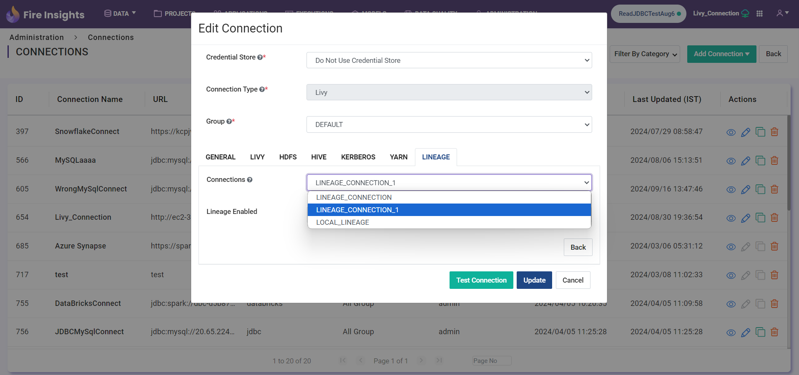

Lineage Configuration
=====

Login to ``Sparkflows`` application -> ``Administration`` -> ``Configurations`` -> ``openlineage.enabled = true`` 

Local Lineage Configuration
=====

To enable OpenLineage, the user must navigate to the administration configuration and enable the openlineage.enabled property.

.. figure:: ../../_assets/lineage/enable_lineage.png
   :alt: enable-lineage
   :width: 60%

Lineage Configuration with Livy 
==========

To enable OpenLineage with the livy connection user must have enabled the below properties

``Sparkflows`` application -> ``Administration`` -> ``Configurations`` -> ``connection.openlineage.enabled = true``

``Sparkflows`` application -> ``Administration`` -> ``Configurations`` -> ``connection.livy.enabled = true``

Creating open lineage connection
===================

Once user enabled the open lineage connection, the user can create the lineage connection in administration

.. figure:: ../../_assets/lineage/create_connection_lineage.png
   :alt: enable-lineage
   :width: 60%

Once user created lineage connection user needs to select the lineage connection on livy connection

While executing workflow with livy user needs to pass the below configuration for the namespace

ex. --conf spark.openlineage.=WORKFLOW_LINEAGE

.. figure:: ../../_assets/lineage/workflow_lineage.png
   :alt: livy-lineage
   :width: 60%

