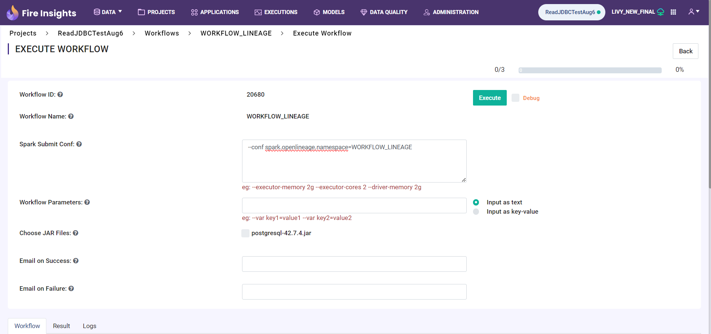

Lineage Configuration
=====
This document outlines the steps to configure Lineage in Sparkflows.

Step 1 : Log In and Navigate to the Configurations Page
----------------------------------

Log in to the **Sparkflows application** and go to **Administration > Configurations**. 

Step 2 : Add JAR files into `fire-user-lib`
-----------------------------------------
User must have added the below JAR files to trigger lineage in local mode:

Lineage Jar : https://mvnrepository.com/artifact/io.openlineage/openlineage-spark_2.13/1.19.0

Guava Jar : https://mvnrepository.com/artifact/com.google.guava/guava/32.0.0-jre

Step 3 : Enable Local Lineage Configuration
---------------------------

To enable OpenLineage, enable the **openlineage.enabled** property on the Configurations Page:
::

   openlineage.enabled = true
   openlineage.end.point = http://localhost:5000
   openlineage.spark.extraListeners = io.openlineage.spark.agent.OpenLineageSparkListener
   openlineage.spark.transport.type = http
   openlineage.spark.facets.disabled = [spark.logicalPlan]
   openlineage.spark.debugFacet = enabled

.. figure:: ../../_assets/lineage/enable_lineage.png
   :alt: enable-lineage
   :width: 60%

Step 4 : Enable Lineage Configuration with Livy 
------------------------------

To configure OpenLineage with the Livy connection, enable the following properties on the Configurations Page:
::

    connection.openlineage.enabled = true
    connection.livy.enabled = true

Step 5 : Create Open Lineage Connection
--------------------------------

After enabling the Open Lineage connection, you can create the lineage connection in the administration settings. 

Follow the steps below to create the connection:

#. Navigate to **Administration > Connections**.

#. Click on the **Add Connection** button located at the top right corner.

#. Enter the connection details on the pop-up window.

   .. figure:: ../../_assets/lineage/create_connection_lineage.png
      :alt: enable-lineage
      :width: 60%

#. Lineage URL will be the URL of the current running marquz lineage server URL.
   e.g. https://marquez.sparkflows.net

#. In spark conf user need to update the spark configurations as below

   ::
   
      openlineage.enabled = true
      openlineage.end.point = https://marquez.sparkflows.net
      openlineage.spark.extraListeners = io.openlineage.spark.agent.OpenLineageSparkListener
      openlineage.spark.transport.type = http
      openlineage.spark.facets.disabled = [spark.logicalPlan]
      openlineage.spark.debugFacet = enabled

#. In Jars of open lineage connection, user needs to update the jar path if
   the execution will be done on Livy

    .. figure:: ../../_assets/lineage/jars_lineage.png
      :alt: lineage-jars
      :width: 60%

#. After entering all the details **Test and Save** the connection.
#. Once the lineage connection is created, select it for the Livy connection as shown below:

   .. figure:: ../../_assets/lineage/livy_lineage.png
      :alt: livy-lineage
      :width: 60%

Step 6 : Execute Workflows with Livy
-----------------------------------

While executing workflows with Livy, include the following configuration for the namespace:

ex. **--conf spark.openlineage.namespace=WORKFLOW_LINEAGE**

