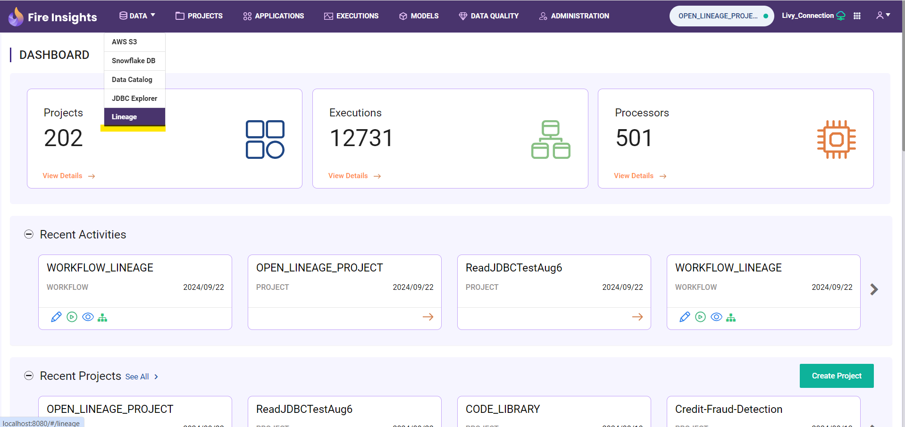
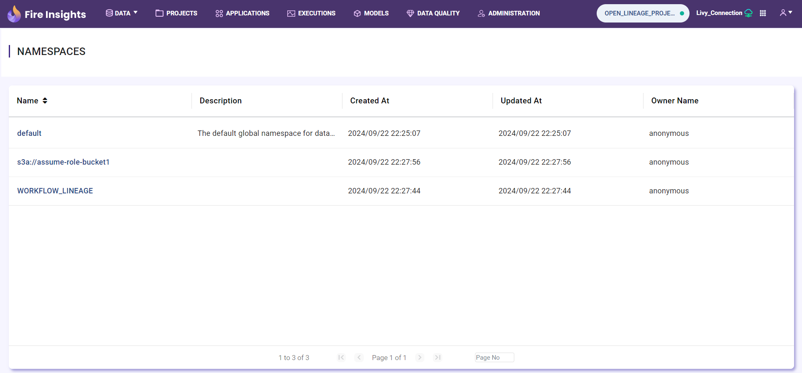
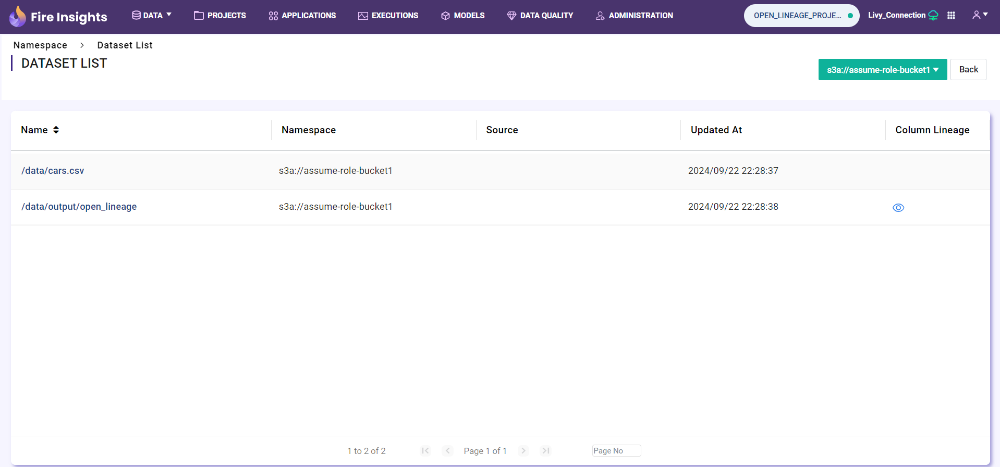
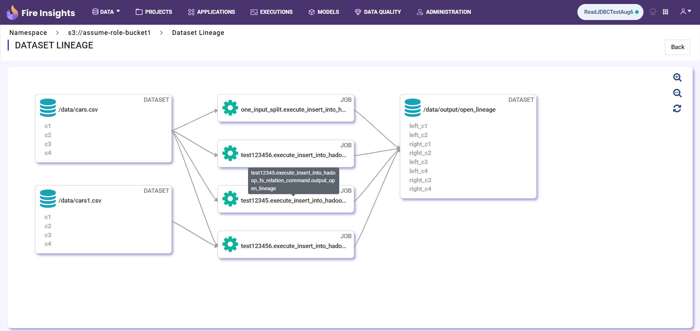
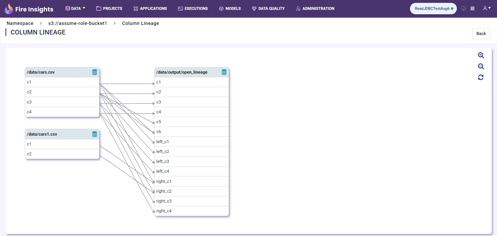

Lineage User Guide
=====

Once Lineage enabled user can able to see the ``Lineage`` tab on data menu

Lineage Namespaces
------------------

Once user click on ``Lineage`` menu it will navigate to the Lineage namespaces page (it will contains all name spaces)

Lineage Datasets
----------------

Once user click on ``namespace name`` it will navigate to the Lineage datasets page 

Dataset Lineage
---------------

Once user click on particular ``dataset Name`` it will display the dataset lineage for the dataset

Column Lineage
--------------

Once user click on ``view icon`` in actions column it will display the column lineage for the dataset

