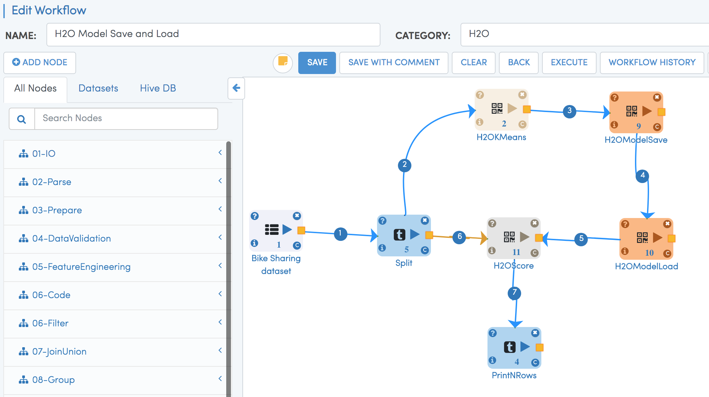

Persisting H2O Models
=====================

H2O Models
----------

H2O Models can be saved in binary format or in MOJO format. Fire Insights has processors for saving and reading them back.

Save H2o Model processor
+++++++++++++++++++++

H2OModelSave Processor saves the H2O model at the specified path in the binary format.

.. figure:: ../../_assets/model/h2omodelsaveconfigurations.PNG
   :alt: Modelsave
   :align: center
   :width: 60%
   
Load H2o Model processor
+++++++++++++++++++++
   
H2OModelLoad Processor loads the H2O model in binary format from the specified path.

.. figure:: ../../_assets/model/h2omodelloadconfiguration.PNG
   :alt: Modelsave
   :align: center
   :width: 60%

More details of saving and loading the H2O Models is available here:

http://docs.h2o.ai/h2o/latest-stable/h2o-docs/save-and-load-model.html

Save and Load H2O Workflow
++++++++++++++++++++++++++
   
Below is a workflow, which saves the generated H2O model on the file system. It then reads it back and uses it for scoring.
In real life, the store model would be read back in another workflow for scoring purposes.

   
