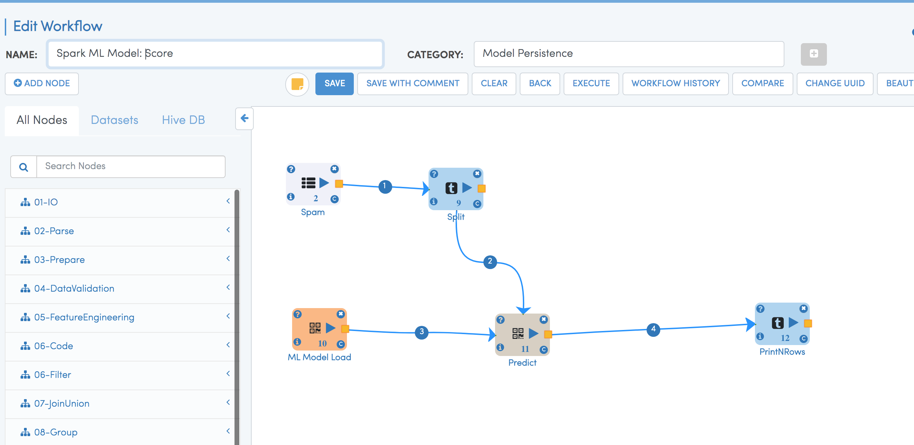
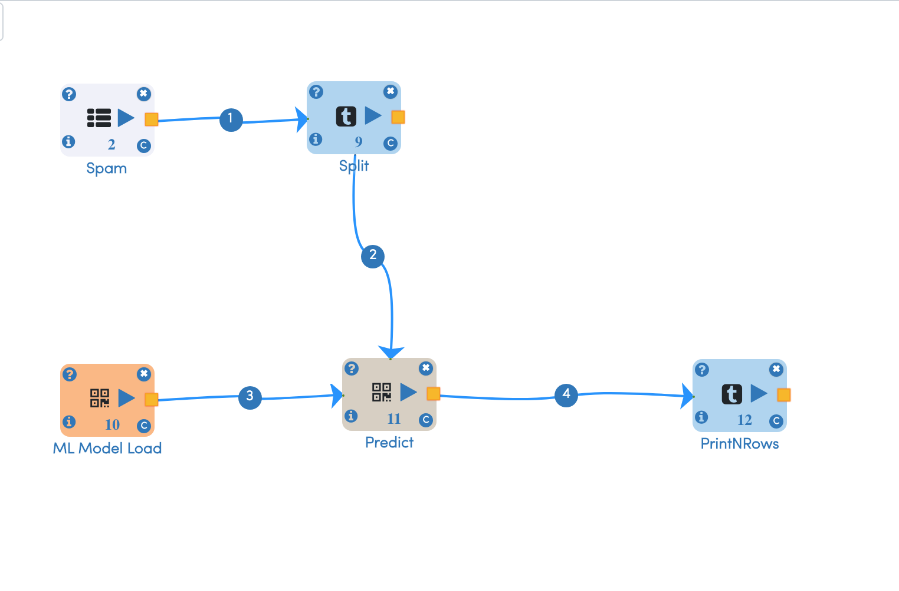

Serving Spark MLlib Models
===========================

Fire Insights creates Apache Spark MLlib models. These models get saved as files on the File System.

NodeModelSave, Spark MLWritable: the standard model storage format included with Spark.

Once the SparkML model is saved, they can be used for serving.

Batch Model Scoring:
--------------------

By using NodeModelLoad & selecting the particular type of model to be loaded, model will be loaded in workflow and it can be used for scoring the input data.

Online Scoring with Kafka and Spark Streaming:
---------------------------------------------

Scalable messaging platform like Kafka to send newly acquired data to a long running Spark Streaming process. The Spark process can then make a new prediction based on the new data.

