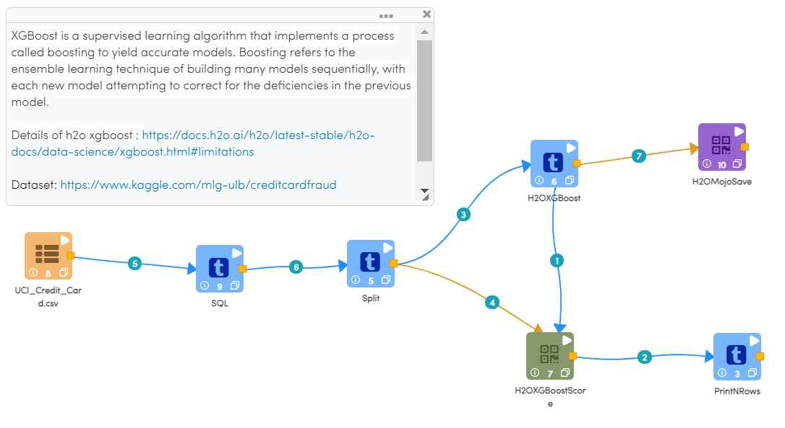

Time Series Modeling
--------------------

Fire Insights provides a number of Processors for Time Series Modeling. These include:

* H2OXGBoost
* Prophet : https://facebook.github.io/prophet/
* Arima

Below is the sample workflows which contains ``H2OXGBoost`` processor in Fire Insights.

It reads the UCI_Credit_Card dataset & use H2OXGBoost processor supervised learning algorithm that implements a process called boosting to yield accurate models and save the model in s3 location.

H2OXGBoost processor Configuration:

.. figure:: ../../_assets/ml_userguide/xgboost_config.PNG
   :alt: ml_userguide
   :align: center
   :width: 60%

H2OMojoSave processor Configuration:

.. figure:: ../../_assets/ml_userguide/model_save.PNG
   :alt: ml_userguide
   :align: center
   :width: 60%

On successful submission of the job, the model get saved to specified locations, you can just view the model at specified location.

.. figure:: ../../_assets/ml_userguide/jobsubmission.PNG
   :alt: ml_userguide
   :align: center
   :width: 60%

.. figure:: ../../_assets/ml_userguide/modellocation.PNG
   :alt: ml_userguide
   :align: center
   :width: 60%

Below is the sample workflows which contains ``Prophet`` processor in Fire Insights.

It reads the AirPassengers dataset & use Prophet processor which forecasting of univariate time series data and print the result.

.. figure:: ../../_assets/ml_userguide/prophet.PNG
   :alt: ml_userguide
   :align: center
   :width: 60%

Prophet processor Configuration:

.. figure:: ../../_assets/ml_userguide/prophet_processor.PNG
   :alt: ml_userguide
   :align: center
   :width: 60%
   
Output result of ``Prophet`` processor:  

.. figure:: ../../_assets/ml_userguide/prophet_result.PNG
   :alt: ml_userguide
   :align: center
   :width: 60%

Below is the sample workflows which contains ``ARIMA`` processor in Fire Insights.

It reads the AirPassengers dataset & use ARIMA processor which Forecast the airline passengers count, generate a new column with unique index/value for each row in dataset and print the result.

.. figure:: ../../_assets/ml_userguide/arima.PNG
   :alt: ml_userguide
   :align: center
   :width: 60%
   
ARIMA processor Configuration:

.. figure:: ../../_assets/ml_userguide/arima_processor.PNG
   :alt: ml_userguide
   :align: center
   :width: 60%
   
Output result of ``ARIMA`` processor:     

.. figure:: ../../_assets/ml_userguide/arima_result.PNG
   :alt: ml_userguide
   :align: center
   :width: 60%
