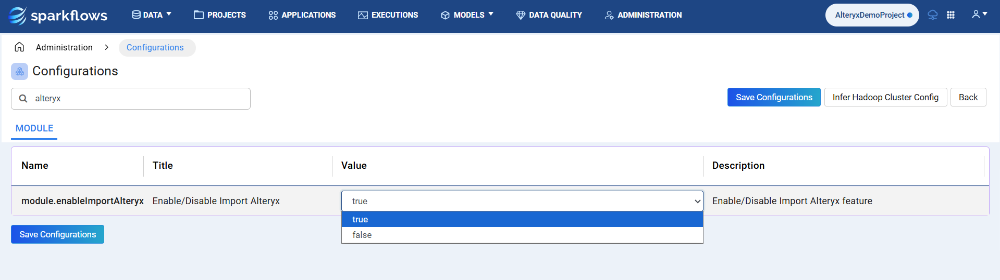

Workflow Migration Process
================================
This guide outlines the step-by-step process for migrating an existing Alteryx Designer workflow into Sparkflows, from importing and configuring the workflow to validating results after execution.

Follow the steps below:

Prerequisites
----
Before starting the migration process, ensure that Alteryx is enabled in Sparkflows. This can be done by navigating to **Administration -> Configurations -> MODULE** and searching for alteryx. Then, set the value of ``module.enableImportAlteryx`` to **true** and save the configuration.

Step 1 : Import the YXMD File
----

- Inside **Overview** of any project, look for **Import Legacy Flows** card option and click on it.

  .. figure:: ../_assets/alteryx-migration/import-legacy-flows-card-option.png
     :alt: alteryx_migration
     :width: 60%

- Select a source type and click **Next**. By default, **Alteryx** is selected as the source type.

  .. figure:: ../_assets/alteryx-migration/legacy-etl-system-source-selection.png
     :alt: alteryx_migration
     :width: 60%
  
- Upload your existing Alteryx Designer workflow **(.yxmd)** into Sparkflows.

  .. figure:: ../_assets/alteryx-migration/upload-files-option.png
     :alt: alteryx_migration
     :width: 60%

- The system parses the file, interprets the configuration, and generates a corresponding Sparkflows workflow.

- Connections, transformations, and dependencies are automatically mapped to equivalent processors in Sparkflows.

- Any unsupported elements are highlighted for easy review and adjustment.

Step 2 : Upload Required Dataset(s)
----

- After the workflow conversion completes, upload all datasets referenced in the workflow.

  .. figure:: ../_assets/alteryx-migration/workflow.png
     :alt: alteryx_migration
     :width: 60%

- Sparkflows supports multiple formats such as **CSV**, **Parquet**, **JSON**, and external data connections.

- Ensure that the dataset schema and field names match those expected by the original workflow to maintain consistent results.

- Datasets can be uploaded directly through the Sparkflows interface or linked from existing storage locations.

  .. figure:: ../_assets/alteryx-migration/add-dataset-1.png
     :alt: alteryx_migration
     :width: 60%

  .. figure:: ../_assets/alteryx-migration/add-dataset-2.png
     :alt: alteryx_migration
     :width: 60%

Step 3 : Run the Workflow
----

- Execute the converted workflow using Sparkflows workflow execution engine.

  .. figure:: ../_assets/alteryx-migration/execute-workflow.PNG
     :alt: alteryx_migration
     :width: 60%

- This can be performed entirely on your **local laptop or desktop**, making it easy to test without depending on an external environment.

- During execution, Sparkflows manages each processor’s configuration and data flow as defined in the converted workflow.

- Execution status, logs, and performance details can be viewed directly in the Sparkflows interface for full transparency.

Step 4 : Validate Results
----

- Use Sparkflows **data validation and comparison capabilities** to verify that the workflow output matches the original Alteryx results.

  .. figure:: ../_assets/alteryx-migration/validate-results-option.png
     :alt: alteryx_migration
     :width: 60%

- You can compare data outputs, inspect intermediate node results, and confirm transformations across steps by using data preview at each node level.

- Adjust node parameters or dataset paths if differences appear.

- Validation can be repeated until full alignment is achieved, ensuring confidence before scaling to production.

