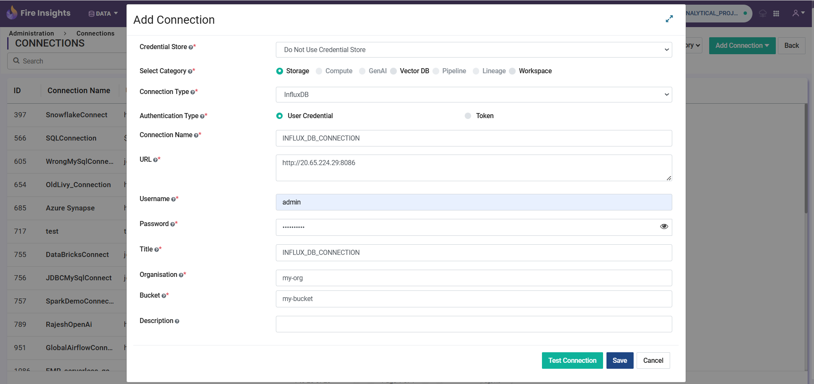
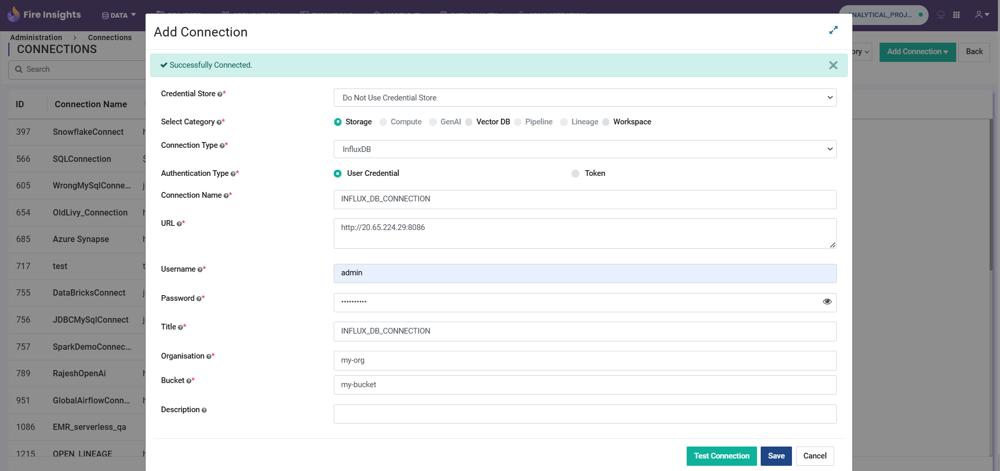
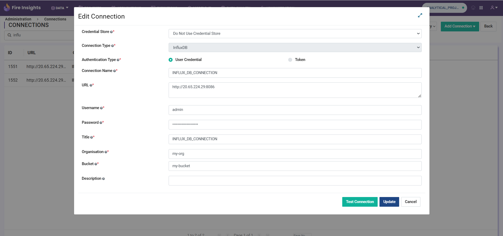

Influx DB Configuration
=================================

Create Influx Database Connection 
-------------

**To Create Infulx Connection**

Login to ``Sparkflows`` application -> ``Administration`` -> ``Global/Group Connections`` -> ``Add Connection For All``

Once user click on save button the influx connection will be created in sparkflows.

Test Influx Database Connection 
-------------

Once user filled the required influx connection details and click on on the ``Test Connection`` button, they can test the connection.

Update Influx Database Connection 
-------------

By clicking on the edit icon of the Influx connection user can update the influx database connection details.

Once the model is deployed, Sparkflows monitoring module, provides the detailed info on environment, deployment type, deployment mode, problem type, alerts and all the metrics needed to keep a check on how model is being used and is performing over a period of time from influx DB. 

.. figure:: ../../../_assets/mlops/11_Monitoring_Page.png
     :alt: Continuous ML
     :width: 70%

**Monitoring Metrics:**

- Predictions over time. 

  .. figure:: ../../../_assets/mlops/average-prediction.png
     :alt: Predictions over time
     :width: 70%
- Scoring latency over a period of time.

  .. figure:: ../../../_assets/mlops/latency-over-time.png
     :alt: Scoring latency over a period of time
     :width: 70%
- Number of rows scored over a period of time.

  .. figure:: ../../../_assets/mlops/prediction-row-count.png
     :alt: Number of rows scored over a period of time
     :width: 70%

- Model drift over time.

  .. figure:: ../../../_assets/mlops/drift-over-time.png
     :alt: Model drift over time
     :width: 70%

