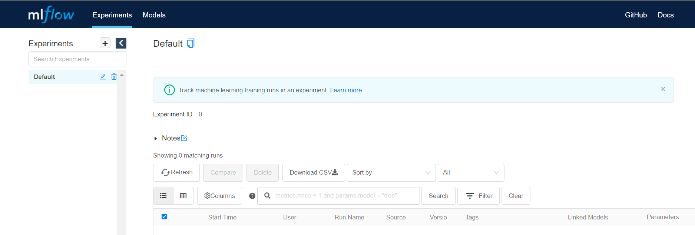
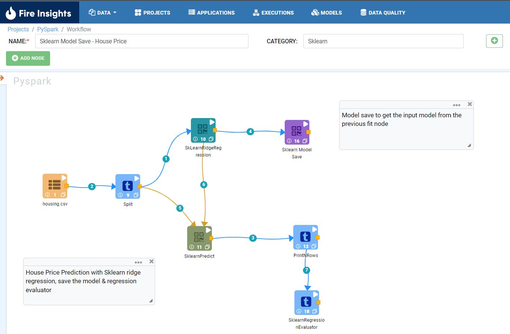
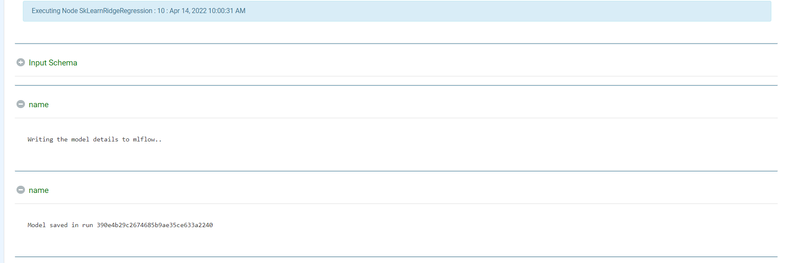
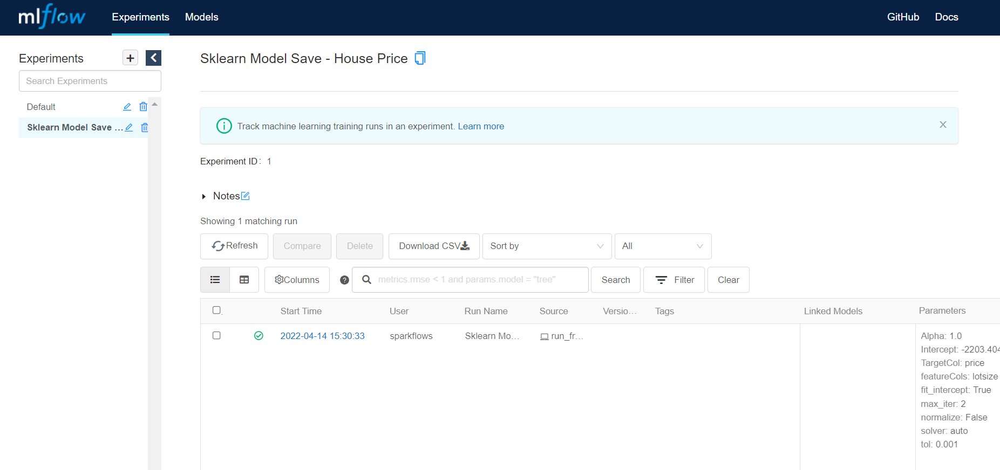

Integration with MLflow
=======================

Fire Insights provides the integration with MLflow Model Registry.

Visit the link given below to get more information on MLflow: 

- https://docs.databricks.com/applications/mlflow/index.html

Prerequisites
-------------

Below are the prerequisites for installing MLflow on a Mac or Linux machine::

  Python 3.7+ 
  pip 21.0+

Install MLflow on Linux:
-----------------------------

::

    pip install mlflow
    
    
Run MLflow UI:
--------------

::

    mlflow ui
    MLFlow UI - http://localhost:5000
    
Login to the above URL to reach the MLflow UI page as shown below:

    
    
.. note::  Make sure to change the localhost to your IP or Domain Name. Remember that the MLflow would run on port 5000 by default.

Integrating MLflow with Fire Insights
------------------------------------

In Fire Insights, processors in Python engine have integration with MLflow via the Mlflow API’s parameters, metrics, model among others. Fire Insights workflows will be registered as experiments in MLflow with their name and each execution will show up as a separate run in the MLflow experiments.

Below is the sample workflow for regression to predict the house price with RidgeRegression Node.

 
 
 

On successful execution of the workflow the model will be saved in MLflow as shown below:

In MLflow, the executed workflow is registered as an experiment with separate executions.

From RidgeRegression model parameters, metrics, etc. are shared with MLflow registry.

.. figure:: ../../_assets/user-guide/machine-learning/sparkml/mlflow/mlflow_result.PNG
   :alt: mlflow
   :width: 65%    

