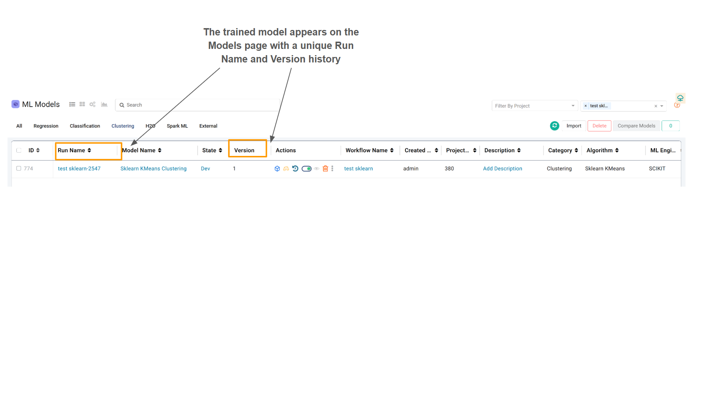
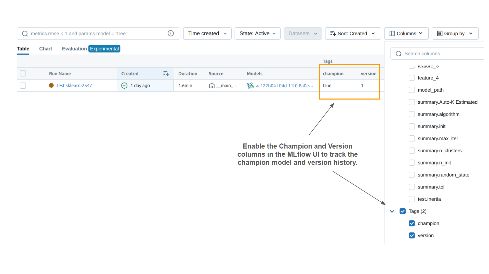

Scikit-learn
=======

This document describes how to implement end-to-end MLOps for Scikit-learn (Sklearn) models in Sparkflows, including training, evaluation, champion model selection, prediction workflows, and continuous monitoring using MLflow, predictions over time, and data drift metrics.

Create the Training Workflow
---------------------------------------

#. **Start a new Workflow**: Create a new workflow in Sparkflows and give it a meaningful name (e.g., ``Sklearn_K_means_Model``).
#. **Read Data**: Use a Read node to ingest your training dataset.
#. **Data Preprocessing (Optional but Recommended)**: Add necessary nodes for data cleaning, feature engineering, and transformation.
#. **Split Data**: Use the Split node to divide your data into training and testing sets.
#. **Train Model**:

   - Add an Sklearn training algorithm node (e.g., ``Sklearn Random Forest``, ``Sklearn Logistic Regression``).
   - Connect the training split output to this node.

#. **Evaluate Model**:

   - Add the Sklearn Evaluate node.
   - Connect the model output and the testing split output to the Evaluator.
   - **Crucial Step**: Ensure the Champion Model Selection is toggled to ``False``.
   - **Crucial Step**: Enable the Prediction over time and set the model type to populate the Predictions over Time Graph under the Models Page.
#. **Predict/Score**:

   - Add the Sklearn Score node.
   - Connect the model output and the testing split output to this node.
   - **Crucial Step**: Ensure the Champion Model Selection is toggled to ``False``.
#. **ML Data Metrics**:

   - Add the ML Data Metrics node.
   - Connect the output of the Predict/Score node to this node.
   - **Crucial Step**: Ensure the Champion Model Selection is toggled to ``False``.
#. **Save**: Use the Sklearn Model Save node to explicitly save the trained model. 

   .. note:: The model gets registered with MLflow automatically, but this ensures a clean save point.

  .. figure:: ../../_assets/mlops/end-to-end-examples/sklearn/sklearn-training-wf.png
     :alt: MLOps Examples
     :width: 70%

  .. figure:: ../../_assets/mlops/end-to-end-examples/sklearn/sklearn-nodes-config-1.png
     :alt: MLOps Examples
     :width: 70%

Run the Training workflow
-------------------------------

The training model gets registered with MLflow automatically while saving the Sklearn model.

All the runs of the training workflow will be available under MLflow which will show up under the experiment name: **PROJECT NAME - WORKFLOW NAME**

Select your champion model by **toggling** the champion button.

.. figure:: ../../_assets/mlops/end-to-end-examples/sparkml/champion-model-toggle.png
   :alt: MLOps Examples
   :width: 70%

Create a Prediction Workflow
----------------------------

#. **Start a new Workflow**: Create a new workflow in Sparkflows and give it a meaningful name (e.g., ``Sklearn_K_means_Predict_Model``).
#. **Read Data**: Use a Read node to ingest the unseen data you wish to score/predict.
#. **Data Preprocessing**: Apply the exact same preprocessing and transformation steps used in the training workflow to the new, unseen data.
#. **Load Model**:

   - Add the Sklearn Model Load node.
   - **Crucial Step**: Ensure the Champion Model Selection is toggled to ``True`` to load the currently designated champion model.
#. **Predict/Score**:

   - Add the Sklearn Predict node.
   - Connect the output of the Load Model node and the preprocessed data to this node.
   - **Crucial Step**: Ensure the Champion Model Selection is toggled to ``True``.
#. **ML Data Metrics**:

   - Add the ML Data Metrics node.
   - Connect the output of the Predict/Score node to this node.
   - **Crucial Step**: Ensure the Champion Model Selection is toggled to ``True``.
#. **Write Results**: Use a Save node to save the prediction results.

  .. figure:: ../../_assets/mlops/end-to-end-examples/sklearn/sklearn-prediction-wf.png
     :alt: MLOps Examples
     :width: 70%

  .. figure:: ../../_assets/mlops/end-to-end-examples/sklearn/sklearn-nodes-config-2.png
     :alt: MLOps Examples
     :width: 70%

Associate the Prediction Workflow with the Training Workflow
---------------------------------------------------------------

By clicking **Associate Scoring Workflow**, prediction workflow can be associated with the training workflow. Follow the below steps for the same:

* First, select the desired prediction workflow and confirm your choice.
* Next, execute the selected prediction workflows using your new, unseen test data.

 .. figure:: ../../_assets/mlops/end-to-end-examples/sparkml/scoring-wf-association.png
     :alt: MLOps Examples
     :width: 70%

Model Monitoring and Drift
-------------------------

Sparkflows MLOps features provide comprehensive monitoring capabilities:

#. **Performance Over Time**: The Predictions over Time Graph (enabled in the training workflow's Evaluator node) displays model performance metrics as the model scores new data over time using the associated prediction workflow.
#. **Data Drift**: The ML Data Metrics node in the prediction workflow calculates key metrics, including:

    - **Data Drift Over Time**: Compares the statistical distribution of input features in the new data against the training data.
    - **Average Drift Over Time**: Compares the distribution of predictions on the new data against the predictions made during training.
    - **Metric Thresholds**: Alerts can be configured based on defined thresholds for these drift metrics, notifying users when the model is decaying.

#. **Metrics Over Time**: Track the model's test metrics over time using unseen datasets. Additionally, monitor the volume of data utilized during batch prediction.

Finally, continuously monitor all relevant metrics over time.

* Data Drift Over Time

  .. figure:: ../../_assets/mlops/end-to-end-examples/sparkml/data-drift-over-time.png
     :alt: MLOps Examples
     :width: 70%

* Average Drift Over Time

  .. figure:: ../../_assets/mlops/end-to-end-examples/sparkml/avg-drift-over-time.png
     :alt: MLOps Examples
     :width: 70%

* Prediction Over Time - Classification

  .. figure:: ../../_assets/mlops/end-to-end-examples/sparkml/prediction-over-time-1.png
     :alt: MLOps Examples
     :width: 70%

* Prediction Over Time - Clustering

  .. figure:: ../../_assets/mlops/end-to-end-examples/sparkml/prediction-over-time-2.png
     :alt: MLOps Examples
     :width: 70%

* Prediction Over Time - Regression

  .. figure:: ../../_assets/mlops/end-to-end-examples/sparkml/prediction-over-time-3.png
     :alt: MLOps Examples
     :width: 70%

* Metrics Over Time 

  .. figure:: ../../_assets/mlops/end-to-end-examples/sparkml/metrics-over-time.png
     :alt: MLOps Examples
     :width: 70%

