Scikit-learn End-to-End Example
===============================

End-to-end MLOps for a Scikit-learn model in Sparkflows — build and train the model, register and version it in MLflow, promote a champion, score unseen data with a prediction workflow, and continuously monitor performance and drift. Everything is built visually with low-code nodes.

**How it works.** You build two workflows that operate as a pair:

- a **training workflow** that prepares data, trains and evaluates the Scikit-learn model, and saves it (auto-registering it in MLflow); and
- a **prediction (scoring) workflow** that loads the promoted *champion* model and scores new, unseen data.

Once the two are associated, every scoring run feeds the Models page with fresh performance and drift metrics, giving you a living view of how the model behaves over time.

Build the Scikit-learn Training Workflow
----------------------------------------

#. **Create a new workflow** and give it a meaningful name (for example, ``Sklearn_Train_Churn_Model``).
#. **Read the data** — add a Read node (such as ``Read CSV`` or ``Read JDBC``) to load your training dataset.
#. **Preprocess (recommended)** — add the cleaning and feature-engineering nodes your data needs.
#. **Split the data** — use the ``Split`` node to divide the data into training and test sets (for example, 80% train / 20% test).
#. **Train the model** — add a Scikit-learn algorithm node (such as ``Sklearn Random Forest`` or ``Sklearn Logistic Regression``) and connect the training split to it.
#. **Evaluate the model** — add the ``Sklearn Evaluate`` node and connect both the trained model and the test split to it. Turn on **Prediction Over Time** and set the **model category** (classification, regression, or clustering) so the Predictions Over Time graph is populated on the Models page.
#. **Score the test data** — add the ``Sklearn Score`` node and connect the trained model and the test split to it.
#. **Capture data metrics** — add the ``ML Data Metrics`` node on the scored test data to track data drift, connecting the Sklearn Score output to it.
#. **Save the model** — add the ``Sklearn Model Save`` node to persist the trained model.

.. important::

   Throughout the **training** workflow, keep **Use Champion Model** set to ``false`` on the Evaluate, Score, and ML Data Metrics nodes. You are training and comparing candidate models here — you promote one to champion *afterwards*, in *Select the Scikit-learn Champion Model* below.

.. note::

   Saving the model also **registers it with MLflow automatically**. The explicit Save node simply gives you a clean, named save point.

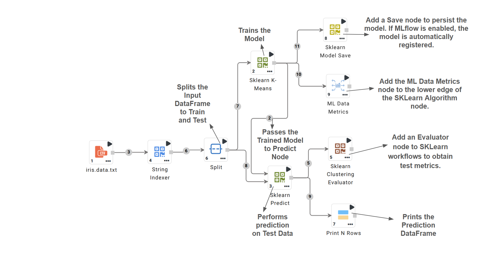

   The complete Scikit-learn training workflow — read the data, split, train, evaluate, score, capture metrics, and save the model.

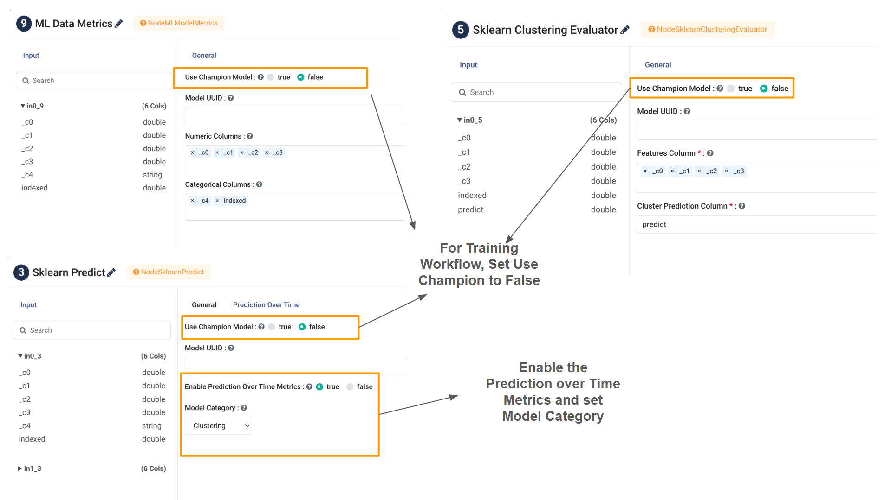

   Configuring the training nodes — keep *Use Champion Model* off and turn on *Prediction Over Time* with the correct model category.

Run the Scikit-learn Training Workflow
--------------------------------------

Run the workflow. As it finishes, the trained model is **registered with MLflow automatically** while the Scikit-learn model is saved, and appears on the **Models** page.

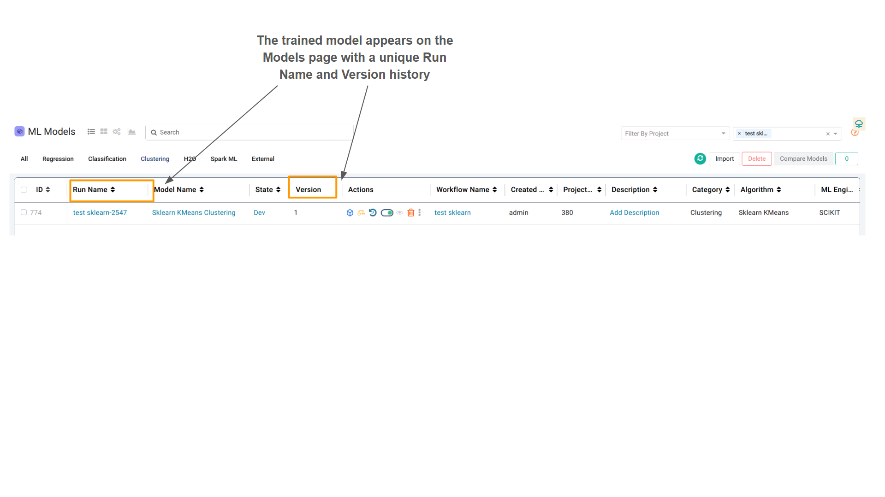

   The newly trained Scikit-learn model, listed on the Models page.

Every run of the training workflow is tracked in MLflow under the experiment name **PROJECT NAME - WORKFLOW NAME**.

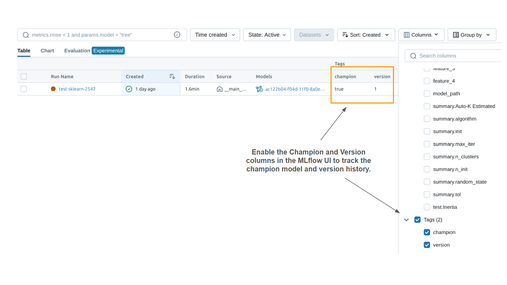

   Each training run is captured as an MLflow experiment run, so you can compare candidates.

Select the Scikit-learn Champion Model
--------------------------------------

After comparing runs, promote your best model to **champion**. On the Models page, use the **champion toggle** in the model's Actions row. The ``⋮`` menu on the same row also lets you download the model, view its event history, and associate a scoring workflow.

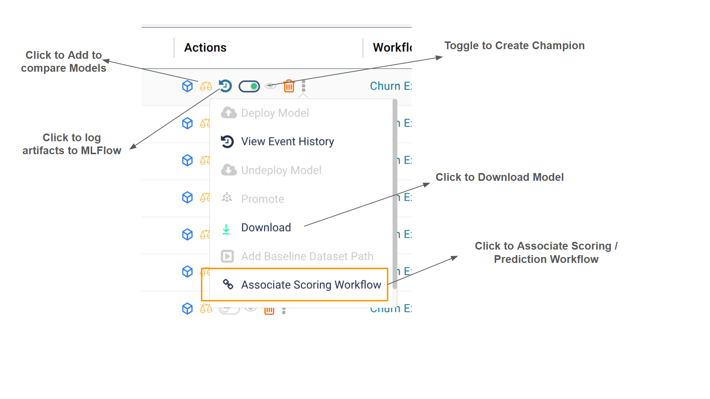

   Toggle a model to champion; the Actions menu also holds *Associate Scoring Workflow*, *Download*, and *View Event History*.

Build the Scikit-learn Prediction Workflow
------------------------------------------

#. **Create a new workflow** and name it clearly (for example, ``Sklearn_Predict_Churn_Model``).
#. **Read the data** — add a Read node for the new, unseen data you want to score.
#. **Preprocess identically** — apply the *exact same* cleaning and feature steps used during training.
#. **Load the champion** — add the ``Sklearn Model Load`` node.
#. **Score the data** — add the ``Sklearn Predict`` node and connect the loaded model and the preprocessed data to it.
#. **Capture data metrics** — add the ``ML Data Metrics`` node on the scored data to track drift (recommended for batch scoring).
#. **Write the results** — add a Save node (such as ``Save CSV`` or ``Save JDBC``) to store the predictions.

.. important::

   In the **prediction** workflow, set **Use Champion Model** to ``true`` on the Load, Predict, and ML Data Metrics nodes so scoring always uses the currently promoted champion.

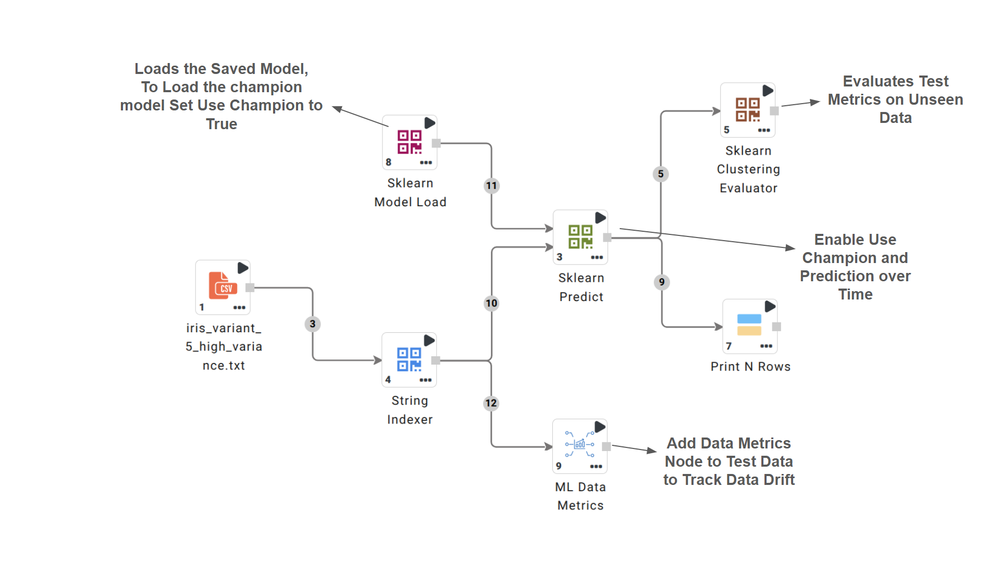

   The prediction workflow — reuse the same preprocessing, load the champion, score the unseen data, and capture drift metrics.

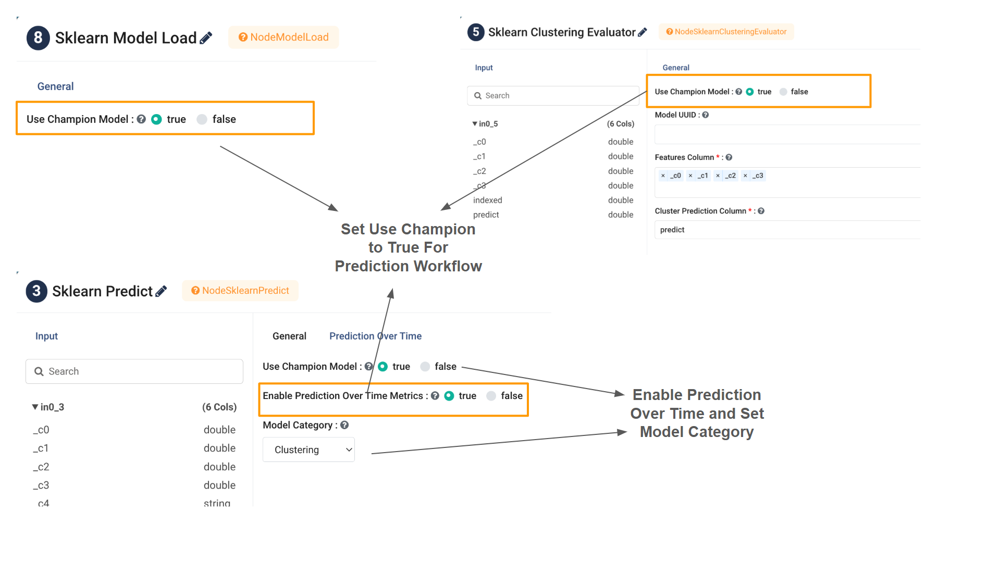

   Configuring the prediction nodes — *Use Champion Model* is set to true on Load, Predict, and ML Data Metrics.

Associate the Scikit-learn Prediction Workflow
----------------------------------------------

Link the prediction workflow to the champion model so its scoring runs feed the monitoring graphs.

#. On the Models page, open the champion model's ``⋮`` menu and choose **Associate Scoring Workflow**.
#. Select your prediction workflow from the dropdown and confirm.
#. Run the prediction workflow on your new, unseen data. Each run now contributes fresh metrics to the model.

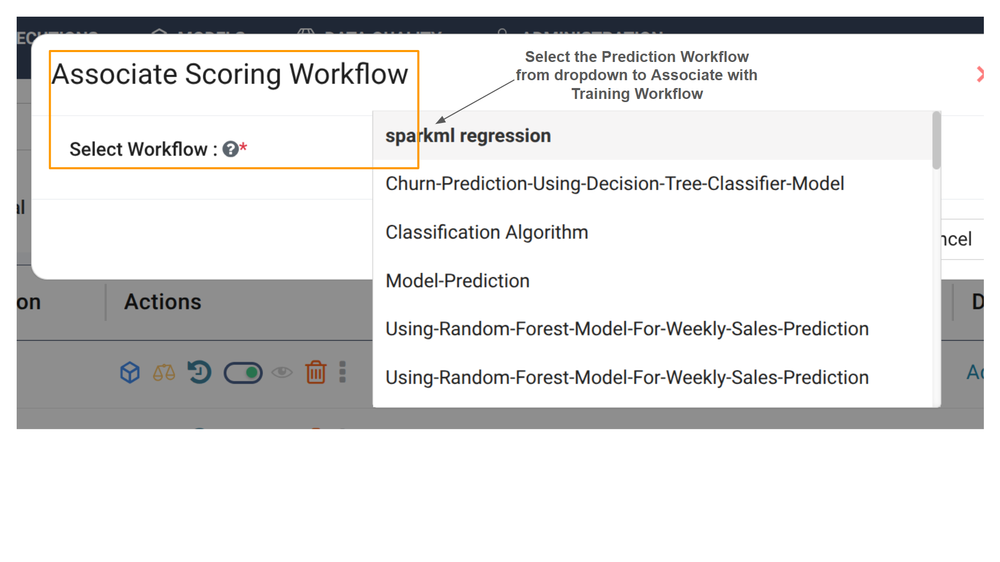

   Choosing the prediction workflow to associate with the trained model.

Monitor the Scikit-learn Model
------------------------------

With the workflows associated, Sparkflows continuously updates a rich set of monitoring views as new data is scored:

- **Predictions Over Time** — model performance as it scores new data over time (enabled on the training Evaluate node).
- **Data Drift Over Time** — the distribution of incoming features compared with the training data.
- **Average Drift Over Time** — the distribution of new predictions compared with predictions made during training.
- **Metrics Over Time** — test metrics on unseen data over time, plus the volume of data scored in each batch.

.. tip::

   Configure thresholds on the drift metrics to be alerted when a model starts to decay, so you know when it is time to retrain.

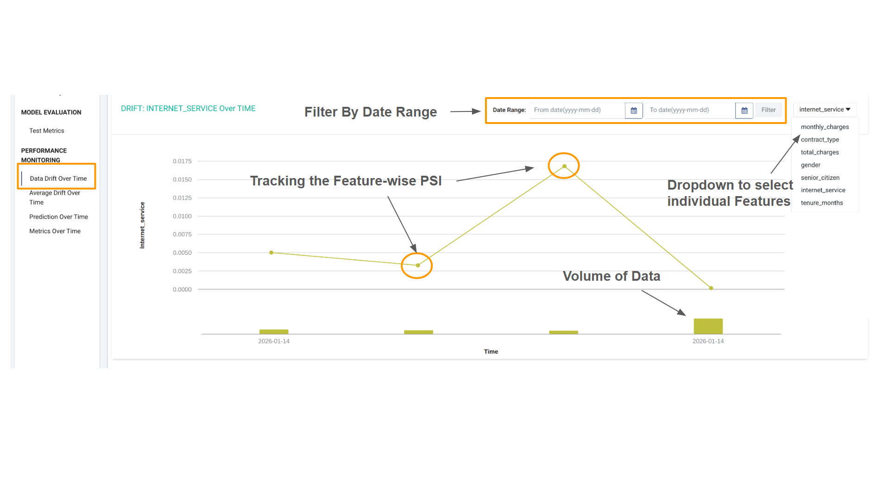

   Data Drift Over Time.

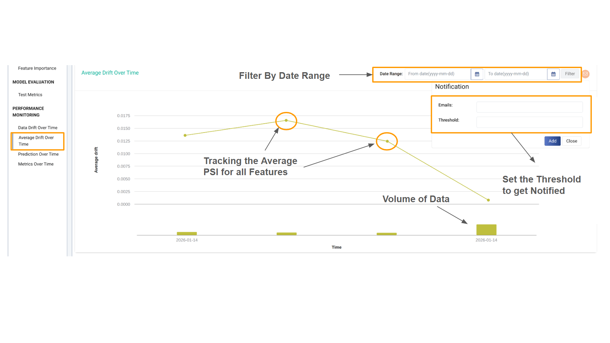

   Average Drift Over Time.

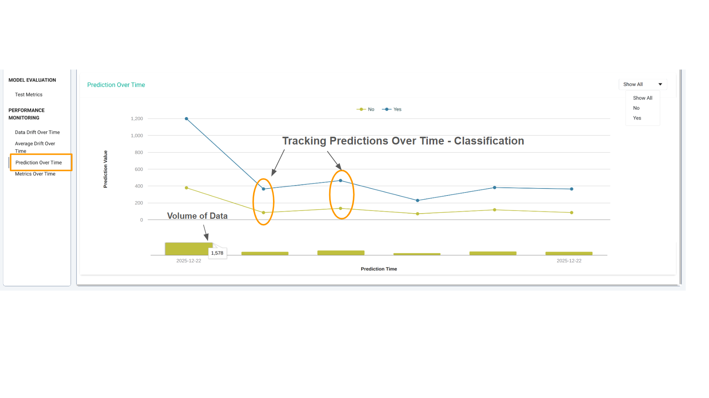

   Prediction Over Time — Classification.

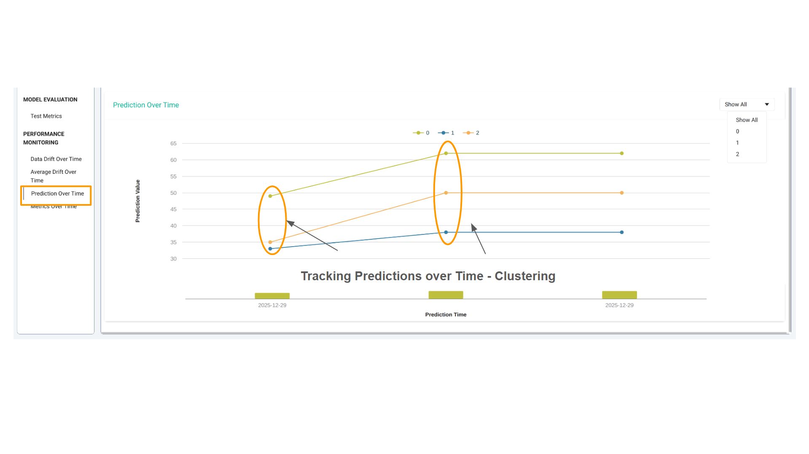

   Prediction Over Time — Clustering.

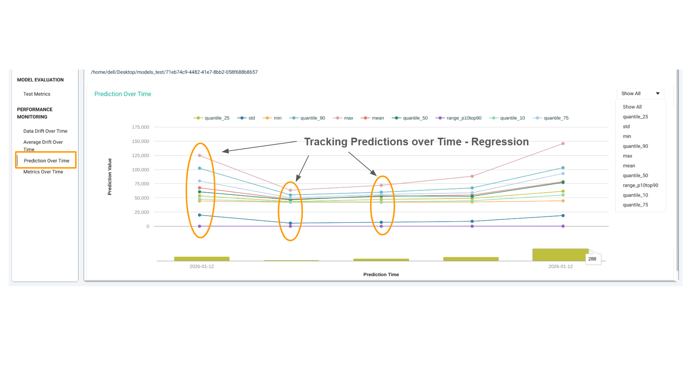

   Prediction Over Time — Regression.

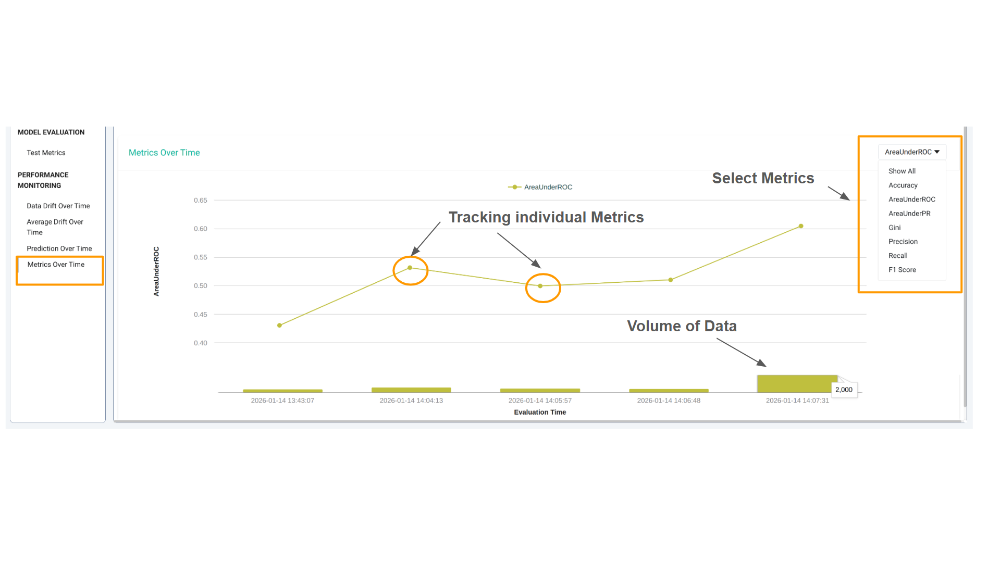

   Metrics Over Time.
