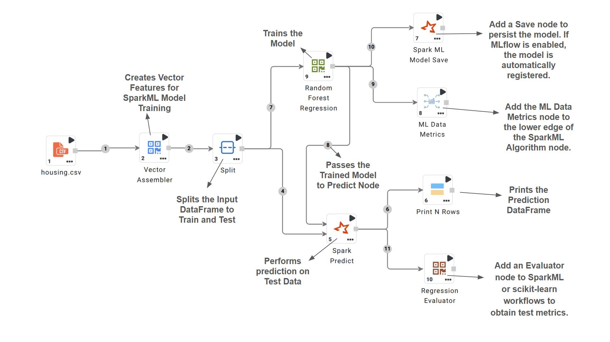
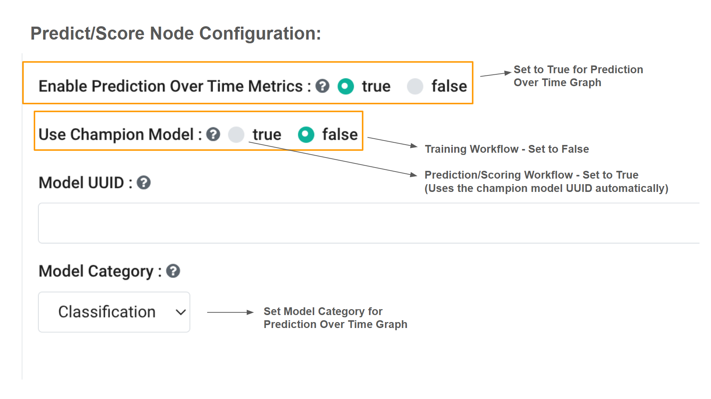
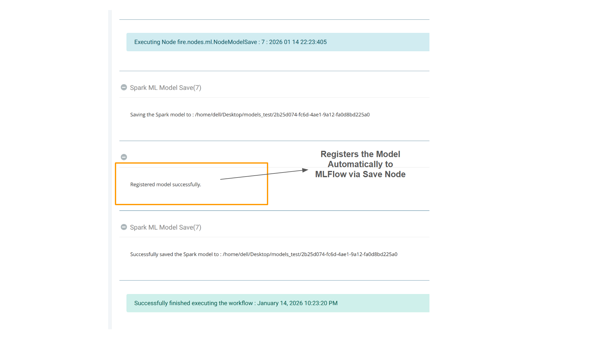
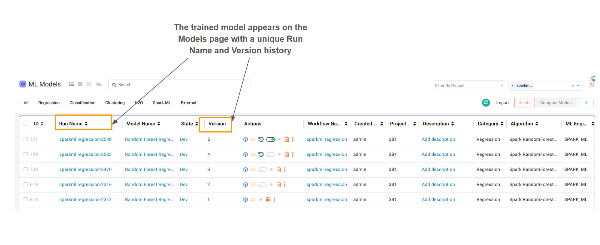
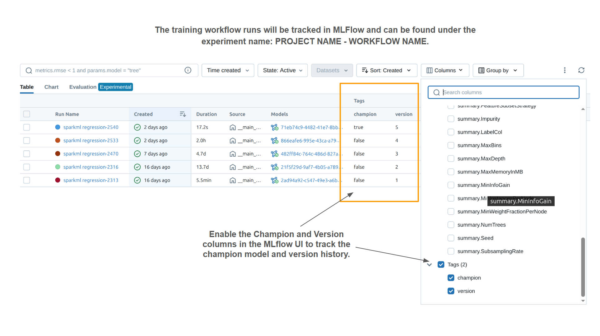
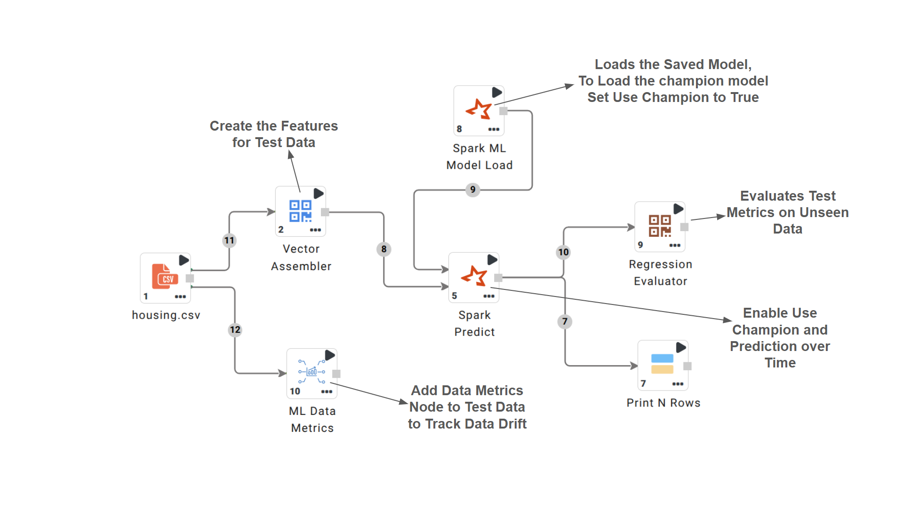
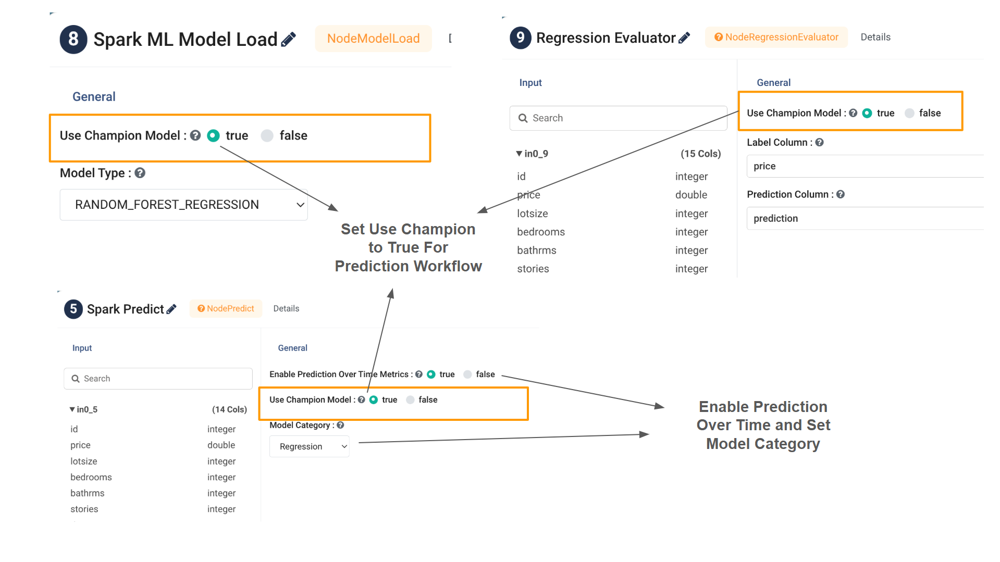

SparkML End-to-End Example
==========================

End-to-end MLOps for a SparkML model in Sparkflows — build and train the model, register and version it in MLflow, promote a champion, score unseen data with a prediction workflow, and continuously monitor performance and drift. Everything is built visually with low-code nodes.

**How it works.** You build two workflows that operate as a pair:

- a **training workflow** that prepares data, trains and evaluates the model, and saves it (auto-registering it in MLflow); and
- a **prediction (scoring) workflow** that loads the promoted *champion* model and scores new, unseen data.

Once the two are associated, every scoring run feeds the Models page with fresh performance and drift metrics, giving you a living view of how the model behaves over time.

Build the SparkML Training Workflow
-----------------------------------

#. **Create a new workflow** and give it a meaningful name (for example, ``SparkML_Train_Churn_Model``).
#. **Read the data** — add a reader node (for example, ``Read CSV``) to load your training dataset.
#. **Preprocess (recommended)** — add the feature-engineering nodes your data needs, such as ``Imputer``, ``String Indexer``, ``One Hot Encoder``, and ``Vector Assembler``.
#. **Split the data** — use the ``Split`` node to divide the data into training and test sets (for example, 80% train / 20% test).
#. **Train the model** — add a SparkML algorithm node (such as ``Random Forest Regression``, ``Random Forest Classifier``, or ``Logistic Regression``) and connect the training split to it.
#. **Score the test data** — add the ``Spark Predict`` node and connect the trained model and the test split to it. On this node, keep **Use Champion Model** set to ``false``, turn on **Enable Prediction Over Time Metrics**, and set the **Model Category** (Classification, Regression, or Clustering) so the Predictions Over Time graph is populated.
#. **Evaluate the model** — add the evaluator that matches your model — ``Regression Evaluator``, ``Binary Classification Evaluator``, or ``Multiclass Classification Evaluator`` — and connect the ``Spark Predict`` output to it.
#. **Capture data metrics** — add the ``ML Data Metrics`` node to track data drift, and connect the ``Spark Predict`` output to it.
#. **Save the model** — add the ``Spark ML Model Save`` node to persist the trained model.

.. important::

   In the **training** workflow, keep **Use Champion Model** set to ``false`` on the ``Spark Predict`` and ``ML Data Metrics`` nodes. You are training and comparing candidate models here — you promote one to champion *afterwards*, in *Select the SparkML Champion Model* below.

.. note::

   Saving the model also **registers it with MLflow automatically**. The explicit Save node simply gives you a clean, named save point.

   The complete training workflow — read the data, assemble features, split, train a Random Forest, then score with Spark Predict, evaluate, save, and capture metrics.

   The Spark Predict node — for training, set *Use Champion Model* to false, enable *Prediction Over Time Metrics*, and choose the *Model Category*.

Run the SparkML Training Workflow
---------------------------------

Run the workflow. As it finishes, the trained model is **registered with MLflow automatically**.

   The model is registered successfully on completion of the run.

The trained model now appears on the **Models** page.

   The newly trained model, listed on the Models page.

Every run of the training workflow is tracked in MLflow under the experiment name **PROJECT NAME - WORKFLOW NAME**.

   Each training run is captured as an MLflow experiment run, so you can compare candidates.

Select the SparkML Champion Model
---------------------------------

After comparing runs, promote your best model to **champion**. On the Models page, use the **champion toggle** in the model's Actions row. The ``⋮`` menu on the same row also lets you download the model, view its event history, and associate a scoring workflow.

.. figure:: ../../_assets/mlops/end-to-end-examples/sparkml/champion-model-toggle.png
   :alt: Promote a model to champion
   :width: 85%

   Toggle a model to champion; the Actions menu also holds *Associate Scoring Workflow*, *Download*, and *View Event History*.

Build the SparkML Prediction Workflow
-------------------------------------

#. **Create a new workflow** and name it clearly (for example, ``SparkML_Predict_Churn_Model``).
#. **Read the data** — add a reader node for the new, unseen data you want to score.
#. **Preprocess identically** — apply the *exact same* feature steps used during training.
#. **Load the champion** — add the ``Spark ML Model Load`` node.
#. **Score the data** — add the ``Spark Predict`` node and connect the loaded model and the preprocessed data to it.
#. **Capture data metrics** — add the ``ML Data Metrics`` node on the scored data to track drift (recommended for batch scoring).
#. **Write the results** — add a writer node (for example, ``Save CSV``) to store the predictions.

.. important::

   In the **prediction** workflow, set **Use Champion Model** to ``true`` on the ``Spark ML Model Load``, ``Spark Predict``, and ``ML Data Metrics`` nodes so scoring always uses the currently promoted champion.

   The prediction workflow — reuse the same preprocessing, load the champion, score the unseen data with Spark Predict, and capture drift metrics.

   *Use Champion Model* is set to true on the Spark ML Model Load, Spark Predict, and ML Data Metrics nodes.

Associate the SparkML Prediction Workflow
-----------------------------------------

Link the prediction workflow to the champion model so its scoring runs feed the monitoring graphs.

#. On the Models page, open the champion model's ``⋮`` menu and choose **Associate Scoring Workflow**.
#. Select your prediction workflow from the dropdown and confirm.
#. Run the prediction workflow on your new, unseen data. Each run now contributes fresh metrics to the model.

.. figure:: ../../_assets/mlops/end-to-end-examples/sparkml/scoring-wf-association.png
   :alt: Associate Scoring Workflow dialog
   :width: 85%

   Choosing the prediction workflow to associate with the trained model.

Monitor the SparkML Model
-------------------------

With the workflows associated, Sparkflows continuously updates a rich set of monitoring views as new data is scored:

- **Predictions Over Time** — model performance as it scores new data over time (enabled via *Prediction Over Time Metrics* on the ``Spark Predict`` node).
- **Data Drift Over Time** — the distribution of incoming features compared with the training data.
- **Average Drift Over Time** — the distribution of new predictions compared with predictions made during training.
- **Metrics Over Time** — test metrics on unseen data over time, plus the volume of data scored in each batch.

.. tip::

   Configure thresholds on the drift metrics to be alerted when a model starts to decay, so you know when it is time to retrain.

.. figure:: ../../_assets/mlops/end-to-end-examples/sparkml/data-drift-over-time.png
   :alt: Data drift over time
   :width: 85%

   Data Drift Over Time.

.. figure:: ../../_assets/mlops/end-to-end-examples/sparkml/avg-drift-over-time.png
   :alt: Average drift over time
   :width: 85%

   Average Drift Over Time.

.. figure:: ../../_assets/mlops/end-to-end-examples/sparkml/prediction-over-time-1.png
   :alt: Prediction over time for classification
   :width: 85%

   Prediction Over Time — Classification.

.. figure:: ../../_assets/mlops/end-to-end-examples/sparkml/prediction-over-time-2.png
   :alt: Prediction over time for clustering
   :width: 85%

   Prediction Over Time — Clustering.

.. figure:: ../../_assets/mlops/end-to-end-examples/sparkml/prediction-over-time-3.png
   :alt: Prediction over time for regression
   :width: 85%

   Prediction Over Time — Regression.

.. figure:: ../../_assets/mlops/end-to-end-examples/sparkml/metrics-over-time.png
   :alt: Metrics over time
   :width: 85%

   Metrics Over Time.
