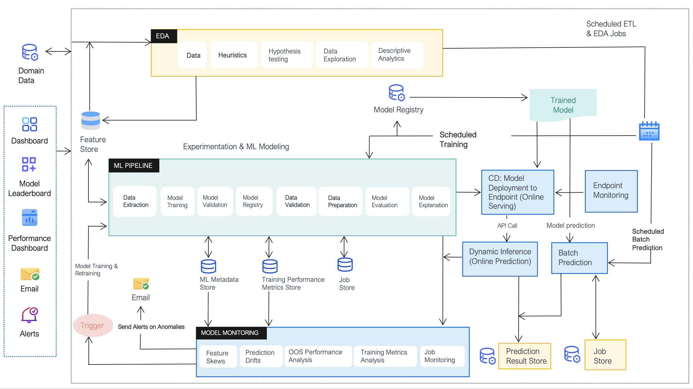
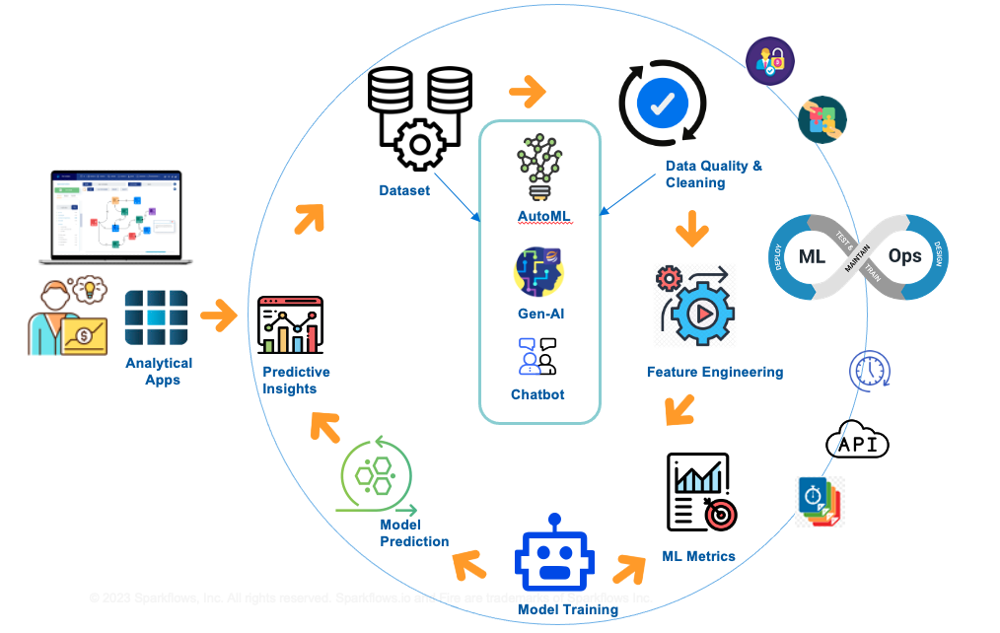
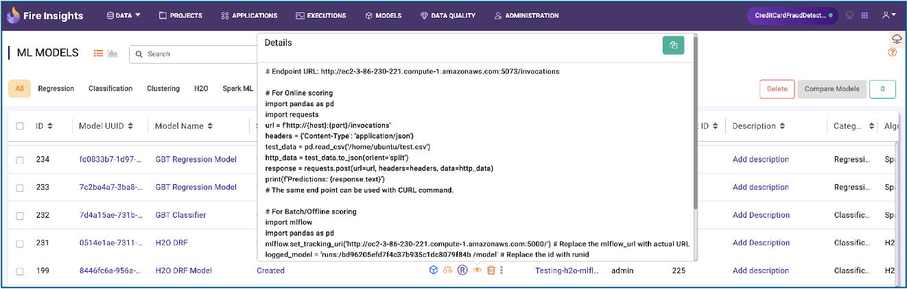

Introduction
======

MLOps, is a set of best practices and tools that aims to streamline and automate the end-to-end machine learning lifecycle. It bridges the gap between data science and IT operations, ensuring the efficient deployment, monitoring, and maintenance of machine learning models in production. MLOps involves version control for models and data, continuous integration and continuous delivery (CI/CD) pipelines, automated testing, and monitoring for model performance and drift. By implementing MLOps, organizations can accelerate their machine learning development, reduce errors, and ensure models remain effective and reliable over time. Sparkflows MLOps allows you to deploy varieties of Machine Learning models. These models can be either built in Sparkflows or models built outside of Sparkflows can also be onboarded and served.

**MLOps Architecture**

Sparkflows enables a Continuous Machine Learning Process Flow.

**MLOps Modules**
***********************

Sparkflows MLOps Offering is bundled with various built-in capabilities as explained below.

- Model Management Dashboard
- Model Deployment and Serving
- Model Security & Governance
- Model Monitoring and Observability

`Learn More <https://github.com/sparkflows/sparkflows-docs/blob/master/docs/mlops/mlops_modules.rst>`_

**Model Management Dashboard**
***********************

Sparkflows Model Management Dashboard Actions:

- Explore and search models created by different workflows in different projects by different users.
- View model details
- Check performance metrics
- Compare multiple models
- Perform various actions like register with MLOps server, deploy into endpoint, track model serving, monitor model and data drifts and define retraining policy.

`Learn More <https://github.com/sparkflows/sparkflows-docs/blob/master/docs/mlops/model_management_dashboard.rst>`_

**Model Lifecycle Actions**
***********************

Users can trigger the actions to register, deploy, promote, undeploy and re-register models from the Model Management Dashboard. The actions are executed in Sparkflows MLOps server. 

`Learn More <https://github.com/sparkflows/sparkflows-docs/blob/master/docs/mlops/model_lifecycle_action.rst>`_

**Model Deployment Options**
***********************

- Single Pane-of-Glass for deployment, monitoring and management.
- Support for various deployment targets.

`Learn More <https://github.com/sparkflows/sparkflows-docs/blob/master/docs/mlops/model_deployment.rst>`_

**Model Serving**
***********************

The models in Sparkflows can be served as one of the two options:

#. **Offline Model Serving**

    * MLOps offline serving is primarily employed for batch scoring, allowing machine learning models to process large volumes of data in a non-real-time, batch fashion.
    * It is utilized for bulk prediction tasks, enabling the efficient processing of extensive datasets with machine learning models in scheduled or periodic operations.
    * Offline model serving typically exhibits high throughput, making it well-suited for scenarios where data processing efficiency and scalability are paramount.

`User Guide <https://github.com/sparkflows/sparkflows-docs/tree/master/docs/mlops/user-guide/offline-model-serving.rst>`_

`Admin Guide <https://github.com/sparkflows/sparkflows-docs/tree/master/docs/mlops/admin-guide/offline-model-serving.rst>`_

#. **Online model serving**
   
    * MLOps online serving is primarily employed for scoring streaming data, ensuring that machine learning models can make predictions in real-time as new data arrives.
    * It offers low latency, enabling immediate model predictions, which is crucial for applications requiring rapid responses to incoming data.
    * Online model serving facilitates real-time model deployment, allowing predictions to be served as soon as new data becomes available.
    * It is typically used on a relatively smaller number of rows of data at a time, making it suitable for applications where low latency is essential but data volumes are modest.

`User Guide <https://github.com/sparkflows/sparkflows-docs/tree/master/docs/mlops/user-guide/online-model-serving.rst>`_

`Admin Guide <https://github.com/sparkflows/sparkflows-docs/tree/master/docs/mlops/admin-guide/online-model-serving.rst>`_

**Model Monitoring**
***********************

Once the model is deployed, Sparkflows monitoring module, provides the detailed info on environment, deployment type, deployment mode, problem type, alerts and all the metrics needed to keep a check on how model is being used and is performing over a period of time. 

`See Details <https://github.com/sparkflows/sparkflows-docs/blob/master/docs/mlops/model_monitoring.rst>`_

**Model Observability & Retraining**
***********************

A policy can be attached to the model to trigger auto-retraining. This policy can be of types:

- time based: The auto-retraining will kick in at a particular time of day/month etc.
- model drift-based: Here the user needs to specify the drift threshold of PSI (default is 0.3) and the count of rows drifted, after which retraining should get triggered.

`Learn More <https://github.com/sparkflows/sparkflows-docs/blob/master/docs/mlops/model_observability_retraining.rst>`_

**Model Security & Governance**
***********************

Sparkflows ensure the following security measures.
- Data Privacy & Protection
- Secure Model hosting
- SSO
- Transparency and Explainability
- Robustness and Reliability
- Governance and Auditing
- User Controls
- Permissions and Secure Sharing

`Learn More <https://github.com/sparkflows/sparkflows-docs/blob/master/docs/mlops/model_security.rst>`_
