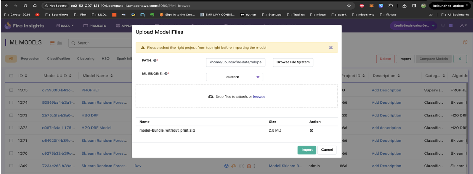
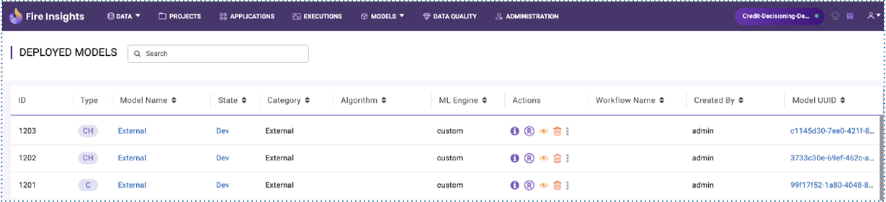
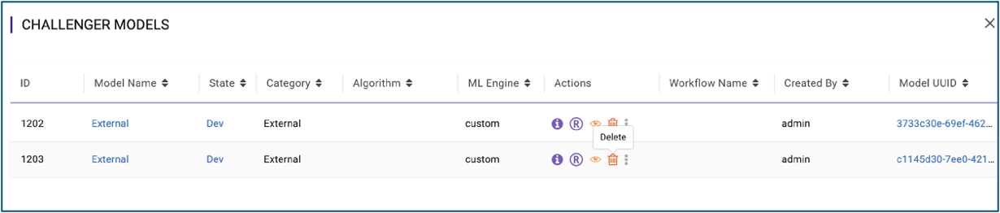

Model Deployment Options
=================

**Single Pane-of-Glass for deployment:**

- Deploy models trained using Sparkflows powerful ML Workflows leveraging 80+ No-Code / Low-Code Nodes.
- Deploy models trained using python scripts inside Sparkflows.
- Deploy model artifacts trained outside of Sparkflows platform (BYOM).

**Sparkflows supports various deployment targets:**

- Kubeflow
- AWS Sagemaker
- MLflow

Sparkflows enables importing external models:

**Champion and Challenger Models:**

Sparkflows allows end users to deploy a Champion model in Production and then challenge them using instances of Challenger Models.

