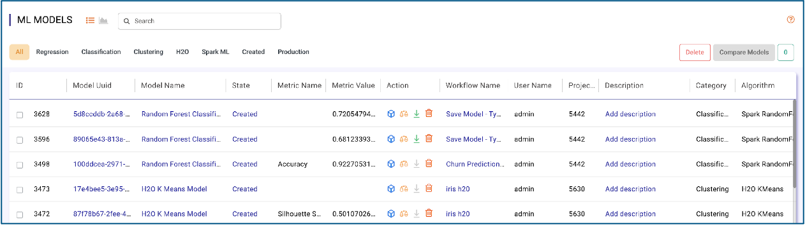
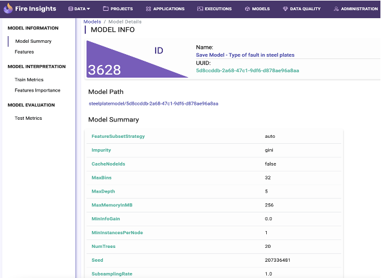
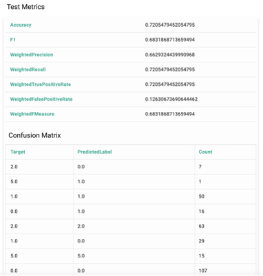
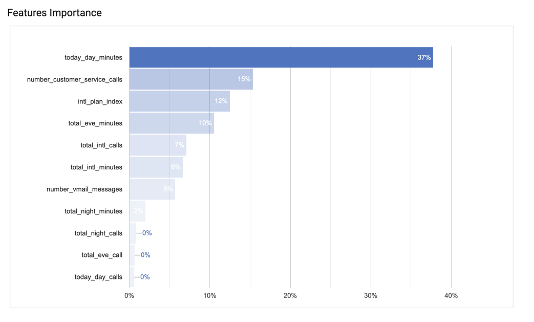

Model Management Dashboard
======================

**Sparkflows Model Management Dashboard Actions:**

- Explore and search models created by different workflows in different projects by different users.
- View model details.
- Check performance metrics.
- Compare multiple models.
- Perform various actions like register with MLOps server, deploy into endpoint, track model serving, monitor model and data drifts and define retraining policy.

**Model Info:**

Sparkflows allows users to drill down into a specific Model Run and view the Model Summary, Feature Importance, Training Metrics, Test Metrics, Confusion Matrix, ROC curve and other info.

