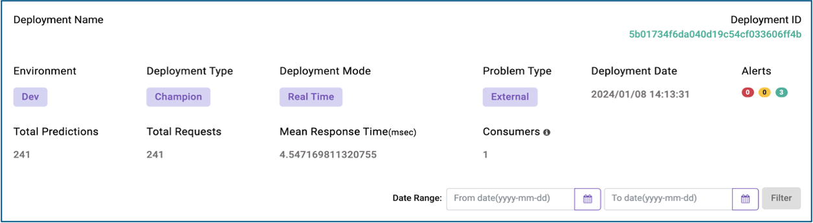

**Model Monitoring**

Once the model is deployed, Sparkflows monitoring module, provides the detailed info on environment, deployment type, deployment mode, problem type, alerts and all the metrics needed to keep a check on how model is being used and is performing over a period of time. 

Monitoring Metrics
- Predictions over time 
- Scoring latency over a period of time
- Number of rows scored over a period of time
- Model drift over time

