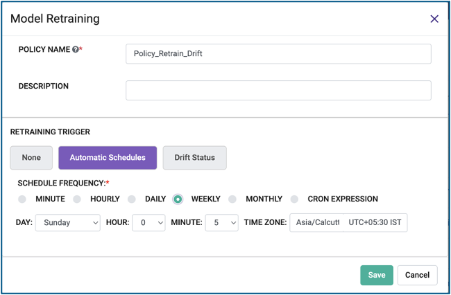

A policy can be attached to the model to trigger auto-retraining. This policy can be of types:

- time based: The auto-retraining will kick in at a particular time of day/month etc.
- model drift-based: Here the user needs to specify the drift threshold of PSI (default is 0.3) and the count of rows drifted, after which retraining should get triggered

   
.. image:: ../_assets/mlops/12_Model_Retraining_Policy.png
   :width: 45%
