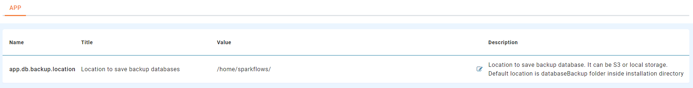
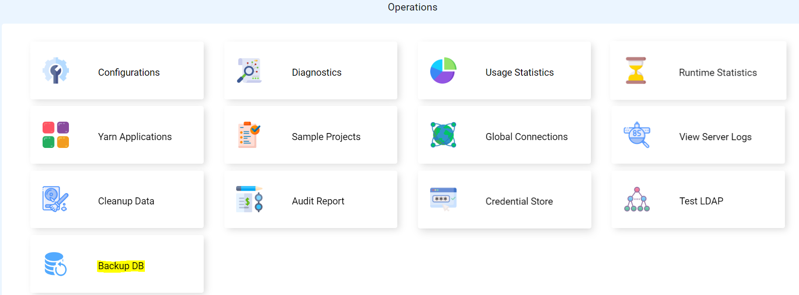
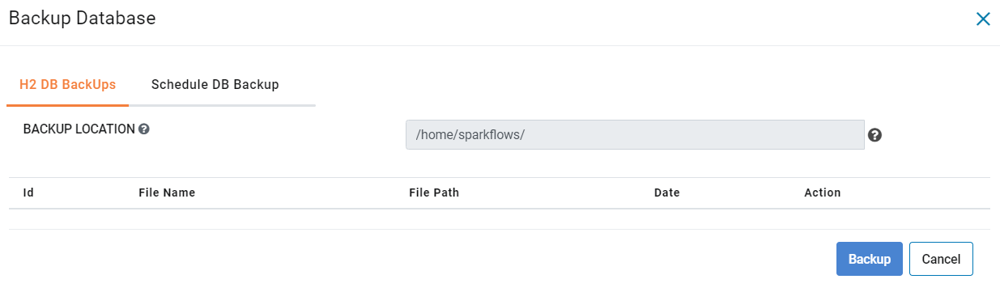
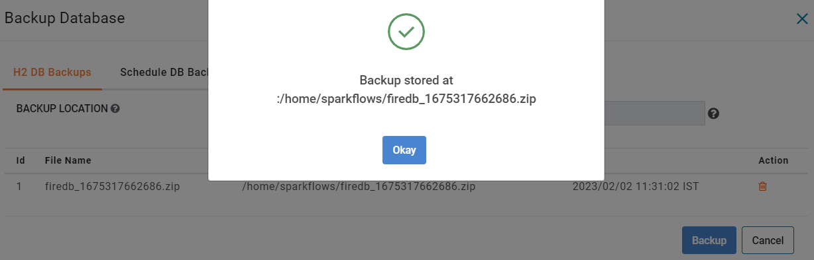
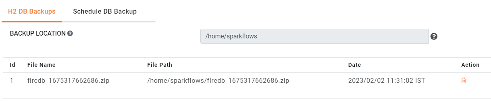
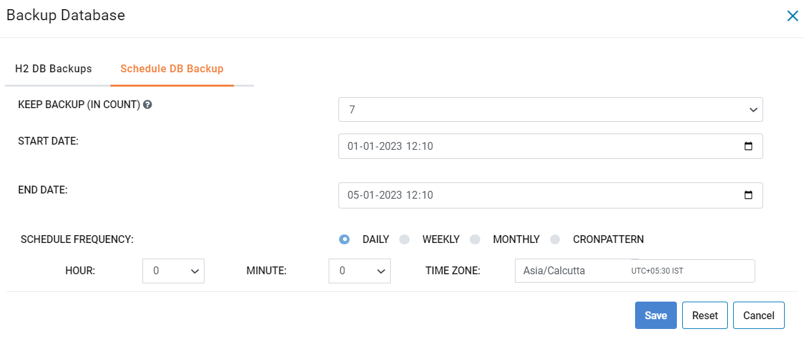

Backup and Recovery
------

This document explains the steps involved in backing up and recovering of data in Sparkflows using either H2 database (H2 DB) or MySQL Database (MySQL DB).

Data Storage on H2 DB and MySQL DB
==================================

Sparkflows stores the metadata into a Relational Database.

It comes with an embedded H2 database (H2 DB). It scales well for pretty heavy loads and upto 50 users. Sparkflows can be easily configured to run with a MySQL database.

When running with the H2 database, Sparkflows, by default, stores the database files in the user home directory which is running Sparkflows. There are 2 files :

- firedb.mv.db	
- firedb.trace.db

For backup, just copying these files to a backup location is enough. There is no need to stop Sparkflows. It is a good idea to copy it to another machine.

When configured with MySQL, the MySQL database named ``Fire`` needs to be backed up manually or by enabling RDS Auto Backup feature.

Automate Backup of H2 DB
================

This section enlists detailed steps for automate backup of H2 DB.

Sparkflows enables Administrator to avail options for Automate Backup of H2 DB from UI and can be stored on same VM or in S3 bucket if its accessible from Fire Inisghts Machine.

Below are the detailed steps. 

Login to update path for backup location
+++++++++++++++++++++++++

Login to ``Sparkflows`` application -> ``Administration`` -> ``Configurations`` -> ``app.db.backup.location`` -> and update path where you want to take backup:

::

    app.db.backup.location : /home/sparkflows

.. note:: The path updated should have sufficient permission to write. You may configure S3 bucket if Sparkflows have sufficient privilege to write.

Select Backup DB tab from the Operations page 
++++++++++++++++++++++++++++++

Go back to ``Administration`` -> ``Operations`` and select ``Backup DB``.

   
The below page would pop up soon after you click on ``Backup DB``.

Hit the Backup button
+++++++++++++++++++++++

Click on the ``Backup`` button to backup the H2 DB in a zip format and receive success message in a pop up window.

   

**Schedule the backup on daily, weekly or monthly basis**
+++++++++++++++++++++++++++++++++++++++++++++++++++++++

Click on ``Schedule DB Backup`` tab to be able to schedule the data and then hit the ``save`` button to save your preferences.

.. note:: Ideal to schedule on weekly basis.
