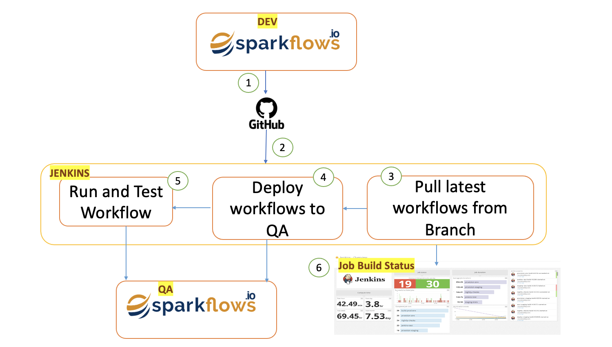

Continuous Integration with Jenkins
=======================

Job Configuration
------------

1. Create and configure a jenkins job to listen to the workflows development Git branch.

2. Configure the jenkins job to run a deployment script to copy the workflows to a target QA environment.

3. Configure the jenkins job to execute the workflow against the target QA environment.

4. Schedule the jenkins job to run at a specific time.

Job Trigger and Execution
--------------

1. Push a workflow from a Sparkflows Editor to the Git branch.

2. Jenkins job should be executed both by Git Commit trigger and the scheduled trigger.

3. The deployment script should be executed to copy the workflow into the target QA.

4. The workflow test script should be executed to run the corresponding jobs in the target QA.

CI/CD Process Flow
--------------

