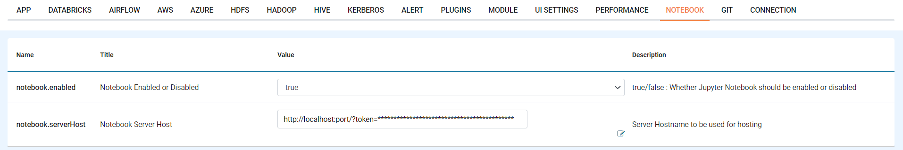

Using Jupyter
=============

Jupyter is extensively used by Data Scientists.

Overview
--------

Fire can be used to easily create a downsampled dataset. Fire provides a ``sample`` processor for it.

Once the dataset size has been reduced, Data Scientists can model with it in Jupyter.

Once the modeling process is complete, the algorithm can be run on the full data in Fire.

Fire Can be Configured to Jupyter Notebook, Below are steps involved in it:

1. Login to Fire web server url

Once Login to Fire web server url, Goto ''ADMINISTRATION -->> Configurations'' and Select ''NOTEBOOK''

Update Below Parameters:

::

    notebook.enabled : true
    notebook.serverHost : jupyternotebook server url which include token
    
.. note::  Make sure to change localhost to your domain name or your ip where Fire is running  and it should be accessible.   

