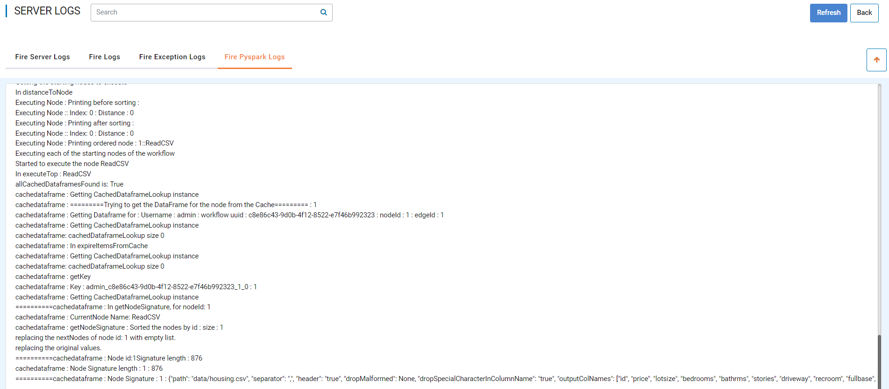
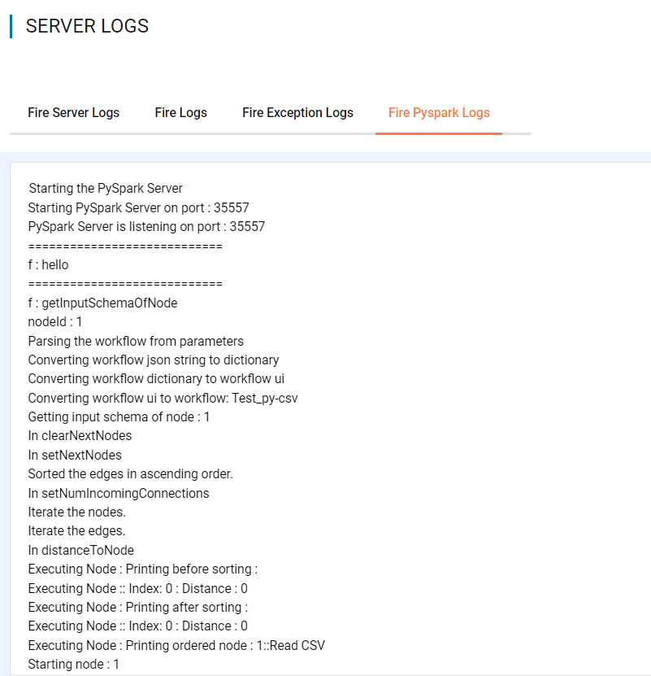

Logs for Fire Pyspark engine
-----

The logs for Fire PySpark engine go into "pyspark.log".

As an Administrator, the logs can be viewed from UI. Once you login with Fire Insights application, you need to go inside ``ADMINISTRATION >> View Server Logs``. 

   
Pyspark Logs:

::

    cd cd fire-x.y.z/log
    Search for pyspark.log

.. figure:: ../../_assets/configuration/logs/pyspark-log.PNG
   :alt: Logs
   :width: 70%

  

.. note:: You can view the logs by login to Fire Insights server as well.
   
