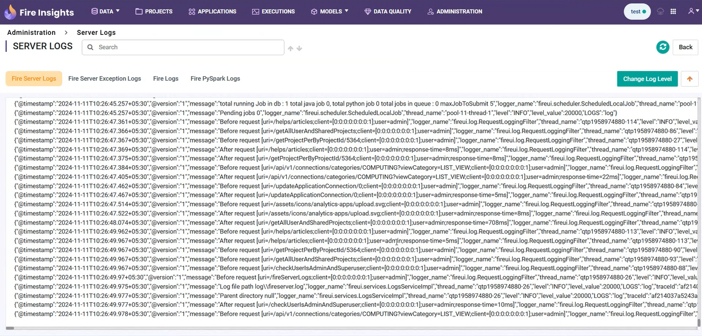

Logs in JSON Format
----------
Setting up the logs in JSON format

Update Log Configuration to JSON
+++++++

* Navigate to **Administration -> Configurations** and in the search bar type ``app.log.format`` to locate the log format configuration setting.

  .. note:: By default, this configuration is set to **text** format, as shown below.

  .. figure:: ../../_assets/configuration/logs/jsonlog2.png
     :alt: Logs
     :width: 70%

* Now edit ``app.log.format`` setting and change the value from **text** to **json** to enable JSON logs and save the configuration.

  .. figure:: ../../_assets/configuration/logs/jsonlog3.png
     :alt: Logs
     :width: 70%

Verify JSON Log Setup
+++++++

Once the configuration is set up, return to **Administration** and navigate to the **View Server Logs** page to review the logs.

   

 Below is a sample of logs in JSON format:

::

{"@timestamp":"2024-11-11T10:26:44.325+05:30","@version":"1","message":"========Received message size : 213","logger_name":"fireui.controllers.MessageSparkJobReceiverController","thread_name":"qtp1958974880-114","level":"INFO","level_value":20000,"LOGS":"log","traceId":"a2dd4af416383a72","spanId":"a2dd4af416383a72","transactionId":"[Tx-41689378-c82b-4a6c-a0b2-ec38ac4d4605]"}
{"@timestamp":"2024-11-11T10:26:44.337+05:30","@version":"1","message":"Changing Analysis Flow Execution Id: 44375 Status : 2 : new status : COMPLETED","logger_name":"fireui.alert.AnalysisFlowExecutionStatusUtil","thread_name":"qtp1958974880-114","level":"INFO","level_value":20000,"LOGS":"log","traceId":"a2dd4af416383a72","spanId":"a2dd4af416383a72","executionId":"wfeId=44375","jobId":"jobId=XXXX...859e","transactionId":"[Tx-41689378-c82b-4a6c-a0b2-ec38ac4d4605]","workflowId":"wfId=22402"}
{"@timestamp":"2024-11-11T10:26:44.342+05:30","@version":"1","message":"Start Time : 2024-11-11 04:56:26 UTC","logger_name":"fireui.alert.AnalysisFlowExecutionStatusUtil","thread_name":"qtp1958974880-114","level":"INFO","level_value":20000,"LOGS":"log","traceId":"a2dd4af416383a72","spanId":"a2dd4af416383a72","executionId":"wfeId=44375","jobId":"jobId=XXXX...859e","transactionId":"[Tx-41689378-c82b-4a6c-a0b2-ec38ac4d4605]","workflowId":"wfId=22402"}
{"@timestamp":"2024-11-11T10:26:44.342+05:30","@version":"1","message":"End Time : 2024-11-11 04:56:26 UTC","logger_name":"fireui.alert.AnalysisFlowExecutionStatusUtil","thread_name":"qtp1958974880-114","level":"INFO","level_value":20000,"LOGS":"log","traceId":"a2dd4af416383a72","spanId":"a2dd4af416383a72","executionId":"wfeId=44375","jobId":"jobId=XXXX...859e","transactionId":"[Tx-41689378-c82b-4a6c-a0b2-ec38ac4d4605]","workflowId":"wfId=22402"}
{"@timestamp":"2024-11-11T10:26:44.345+05:30","@version":"1","message":"Sending mail TO : FROM : rajtestspf@gmail.com","logger_name":"fireui.alert.SendEmail","thread_name":"qtp1958974880-114","level":"INFO","level_value":20000,"LOGS":"log","traceId":"a2dd4af416383a72","spanId":"a2dd4af416383a72","executionId":"wfeId=44375","jobId":"jobId=XXXX...859e","transactionId":"[Tx-41689378-c82b-4a6c-a0b2-ec38ac4d4605]","workflowId":"wfId=22402"}
