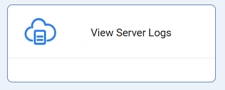
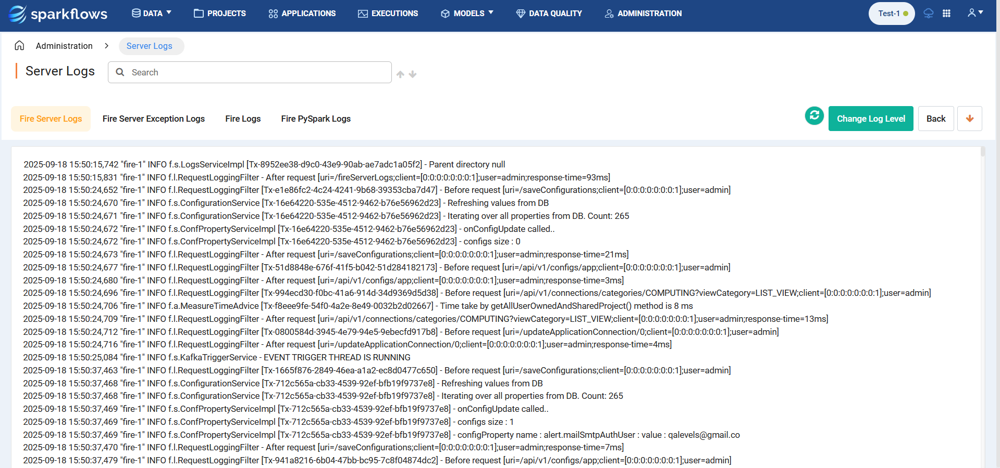
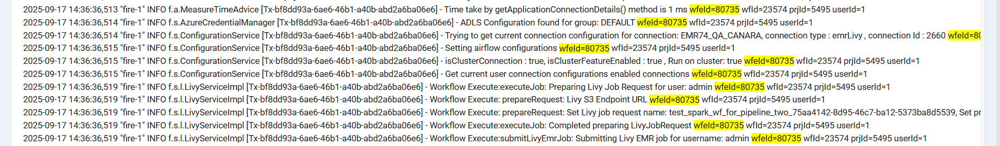
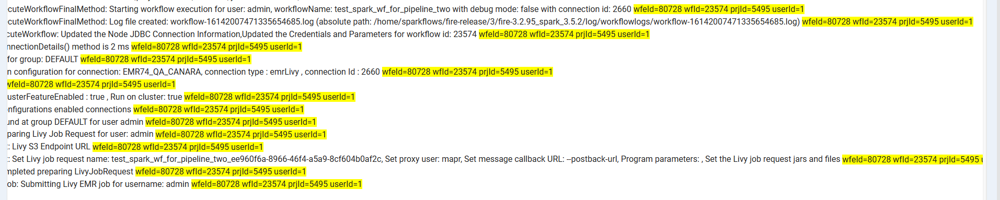
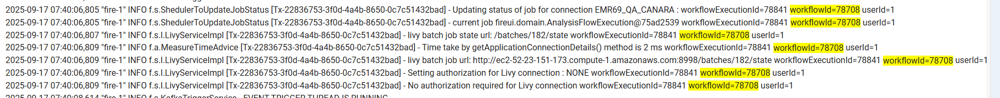
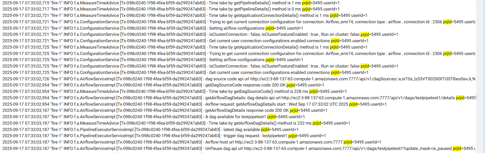

Logs Search Examples
----------

This document outlines ways to search and track logs using specific patterns for some common scenarios. In order to search for specific logs the user would have to navigate to **Administration** and click on **View Server Logs** where the user can search for specific logs as needed.

Tracking Logs Using Patterns
====

**Pipeline Logs**
++++++++++++++++

Example 1

1. When a user executes a pipeline on an Airflow connection, they can navigate to **Pipeline → Executions** page and get the pipelineExecutionId, as shown below:

   .. figure:: ../../_assets/configuration/logs/logs-pipeline-execution-page.png
            :alt: Logs
            :width: 70%

2. Next, the user can copy the ID of the pipeline execution and search for the pattern given below in Server Logs, through which the user can access all logs of that specific Pipeline Execution.

   **Ex Pattern: [PipelineExecution] pipelineExecutionId=161120**

3. Now, the user can see the enhanced log entries generated during pipeline executions i.e. Pipeline Starting, Pipeline Queued, and Pipeline Completed entries.

   * **Pipeline Starting Log Entry**

     :: 
   
         [PipelineExecution] pipelineExecutionId=161120 | Current Status=STARTING | PipelineId=9805 | ProjectId=4878 | ConnectionId=259 | Current Status=STARTING pipelineExecutionId=161120

     .. figure:: ../../_assets/configuration/logs/logs-pipeline-execution-start-1.PNG
            :alt: Logs
            :width: 70%

     .. figure:: ../../_assets/configuration/logs/logs-pipeline-execution-start-2.PNG
            :alt: Logs
            :width: 70%

   * **Pipeline Queued Log Entry**

     ::

         [PipelineExecution] pipelineExecutionId=161120 | Current Status=QUEUED | PipelineId=9805 | ProjectId=4878 | ConnectionId=259 | Current Status=QUEUED pipelineExecutionId=161120

     .. figure:: ../../_assets/configuration/logs/logs-pipeline-execution-queued.PNG
            :alt: Logs
            :width: 70%

   * **Pipeline Completed Log Entry**

     ::

        [PipelineExecution] PipelineExecutionId=161120 | Current Status=COMPLETED | pipelineId=9805 | ProjectId=4878 | ConnectionId=259 | ExecutionItemId=433873 | ExecutionItemName=testlist | State changed: STARTING -> COMPLETED pipelineExecutionId=161120

     :: 

         [PipelineExecution] PipelineExecutionId=161120 | Current Status=COMPLETED | pipelineId=9805 | ProjectId=4878 | ConnectionId=259 | All pipeline execution items finished. Updating parent pipeline execution. pipelineExecutionId=161120

     ::

         [PipelineExecution] PipelineExecutionId=161120 | Current Status=COMPLETED | PipelineId=9805 | ProjectId=4878 | ConnectionId=259 | DagId=test_pipeline_retry_and_delay_print_dag_argument_tagNov_2725 | Pipeline execution state updated to COMPLETED and end time set pipelineExecutionId=161120

     .. figure:: ../../_assets/configuration/logs/logs-pipeline-execution-completed.PNG
            :alt: Logs
            :width: 70%

Example 2
++++
A user can track a group of related logs using a **Transaction ID**, which remains the same across all logs for a specific transaction. To trace the logs for a particular transaction, the user would first identify the initial log entry of interest, then use its **Transaction ID** to retrieve the complete set of logs associated with that transaction.

**Step 1: Locate the Initial Log Entry Using Execution ID**

    1. If a user wants to track or view the logs for a pipeline executed on airflow connection, first the user would execute the pipeline. 

     .. figure:: ../../_assets/configuration/logs/Ex1-execute-pipeline-logs.png
        :alt: Logs
        :width: 70%

    2. Then the user navigates to **Pipeline → Executions** page from where the pipeline’s Execution ID will be visible. Copy this ID.

     .. figure:: ../../_assets/configuration/logs/Ex1-pipeline-execution-id.png
        :alt: Logs
        :width: 70%

    3. Next, the user navigates to **Administration → View Server Logs** page and in the search bar paste the ID and find the logs for pipeline execution **78224**, then to find the initial log entry refer to the example given below which was the first log for the pipeline execution.

     .. figure:: ../../_assets/configuration/logs/Ex1-first-log-pipeline.png
        :alt: Logs
        :width: 90%

**Step 2: Retrieve All Related Logs Using Transaction ID**

    1. The user then copies the complete unique pattern **Tx-4bb18174-95aa-4ed4-9341-3ff12694b8e0** seen at the starting of the above log and pastes it in the search bar to get all the logs for the pipeline execution. 

    2. The user can also see the state of the pipeline:

        * **Succeeded**

         .. figure:: ../../_assets/configuration/logs/Ex1-tx-id-pipeline.png
            :alt: Logs
            :width: 70%

        * **Failed** 

         .. figure:: ../../_assets/configuration/logs/Ex1-tx-id-failed-pipeline.png
            :alt: Logs
            :width: 70%

Example 3
++++
1. When a user executes a pipeline on an Airflow connection, they can navigate to **Pipeline → Executions** page and get the pipelineExecutionId, as shown below:

   .. figure:: ../../_assets/configuration/logs/Ex2-pipeline-execution-id.png
            :alt: Logs
            :width: 70%

2. Next, the user can copy the ID of the pipeline execution and search for the pattern given below, through which the user can access all logs of that specific Pipeline Execution.

   **Ex Pattern: pipelineExecutionId=78224**

   .. figure:: ../../_assets/configuration/logs/Ex2-pipeline-execution-id-logs.png
            :alt: Logs
            :width: 70%

   Through the unique **Transaction Id** present at the start of the first occurrence of **pipelineExecutionId=78224** user can also get the state of the pipeline.

Example 4
++++
1. A user can even get each and every log line for a specific pipeline execution by searching just the pipeline execution id like below:

   **Ex: 78225 (pipeline execution id)**

   .. figure:: ../../_assets/configuration/logs/Ex3-pipeline-execution-id.png
            :alt: Logs
            :width: 70%

**Workflow Logs**
++++++++++++++++++

Example 1
++++
A user can track a group of related logs using a **Transaction ID**, which remains the same across all logs for a specific transaction. To trace the logs for a particular transaction, the user first would identify the initial log entry of interest, then use its **Transaction ID** to retrieve the complete set of logs associated with that transaction.

**Step 1: Locate the Initial Workflow Log Entry Using Execution ID**

    1. If user wants track or view the logs for a workflow executed on a Livy connection, first the user will execute the workflow.

     .. figure:: ../../_assets/configuration/logs/Ex4-workflow-execute-page.png
            :alt: Logs
            :width: 70%

    2. Then the user will navigate to **Workflows → Executions** page from where the workflow’s execution ID will be visible and copy it.

     .. figure:: ../../_assets/configuration/logs/Ex4-workflow-execution-id.png
            :alt: Logs
            :width: 70%

    3. Next, the user will navigate to **Administration → View Server Logs** Page and in the search bar paste and find the logs for workflow execution **wfeId=80733**, to find the initial log entry as seen in the example below which was the first log for the workflow execution:

      .. figure:: ../../_assets/configuration/logs/Ex4-first-log-workflow.png
            :alt: Logs
            :width: 70%

**Step 2: Retrieve All Related Workflow Logs Using Transaction ID**

    1. The user then copies the complete unique pattern **Tx-d2edeefa-e87e-448c-a6da-30493f438e39** seen at the starting of the above log and pastes it in the search bar to get all the logs for the workflow execution. 

     .. figure:: ../../_assets/configuration/logs/Ex4-Tx-id-workflow.png
            :alt: Logs
            :width: 70%

    2. The user can also see the state of the workflow that shows **COMPLETED** as seen in the below screenshot.

       To check this user can search for the Log Pattern as given below:

       **Ex Pattern - Changing Analysis Flow Execution Id: 80733**

      .. figure:: ../../_assets/configuration/logs/Ex4-success-workflow.png
            :alt: Logs
            :width: 90%

    3. The user can also see the state of the workflow that shows **FAILED** as seen in the below screenshot 

       To check this user can search for the Log Pattern as given below:

       **Ex Pattern - Changing Analysis Flow Execution Id: 80734**

      .. figure:: ../../_assets/configuration/logs/Ex4-failed-workflow.png
            :alt: Logs
            :width: 90%

Example 2
++++
A user can get the logs of a workflow execution along with the state of the execution using the below Log Pattern on **Administration → View Server Logs** search bar and also get the status of the workflow. 

**Ex Pattern: wfeId=80735**

The user can also view the status of the workflow execution as shown in the below screenshot:

Example 3
++++
A user can get logs for a specific workflow execution by using a combined pattern in **Administration → View Server Logs** search bar:

::
    
    wfeId : Workflow Execution Id
    wfId : Workflow Id
    prjId : Project Id
    userId : User Id

**Ex Pattern : wfeId=80728 wfId=23574 prjId=5495 userId=1**

Example 4 
++++
A user can also get logs related to a specific workflow by searching with the following pattern in **Administration → View Server Logs** search bar:

**Ex Pattern : workflowId=78708**

**User Logs**
++++++++++++++

Example 1
++++
A user can get a specific User’s logs by searching for the pattern given below on **Administration → View Server Logs** search bar:

    * By User ID

      **Ex Pattern: userId=1**

      .. figure:: ../../_assets/configuration/logs/Ex6-logs-user-id.png
          :alt: Logs
          :width: 70%

    * By Username

      **Ex Pattern: user=username (Ex: user=admin)**

      .. figure:: ../../_assets/configuration/logs/Ex6-logs-user-name.png
          :alt: Logs
          :width: 70%

**Project Logs**
++++++++++++++++++

Example 1
++++
A user can get the logs for a specific project by using the pattern given below on **Administration → View Server Logs** search bar:

**prjId**: Project Id

**Ex Pattern : prjId=5495**

