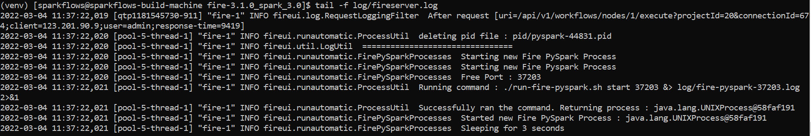
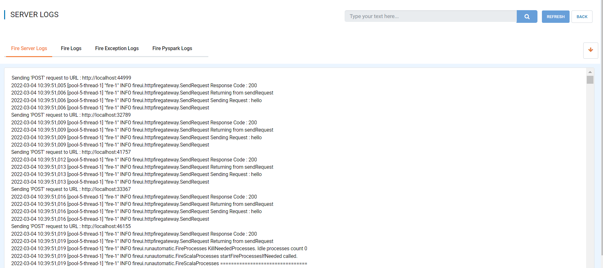
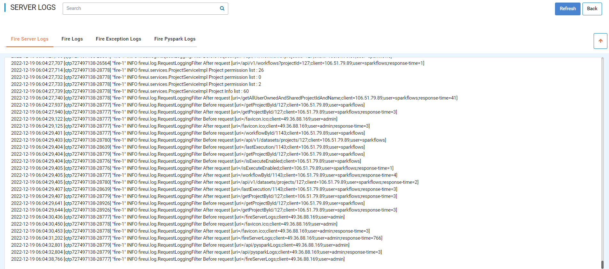
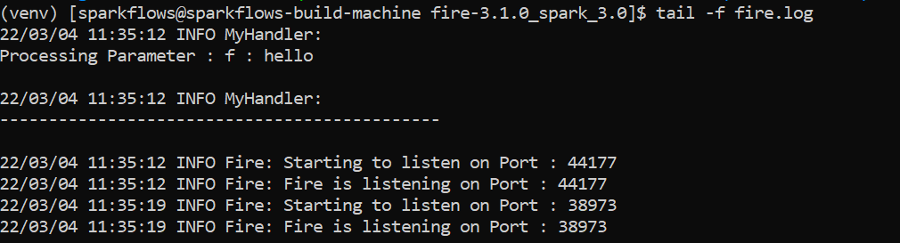
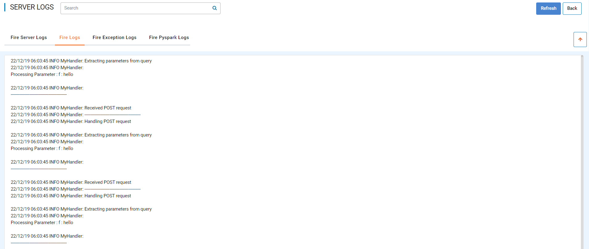
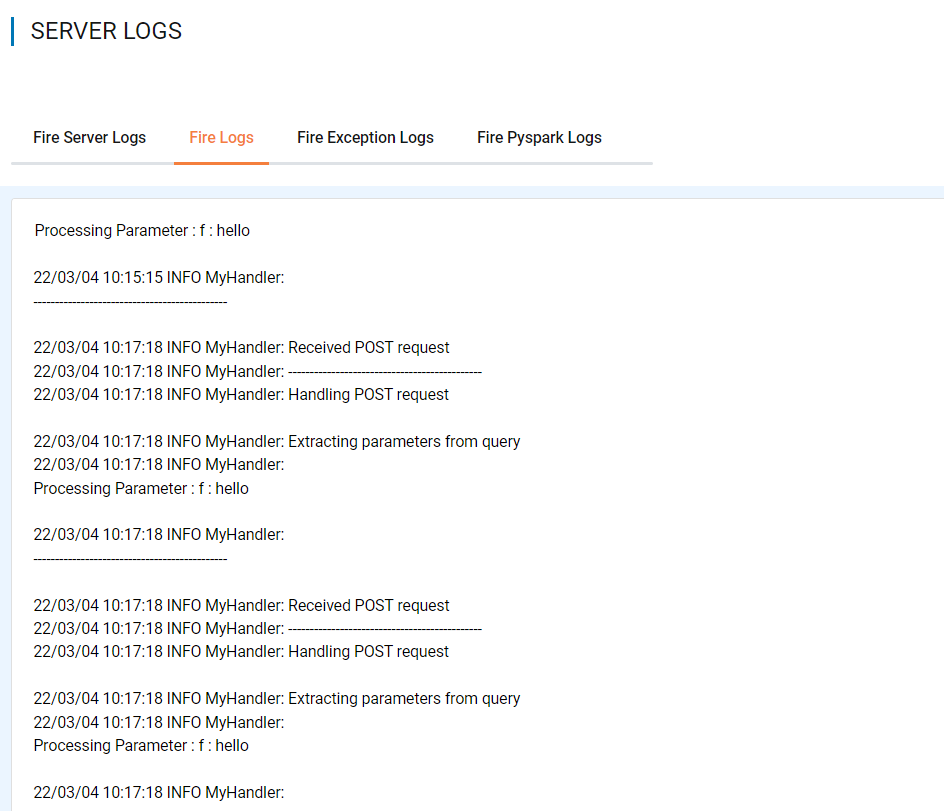
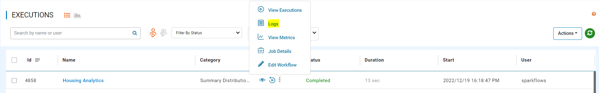
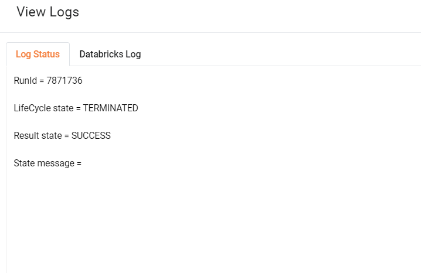
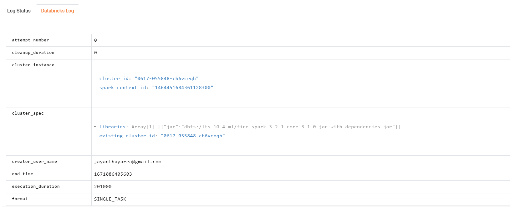

Logs
=======

Below is the list of 3 processes that run in Fire Insights :

* Fire server
* Fire Scala engine
* Fire PySpark engine (If PySpark is configured.)

You can view the logs for each process either by logging into the VM where Fire Insights is installed or through the UI with admin access.

Logs for Fire Server
----------

From the VM
+++++++

You can view the logs from vm on which Fire Insights is running from below location:

Fire server Logs:

::

    cd fire-x.y.z/log/
    Search for fireserver.log, where you can view fireserver logs.
    

Logs from UI
+++++

You can view the logs from UI if you have admin access.

Below are steps involved in it:

Go to Administrations page and select View Server Logs, it will open new windows which display all the Logs ie. ''Fire Server Logs, Fire Logs, Fire Exception Logs & Fire Pyspark Logs'' respectively.

Logs for Fire Web Server
+++++

The logs for Fire web server go into "fireserver.log". The logging level is determined by the properties file "conf/logback-spring.xml".

As an administrator, the logs can be viewed from UI. Once you login with Fire Insights application, you need to go inside ``ADMINISTRATION >> View Server Logs``. 

   
Changing the Various Logging Levels
++++++++++++++++++++++++++++++++++++++++

You can change the logging levels to ``debug`` mode by updating "conf/logback-spring.xml" file using the below and restart the Fire server:

::

    <!-- LOG "org.springframework.web" at ERROR level -->
    <logger name="org.springframework.web" level="DEBUG"
        additivity="false">
    <appender-ref ref="RollingFile" />
    <appender-ref ref="Console" />
    <appender-ref ref="SevereRollingFile" />
    </logger>

If using Fire in Docker, along with the above change to setting the level to "DEBUG", you would need to pass ``logback-spring.xml`` in ``entrypoint.sh`` instead of ``log4j.properties`` (default)::

    -Dlog4j.configuration=file:conf/logback-spring.xml

    
Logs for Fire Scala Engine
--------

Fire Logs:

::

    cd cd fire-x.y.z
    Search for fire.log
    

Logs for Fire Engine
--------------------

The logs for Fire engine go into "fire.log". 

As an administrator, the logs can be viewed from UI. Once you login using Fire Insights application, you need to go inside ``ADMINISTRATION >> View Server Logs``. 

   
Logs for Fire Pyspark engine
-----

The logs for Fire PySpark engine go into "pyspark.log".

As an Administrator, the logs can be viewed from UI. Once you login with Fire Insights application, you need to go inside ``ADMINISTRATION >> View Server Logs``. 

.. figure:: ../../_assets/operating/operations/fire-pyspark-logs.PNG
   :alt: connection
   :width: 60%
   
Pyspark Logs:

::

    cd cd fire-x.y.z
    Search for pyspark.log

.. figure:: ../../_assets/configuration/logs/pyspark-log.PNG
   :alt: Logs
   :width: 70%

.. figure:: ../../_assets/configuration/logs/pyspark_log.png
   :alt: Logs
   :width: 70%
  

.. note:: You can view the logs by login to Fire Insights server as well.
   

Logs for Job Submitted on the Cluster
--------------------

Fire enables you to view the logs for job submitted on the cluster from UI. As an user, you can view the logs while running any workflow as below. You can go to "executions page" and click on ''three dots'' and logs option will be available.

   

   

   
.. note:: Above example is shown for the job submitted on Databricks cluster.

::

    Note: The log directory is configurable through the properties file(conf/application/properties), with the property name set as logs.dir.
