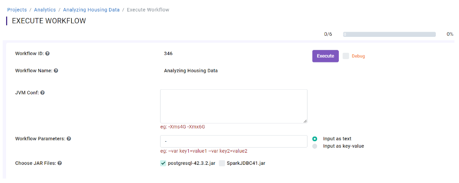

Running Workflows using the Dependent Jars
---------------------------

When running workflows which depend on the External third party JAR file, select the checkbox for that JAR file in the Workflow Execution Page and Execute the workflow.

