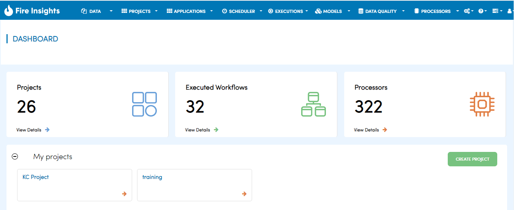

Step 1: Create an Application
==============================

Before you can start creating a workflow, you will need to create an 'Application'. Application is a bucket where all your artifacts such a datasets, workflows, dashboards etc. related to a project would reside. Applications are equivalent to workspaces in IDEs. 

From the landing page of Fire Insights, click on "Create Application" to create a new application.

.. figure:: ../_assets/tutorials/quickstart/2.PNG
   :alt: Quickstart
   :align: center
   :width: 60%

Specify name and description, and click on "Create/Update" button. The new application is created and it is now ready to use.  

.. figure:: ../_assets/tutorials/quickstart/3.PNG
   :alt: Quickstart
   :align: center
   :width: 60%
