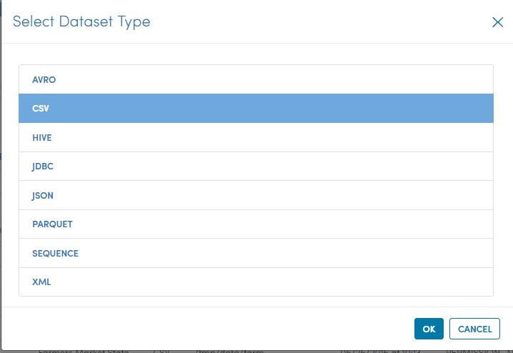

Step 3 : Create a Dataset
----------------

In this step, create a dataset over customers housing data. Creating a Dataset allows us to define it once and use it various workflows.

The steps involved in creating a dataset are:

- *Go to the Application where you want create dataset*
- *Go to the Dataset Listing Page*
- *Click on Create New Dataset*
- *Enter the fields in the dialog for the file for which we are creating the Dataset*
- *Update the schema of the Dataset*
- *Save the Dataset with a new name*

Customer Housing Data
=========================

The data is in CSV format.

Below are a few records from the data::

.. figure:: ../../_assets/tutorials/dataset/2.PNG
   :alt: Dataset
   :align: center
   :width: 60%
   
   
Go to the Dataset Listing Page
==============================

 .. figure:: ../_assets/tutorials/dataset/1.PNG
   :alt: Dataset
   :align: center
   :width: 60%

Click on Create Dataset
=======================

Click on the ``Create Dataset`` link to get started with creating the new dataset.

Enter the Field Details
=======================

Enter the fields below into the form. Below are the details of the fields:

- **NAME** : Name of the New Dataset we are creating.
- **DESCRIPTION** : Description of the New Dataset.
- **HAS HEADER ROW** : This is used for CSV/TSV files. It indicates whether the dataset has a header row specifying the name of the columns or not.
- **DELIMITER** : Delimiter field is also used for CSV/TSV files. It indicates the delimiter to be used between the fields in the data.
- **PATH** : Path for the location of the file or directory containing the data files for the Dataset.

 
 .. figure:: ../_assets/tutorials/dataset/3.PNG
   :alt: Dataset
   :align: center
   :width: 60%
 
 
Update the Schema of the Dataset
================================

Now click on ``Update`` to update the Schema of the Dataset. It would display sample data for the dataset followed by the Schema.

In this case, the data file did not have a header row. So Fire gave it standard column names of ``C0, C1`` etc.

You can update the column names in the schema based on your data.
 
 .. figure:: ../_assets/tutorials/dataset/4.PNG
   :alt: Dataset
   :align: center
   :width: 60%
   

Save the New Dataset
====================

Now click on ``Save`` to save the new Dataset created.
 
 
 
 
 
 
 
 

