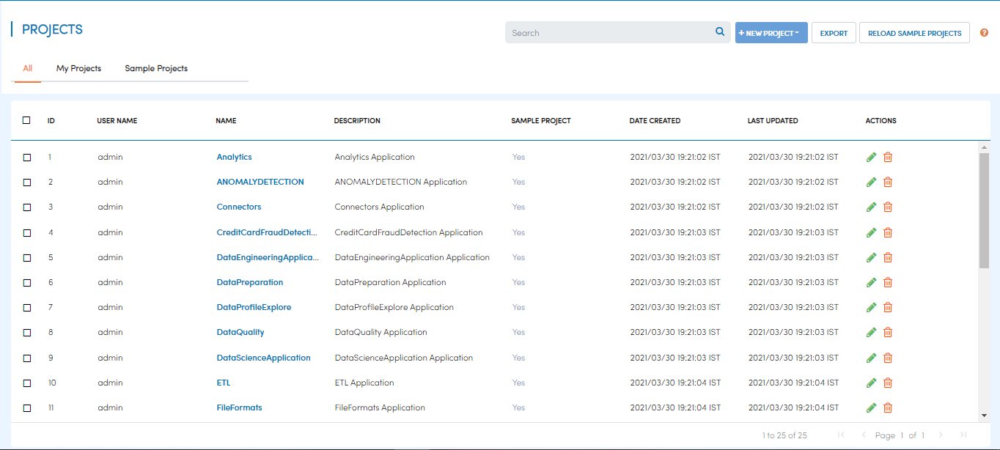
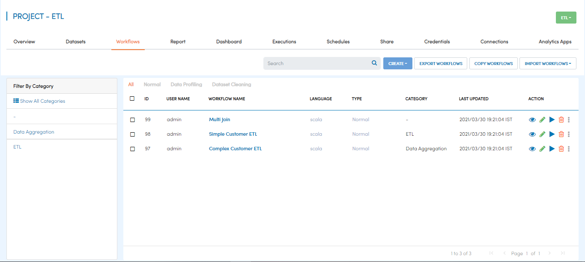
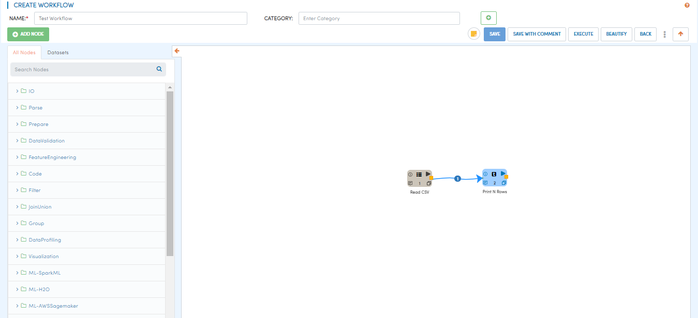

Step 4 : Create Workflow
------------

After you have created the datasets, you can start to build a workflow to process them. 

A typical workflow will take one or more dataset, clean them and join them to create an enriched dataset. After the enriched dataset is created, the workflow can perform steps to build machine learning models.

At at highlevel,creating a workflow involves the following steps:

- *Open the Application where you want to create your workflow*
- *Click "Workflows" tab*
- *Click "Create" button and choose the kind of workflow you want to create*
- *Click the processors on the left hand side pane to add them in the Workflow Canvas*
- *Configure and connect the processors to route data from one processor to another*
- *Name the workflow and save it*

Application
=======================
Open the application where you want to create your new workflow.

Workflows Tab
============================
Click of "Workflows" tab to see the list of workflows already in the application. The workflow list will be empty if no workflows have been created ealier. 

Create Empty Workflow
========================

Click "Create" and choose the type of workflow you want to create. In the "Create Workflow" page, enter a name, category and description of the workflow. Category is used to group various workflows. For instance, if you have various workflows for customer reports, the category could be "Customer Reports".

Click save to save the empty workflow.

Build Workflow
===================

After you have saved the empty workflow, you can start adding processors to process the datasets that you had defined earlier. Click on the processors on the left hand side pane. This will make the processor appear on workflow canvas. Add other procesors as needed, configure and connect them.  Two processor can be can be connected by clicking on the yellow box in the first processor and dragging to the second processor. 

Save Workflow
=================

Once you are satisfied with your workflow, dave the workflow by clicking on 'Save' button.

Each time the workflow is saved, a new version of workflow is created.

