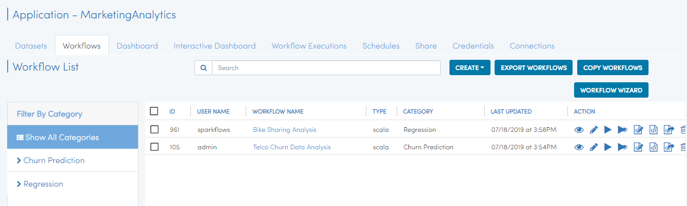
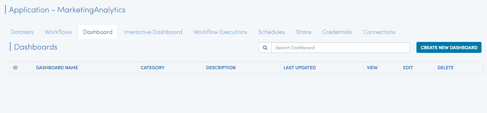
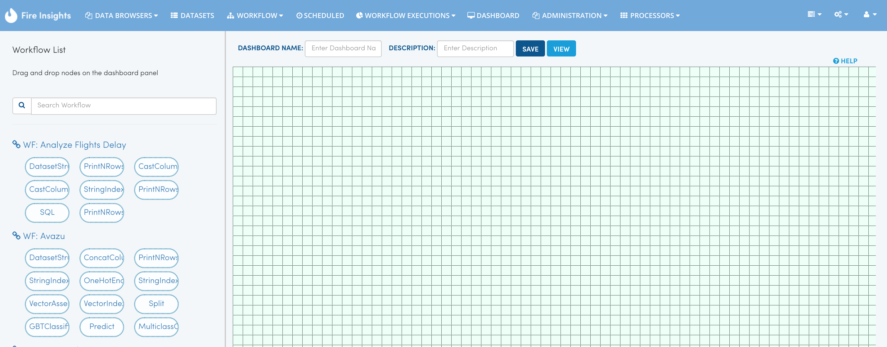
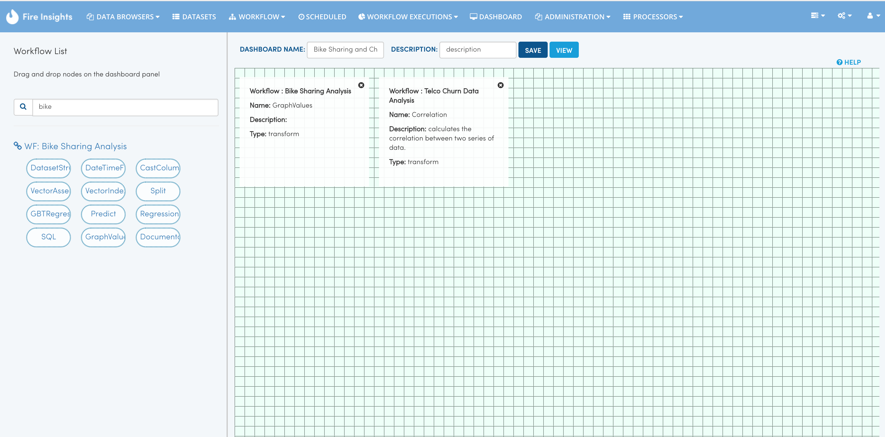

Step 6 : Create New Dashboard
------------------

Dashboards allow you to display the output of multiple workflows in one place to be viewed.

The steps involved in creating a dashboard are:

- *Go to Application page where you want to Create Dashboard*
- *Go to Dashboard page*
- *Click on Create New Dashboard*
- *Drag and drop selected Nodes from the workflows into the Dashboard canvas*
- *Save the Dashboard*

Go to Application page
======================

Open Application from where you want to Create Dashboard

Go to Dashboards page
=====================

Select Dashboard tab will take to Dashboard page

   
Click on Create New Dashboard
=============================

This would open up the Dashboard Designer Page.

   
   
Name the Dashboard
==================

Give a ``name`` to your Dashboard. You can also add a description for the New Dashboard.

Drag and drop selected Nodes from the workflows into the Dashboard canvas
===================================

On the LHS of the Dashboard Designer, the list of workflows would show up. With each Workflow, the Nodes inside the Workflow would be displayed.

Nodes inside the workflow can be dragged and dropped onto the Dashboard to make them part of the Dashboard.

In the Dashboard below we have added 2 nodes to the Dashboard.

Save the Dashboard
==================

Finally ``Save`` the Dashboard.

In order to view the Dashboard, click on the 'View' button.
 
 
View the Dashboard
==================

Click on the ``View`` button to view the dashboard.

The Dashboard shows the content from the latest execution of the Workflow.

If the workflow has never been executed, the Dashboard would show empty content.

.. figure:: ../_assets/tutorials/04/dashboard-view-1.png
   :scale: 100%
   :alt: Dashboard Designer
   :align: center
   
 
 
 
 

