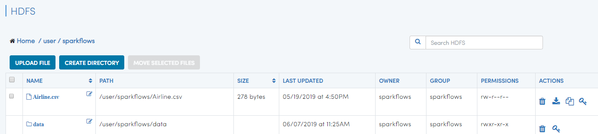
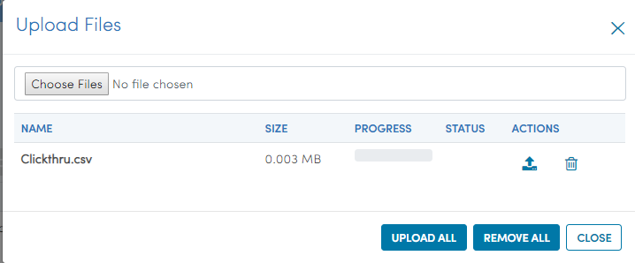
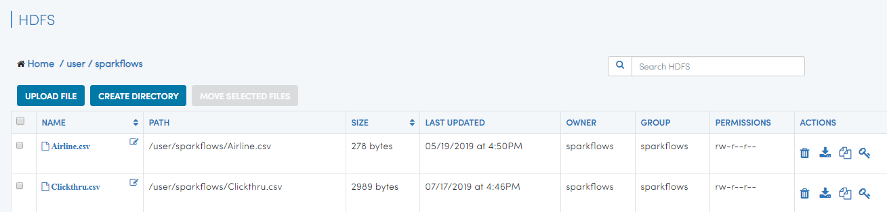

Step 2 : Upload Data Files
===========================

Every workflow needs data to work on. As a next step, you will upload a CSV file that you want to process in your workflow.

If you have your data in CSV file, click on "Data Browsers" and select "HDFS". Your home directory will be displayed. Initially, it will be empty as you have not uploaded any file. 

Click on "Upload File" button. Choose one or more CSV files that you want to upload. 

After selecting the files, click "Upload All". 

   

In order to use CSV files in workflow, Fire Insights requires that you wrap them in datasets. In the next step, you will create datasets from the files you have just uploaded.   
