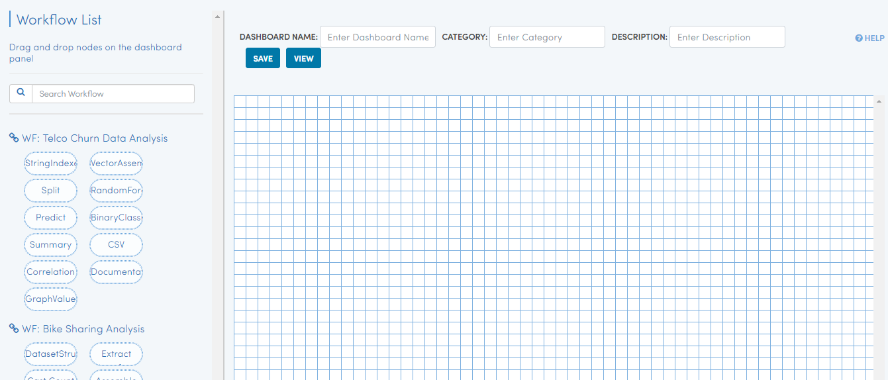
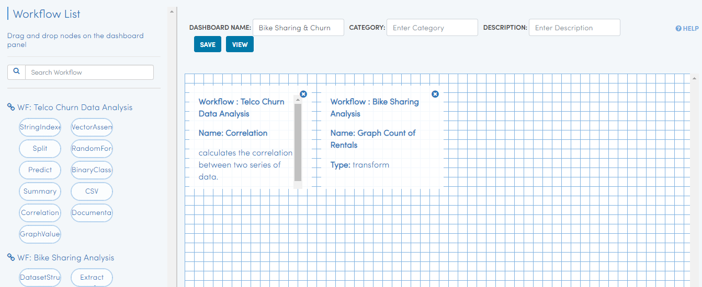
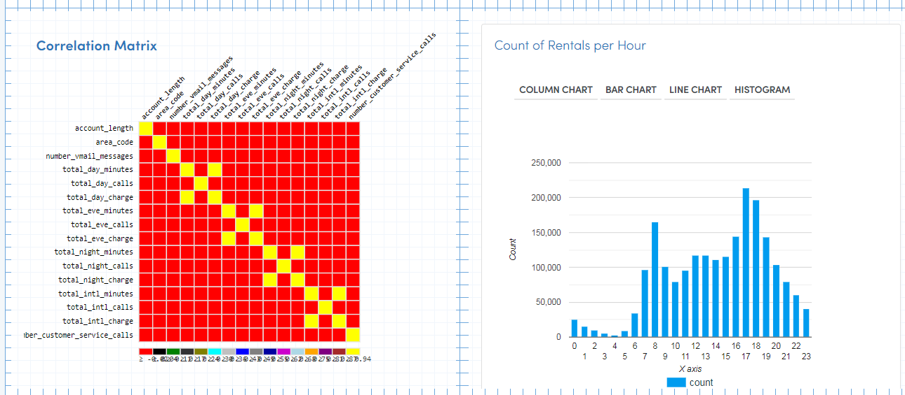

Step 6 : Create Dashboard
------------------

Dashboards allow you to display the output of multiple workflows in one place.

The steps involved in creating a dashboard are:

- *Go to Dashboard tab*
- *Click on Create New Dashboard*
- *Drag and drop selected Nodes from the workflows into the Dashboard canvas*
- *Save the Dashboard*

Dashboards 
=====================

Select Dashboard tab will take to Dashboard page

.. figure:: ../_assets/tutorials/quickstart/11.PNG
   :alt: Dashboard
   :align: center
   
Create Dashboard
=============================

This would open up the Dashboard Designer Page.

   
   
Name Dashboard
==================

Give a name to your dashboard. You can also add a description for the new dashboard.

Build Dashboard
===================================

On the left hand side of the Dashboard Designer, the list of workflows would show up. With each Workflow, the nodes inside the Workflow would be displayed.

Nodes inside the workflow can be dragged and dropped onto the dashboard to make them part of the dashboard.

In the dashboard below we have added two nodes to the dashboard.

   

Save Dashboard
==================

Finally save the dashboard.

In order to view the dashboard, click on the 'View' button.
 
 
View Dashboard
==================

Click on the  'View' button to view the dashboard.

The dashboard shows the content from the latest execution of the workflow.

If the workflow has never been executed, the dashboard would not show anything.

   
 
 
 
 

