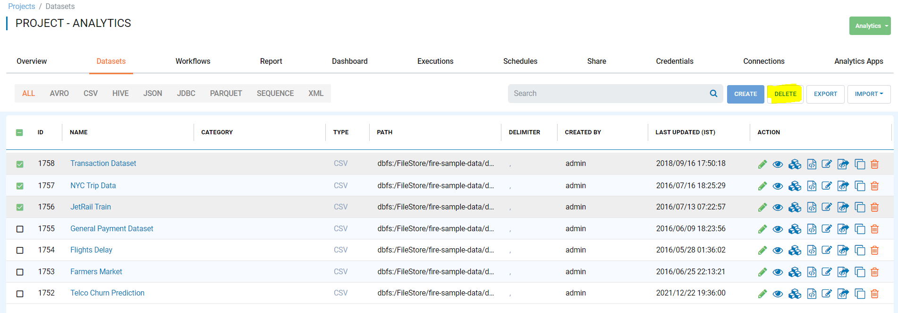
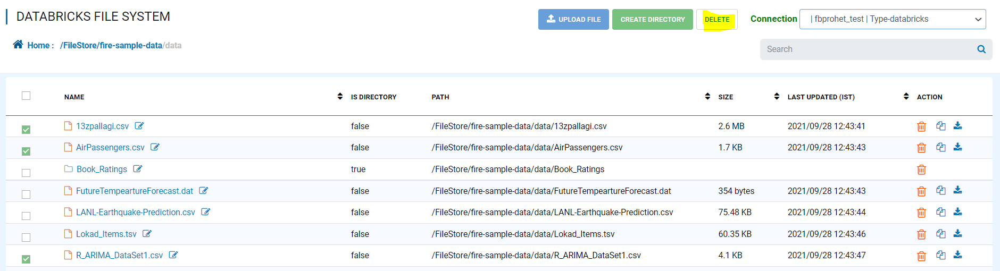
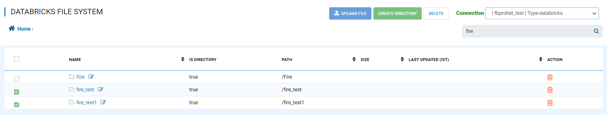
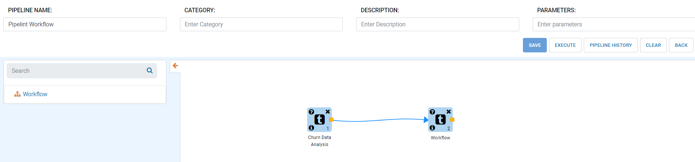
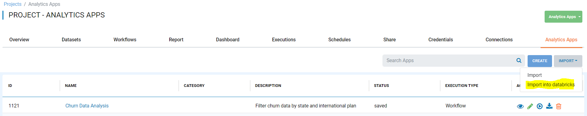
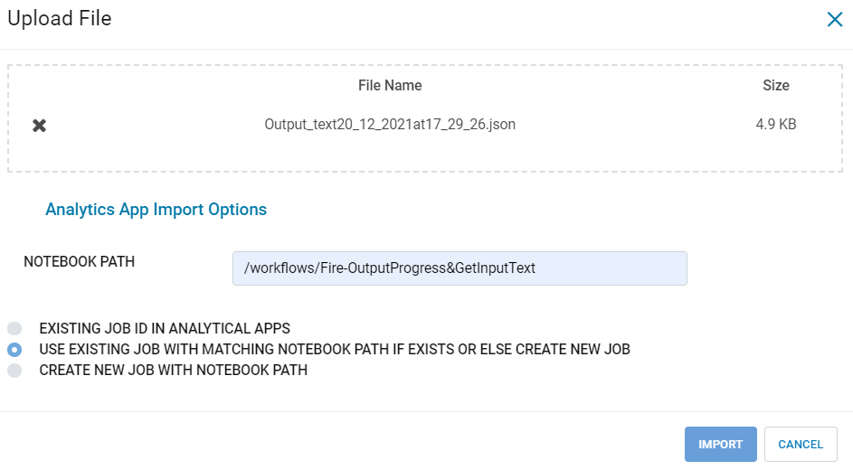

December 2021 (Version 3.1.45)
==============

Datasets
+++++++

Fire Insights enables you to delete multiple Datasets.

DBFS
+++++++

Fire Insights enables you to delete multiple files.

Fire Insights enables you to delete multiple folders.

UI Upgrades
++++++++++

UI upgrades for Pipeline Editor

Analytics Application
+++++++++++++++

Fire Insights enables you to Import Analytics Application with Databricks Notebook Path.

   

   
Generate Pyspark Code
+++++++

Fixes and Includes more spark Nodes for Generate Pyspark Code.
