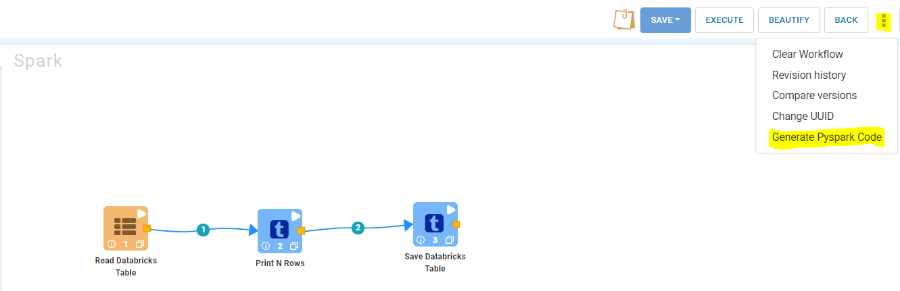
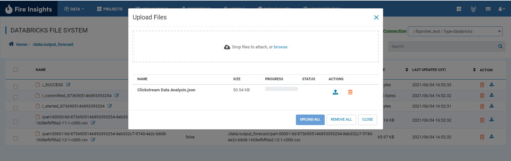
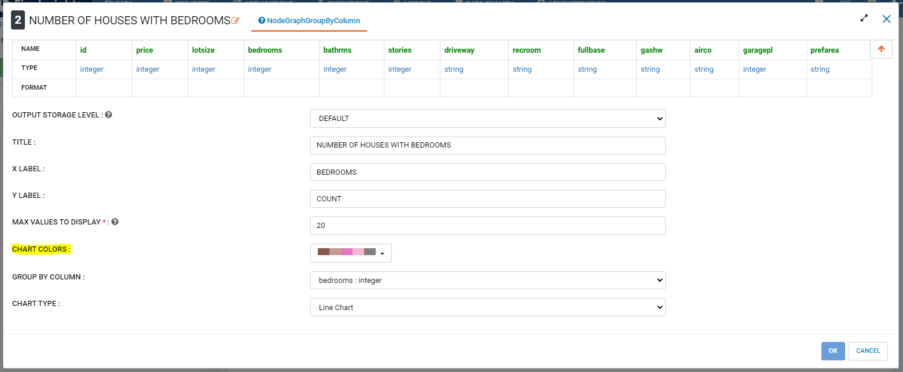
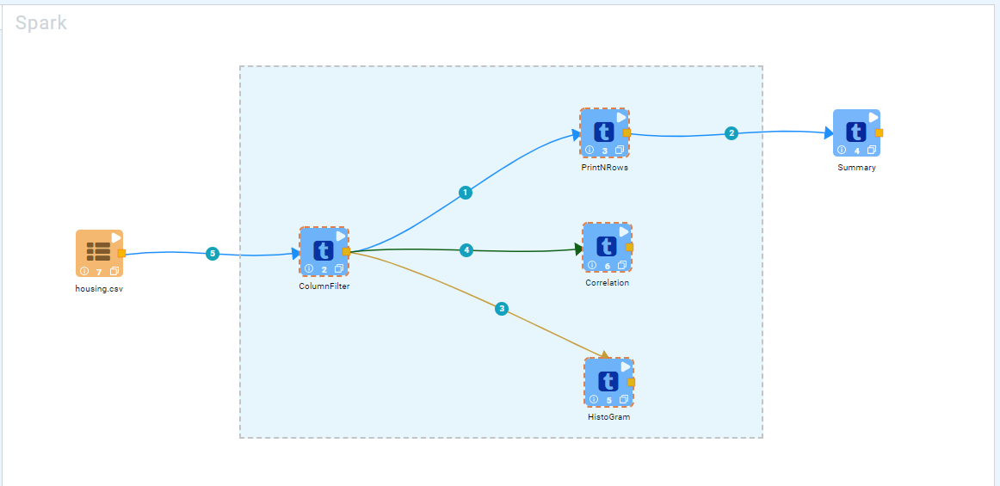
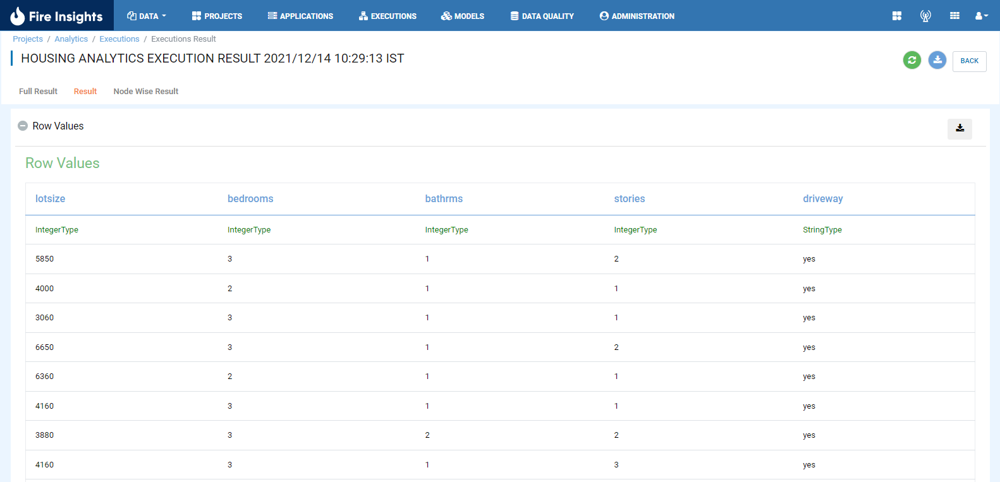

Version 3.1.23 - November 30th, 2021
==============

Generate Pyspark Code
+++++++

Fire Insights enables you to Generate Pyspark Code even with spark engine and run the job using python engine.

   

Documentation
+++++

Reference guide : https://docs.sparkflows.io/en/latest/databricks-user-guide/generate-pyspark-code.html

DBFS
+++++++

Displaying progress bar while uploading file in dbfs

UI
++++++

Added color palette themes in graph nodes i.e NodeGraphValues, NodeBubbleChart, NodeGraphGroupByColumn, NodeGraphSubPlots

   
Ability to select multiple nodes in the workflow editor, using click and drag mouse.

   
Switch view option (like Full result, Result and Node wise result) added on Executions Result page.

UI Upgrades
--------------

- Executions page look and feel.
- Top menu look and feel. : Remove sub menu
- Added current project submenu as icon inside project list page.

