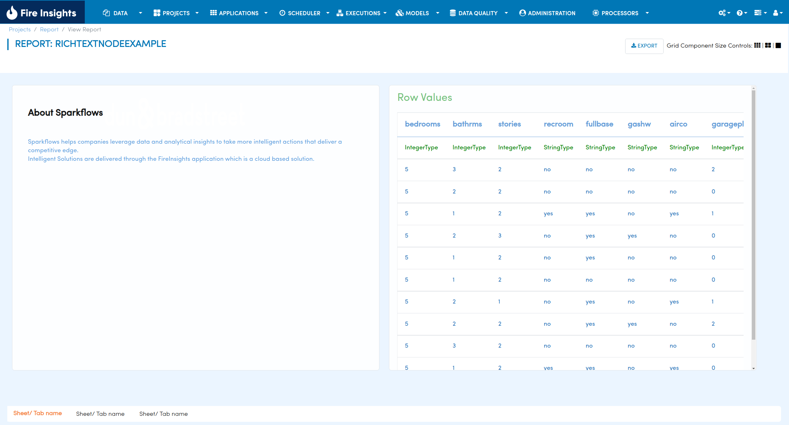
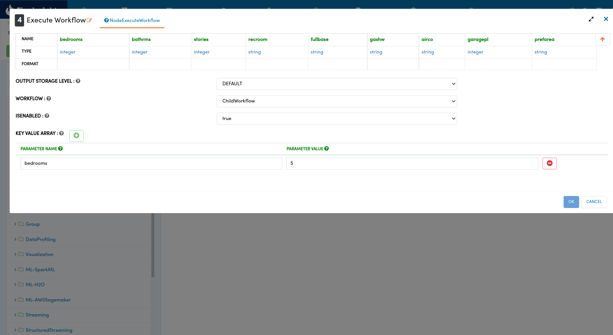
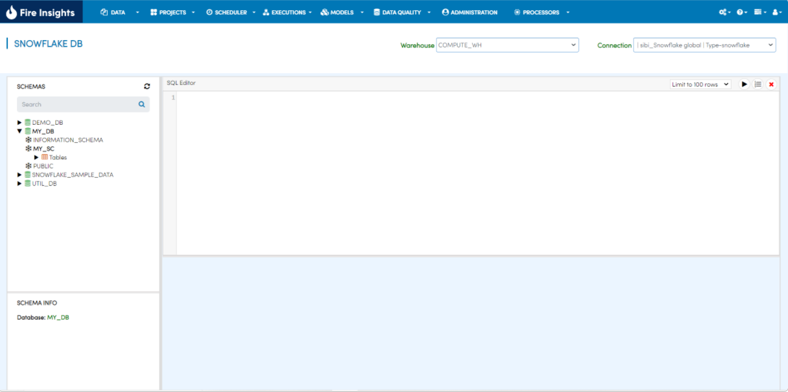
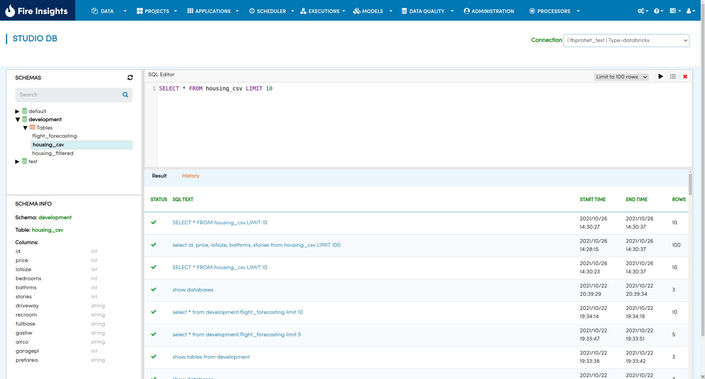

Version 3.1.22 - October 30th, 2021
===========

New Processors
---------------

In October, we have added the following new Processors for better performance. Do read on to know about the latest.

Output Rich Text
+++++

- This node outputs Rich Text. In this node, static rich text can be added. On execution of this node, this rich text gives output on the screen. 
- This node can be included in the Report, thus enabling Rich Text to be added to the Report.

Execute Workflow
+++++

- This node executes another workflow.
- You can provide the next workflow to be executed in this node.
- The workflow to be executed should belong to the same project.

Snowflake
-------

Snowflake Editor page
+++++

A new Snowflake Data Catalog page has been added.

- You can browse the Snowflake Query editor page.
- You can browse the Snowflake Databases, Schemas & Tables using selected snowflake connection.
- In configuration, module "enableSnowflakeDb" has to be set to "true" for browsing Snowflake Db page.

Documentation
+++++

- Reference guide : https://docs.sparkflows.io/en/latest/snowflake/browse-snowflake-tables.html

Databricks
-------
We have also made enhancements to the Databricks SQL Editor.

Databricks SQL Editor Upgrades
+++++

- It stores the SQL query as they are used.
- Displays the SQL query history in a tab next to the results tab.
- On clicking on Query, a dialog opens up where user can select SQL, paste in editor and run query.
- When query starts with DROP, the dialog will not open up. To copy the query, you have to write the query manually to execute the DROP statement.

