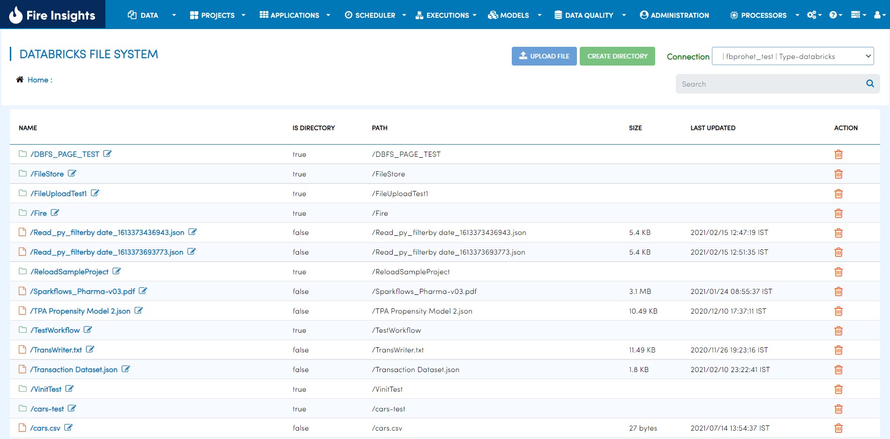
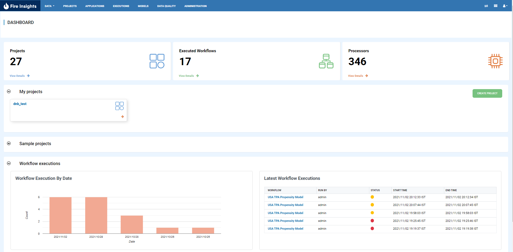
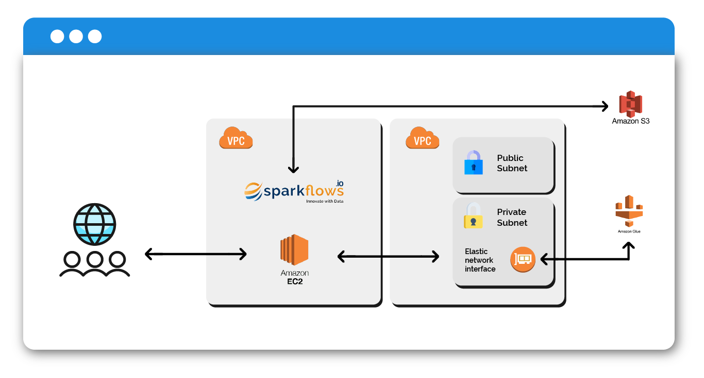
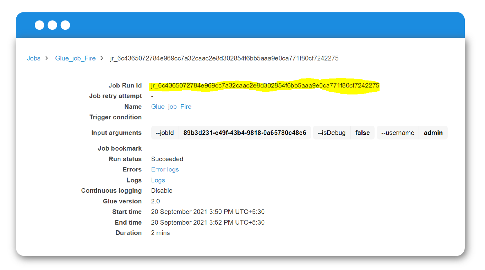

Version 3.1.21 - September 30th, 2021
===========

DBFS
----

Rename DBFS folders
+++++
 A great feature has been added for renaming in this month. You were only able to rename DBFS files earlier but now you can rename DBFS folders too.

Workflows
---------

Workflow parameters in the execute page
+++++

We have highly upgraded the Workflow parameters on the Execute Page as below- 

- You can add parameters as simple text or as key-value pair now. 
- In case of key-value option, the last executed parameters will be shown by default. 
- You can add more parameters or delete some parameters.

.. figure:: ../_assets/releases/workflow_parameter.png
        :alt: web-app
        :width: 80%

Analytics Application
---------------------

Mapping table columns
+++++
We now enable to map the columns of a Table to updated names. This mapping is then sent over as parameters to the Notebook or Workflow during execution.

- Analytics App now supports map databricks table columns. 
- You can add databricks query with elements and populate values. 
- With the use of these query elements you can get value from databricks and map with predefined columns for parameters.
- Mapping is then sent over as parameters to the Notebook or Workflow during execution.

.. figure:: ../_assets/releases/analytics_app.png
        :alt: web-app
        :width: 80%

Documentation
+++++

- Reference guide : https://docs.sparkflows.io/en/latest/user-guide/web-app/map-table-columns.html

UI
---
We have an upgraded UI on the dashboard which is very interesting and you can view it below.

- Updated chart colors
- Updated tables and projects card style on the dashboard

AWS Glue
-------

- Integration of AWS Glue

Sparkflows has now integrated with AWS Glue. Now the users of Sparkflows can easily create connections to AWS Glue and run the Sparkflows jobs seamlessly onto AWS Glue   and view the results back in Sparkflows.

Sparkflows has partnered with AWS to bring Self-Serve Advanced Analytics to the users of AWS. 

AWS Glue is a serverless data integration service that makes it easy to discover, prepare, and combine data for analytics, machine learning, and application development.

.. figure:: ../_assets/releases/workflow.png
        :alt: web-app
        :width: 80%
        

