April 2022 (Version 3.1.50)
==========

These features and Sparkflows platform improvements were released in April 2022.

AutoML Features
+++++++++++++++

Fire Insights Provides option to user to select the data, type, evaluation metrics, target column, model type and build the automl model from H2O and pycaret.

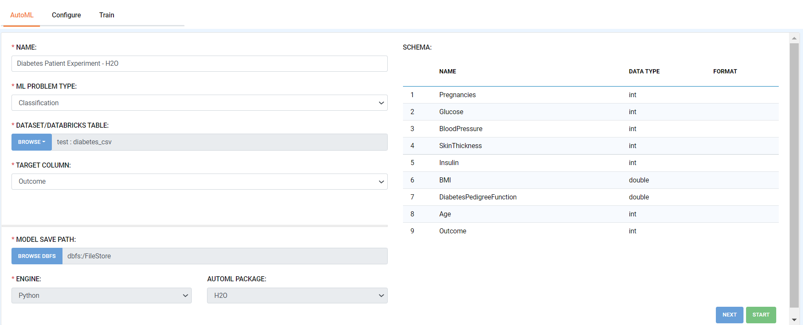
   
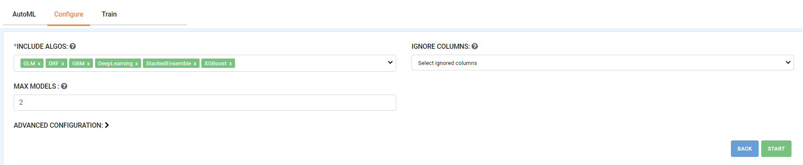

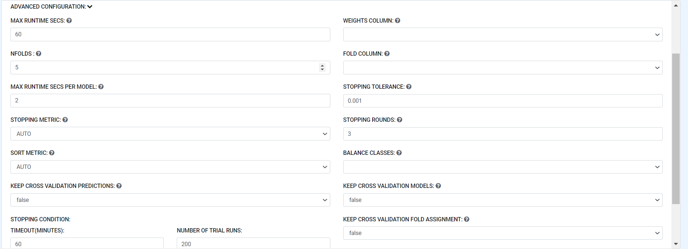

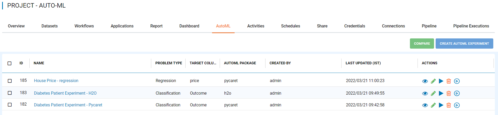

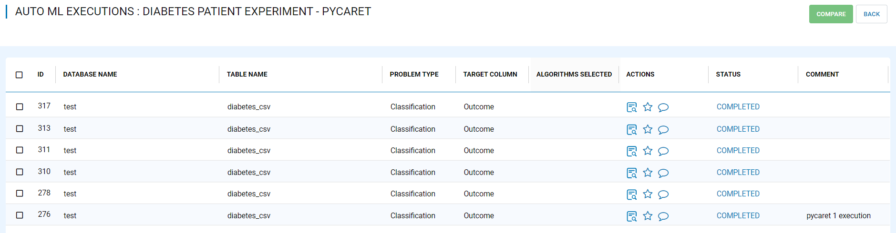

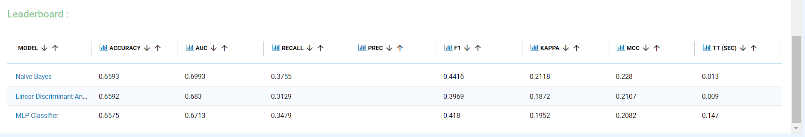
 
Scheduler
++++++++++

Fire Insights enable you to schedule job on databricks cluster.

.. figure:: ..//_assets/releases/2022-april/schedule_page.PNG
   :alt: schedule
   :width: 70%
   
.. figure:: ..//_assets/releases/2022-april/schedule.PNG
   :alt: schedule
   :width: 70%
   
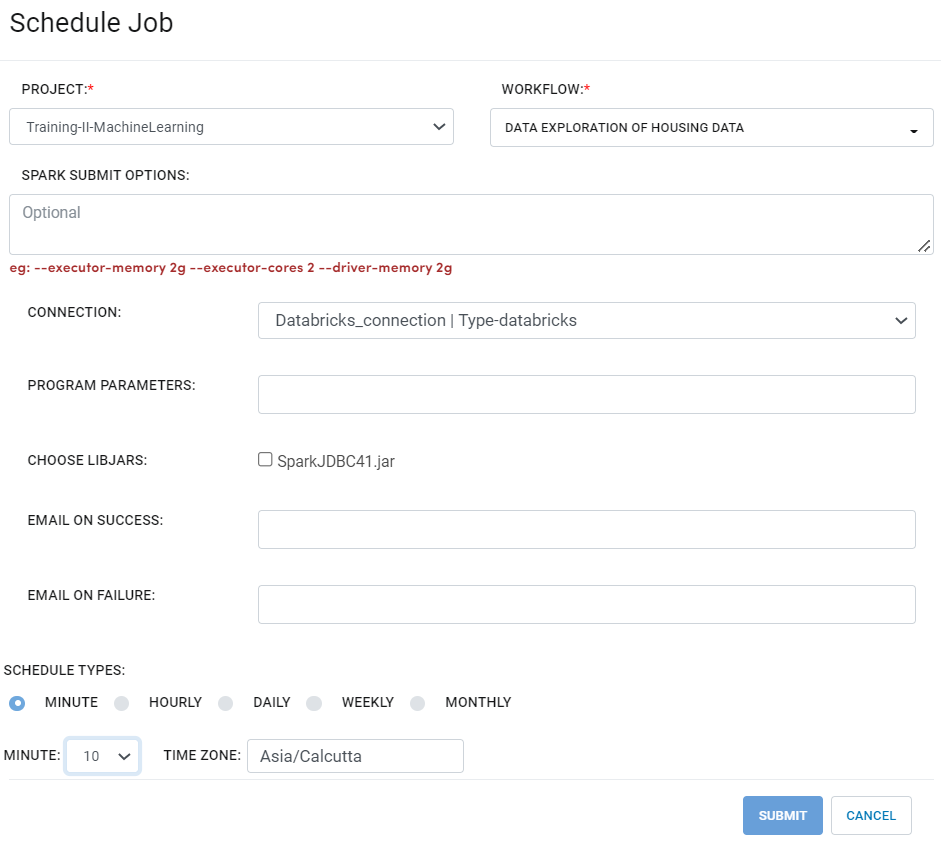
   
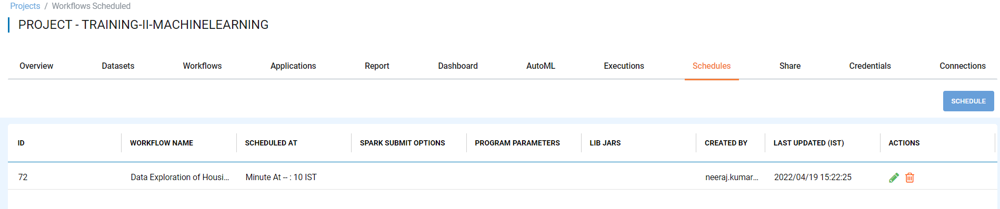

UI
++++++

- Adding drag/drop file feature for upload file.

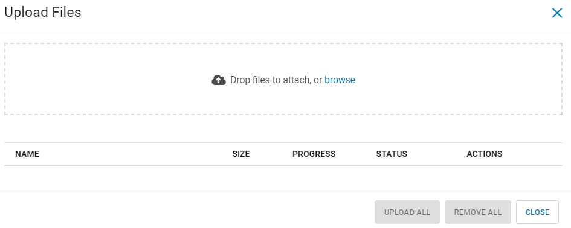
   
- Look and feel of Executions page

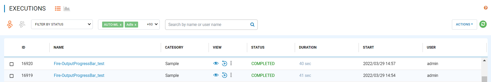

- Dataset page Upgrade

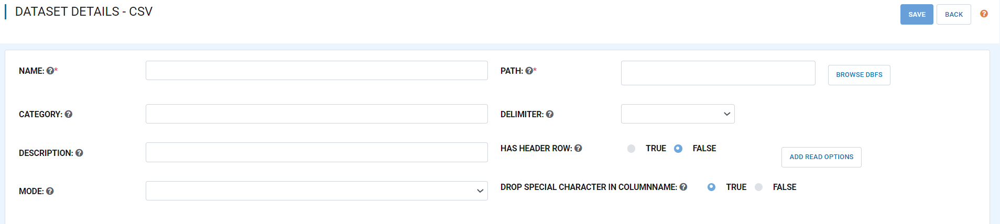

- Added filter in audit logs

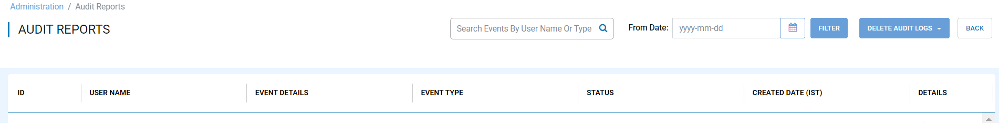

- Look and feel for Clean up

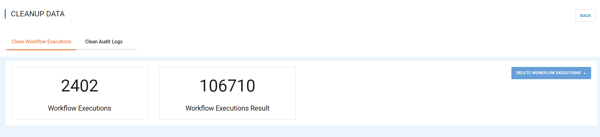

Data Quality Feature Improvement
+++++++++++

Fire Insights enable you to use new processors added for data quality great expectations as below:

- ExpectColumnValuesToBeInBetween
- ExpectColumnValuesToBeNull
- ExpectColumnValuesToBeUnique
- ExpectColumnValuesToNotBeNull
- ExpectTableRowCountToBeBetween

Data Quality Page
+++++++++++

Fire Insights enable you to show Data Quality informations with Great-expectations.

Once the workflow with Great Expectations Processor get submitted, you can check the details informations on Data Quality page.

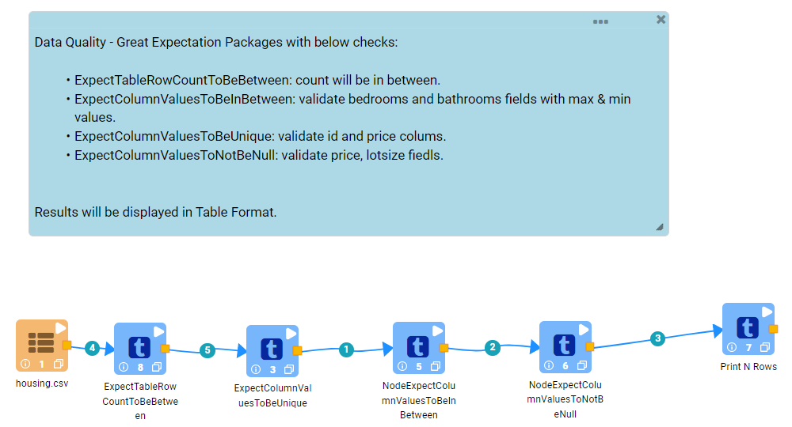
   
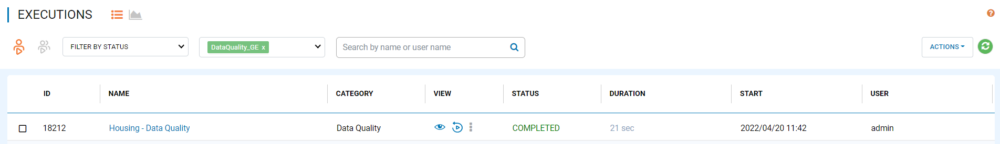
   
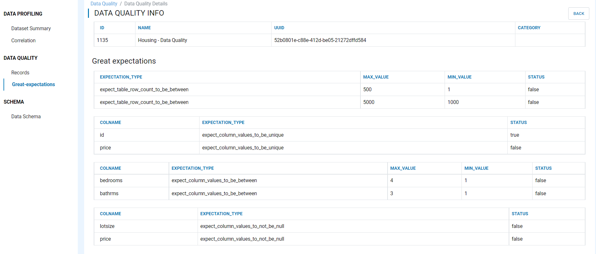

