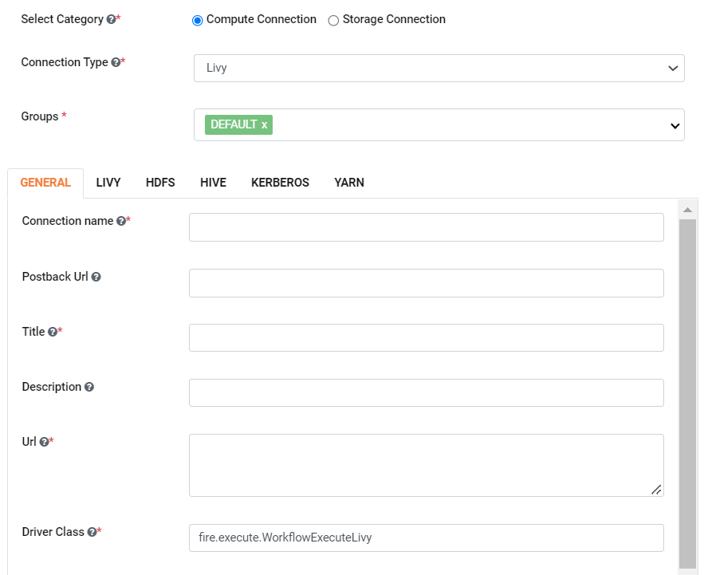
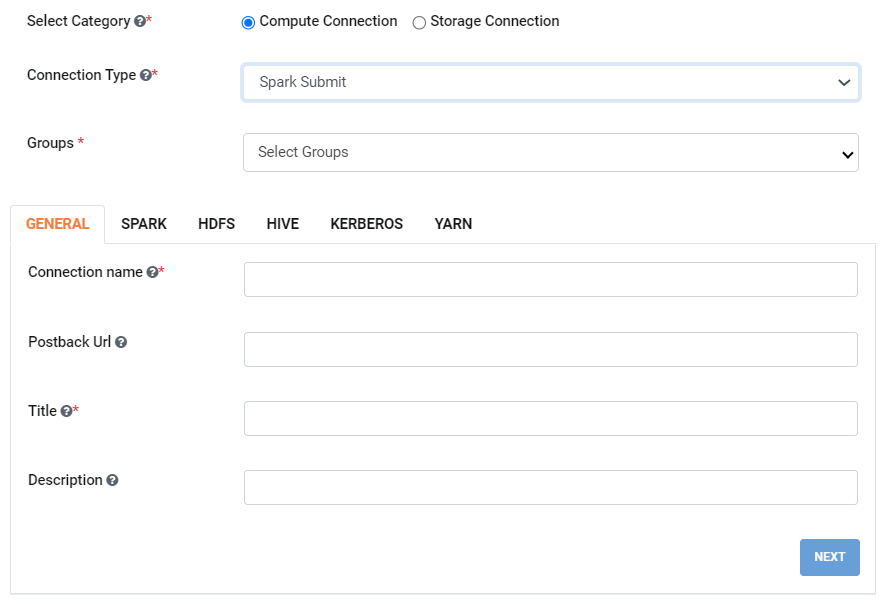
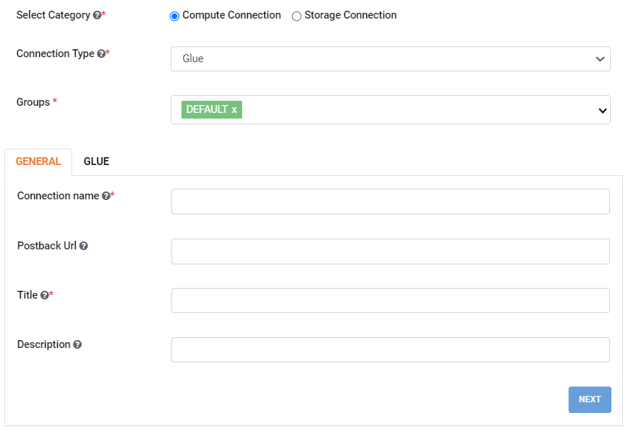
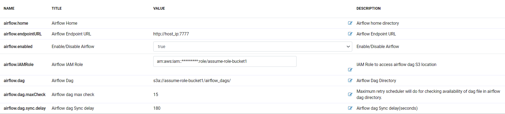
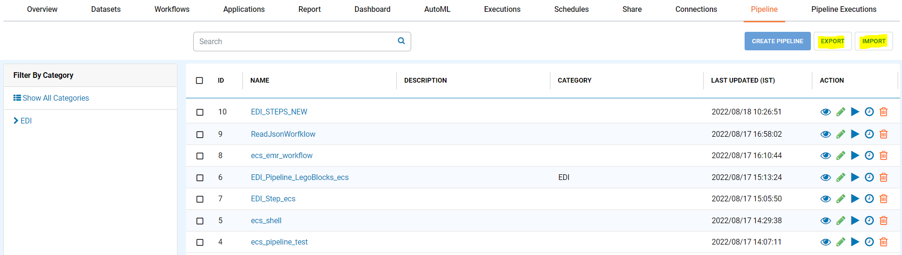
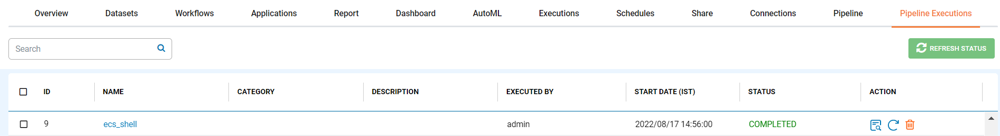
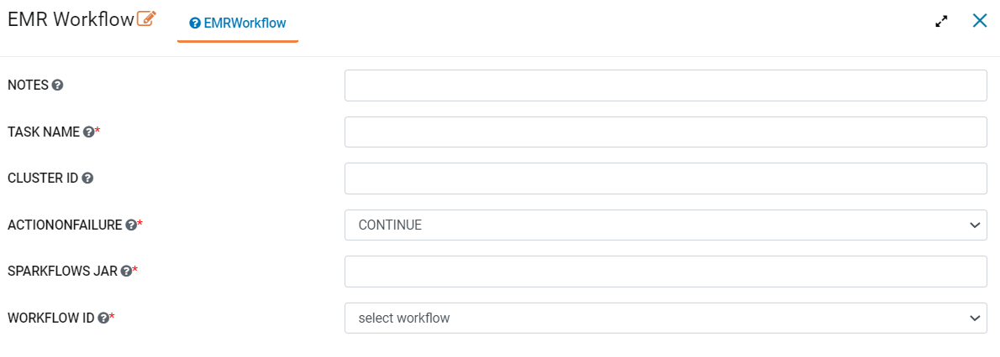
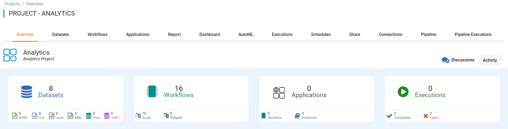
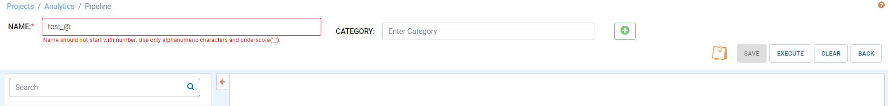

August 2022 (Version 3.1.60)
========

These features and Fire Insights platform improvements were released in August 2022.

NEW CONNECTIONS
----------

Now Fire Insights enable you to create Different Compute Connection and submit the job on respective connection.

- Livy Connections 

Documentation
+++++

  - Reference guide : https://docs.sparkflows.io/en/latest/aws/emr-livy/index.html

   
- Spark Submit Connections

   
- AWS Glue Connections

Airflow Enhancements
----------

Fire Insights Now enable you to Integrate Airflow running on Remote server, create Dags in S3 and Sync up to remote machine using cron job.

Pipeline
-------

- Pipeline Export
- Pipeline Import

- Pipeline Refresh status

you can refresh execution status of pipeline already excuted.

   
- New Node in Pipeline

  - EMR Workflow
  

UI Upgrades
------

- Project Discussion

Fire Insights enable you add comments for project you are using.

   
- Pipeline Name Validations

