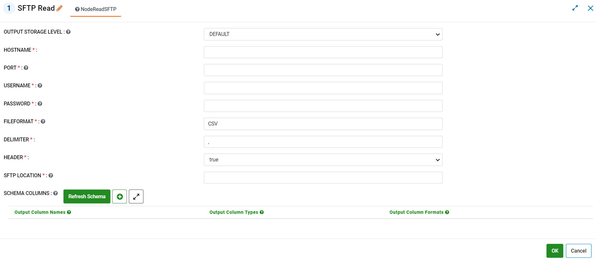
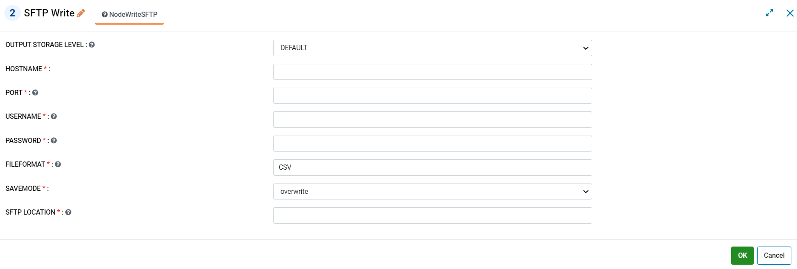
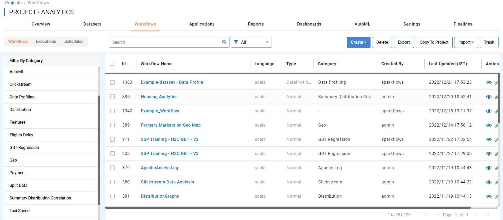
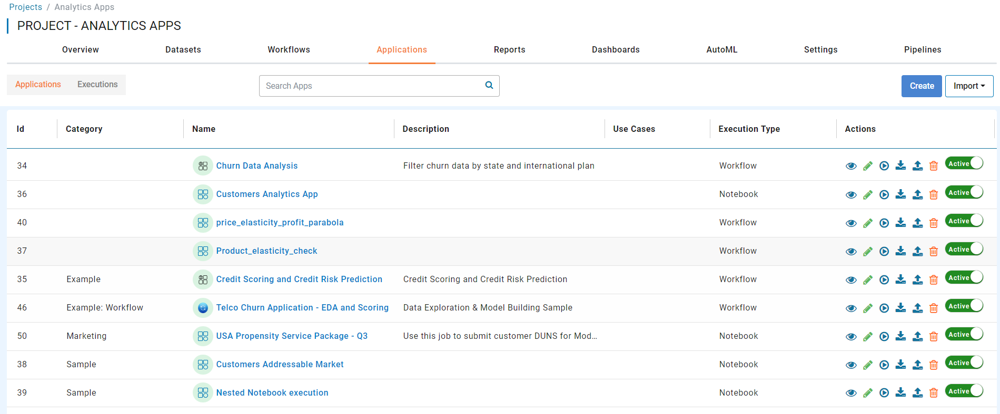
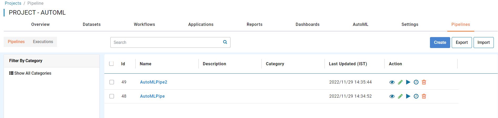
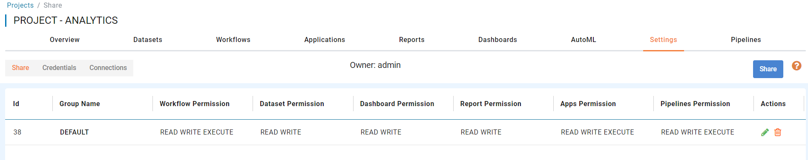

DECEMBER 2022
=============

These features and Sparkflows platform improvements were released in December 2022.

Additional Nodes
------

Sparkflows has added the below capabilities to its Pyspark workflow engine.

- Read From SFTP

- Write To SFTP

UI Improvements
----------

- UI Improvement in Project with Workflows Tab with "Workflows, Executions and Schedule"

- UI Improvement in Project with Applications Tab with "Applications and Executions"

- UI Improvement in Project with AutoML Tab with "AutoML and Executions"

.. figure:: ../_assets/releases/2022-dec/project_automl_tab.PNG
   :alt: project automl tab
   :width: 80%

- UI Improvement in Project with Pipelines Tab with "Pipelines and Executions"

- UI Improvement in Project with Settings Tab with "Share, Credentials and Connections"

