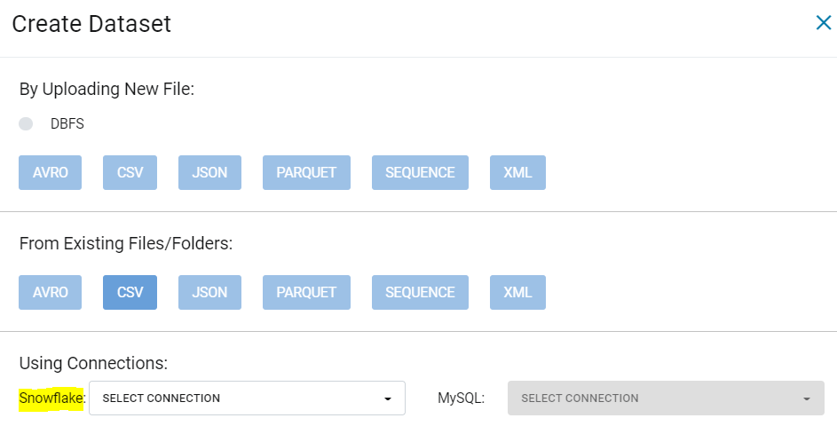
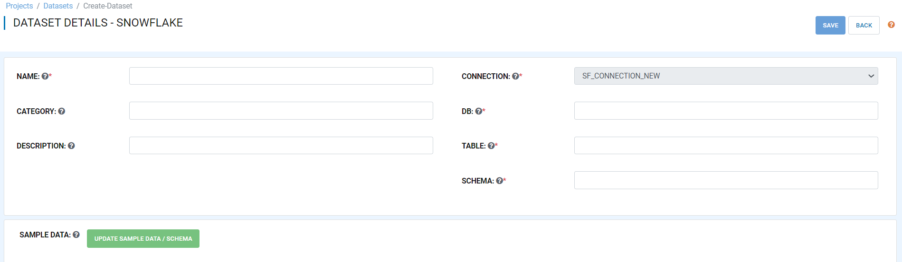
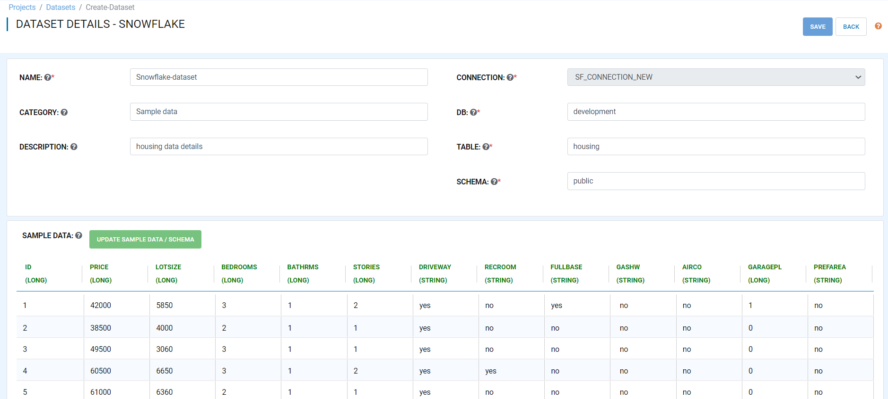
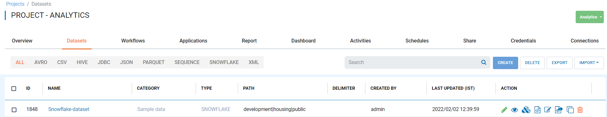
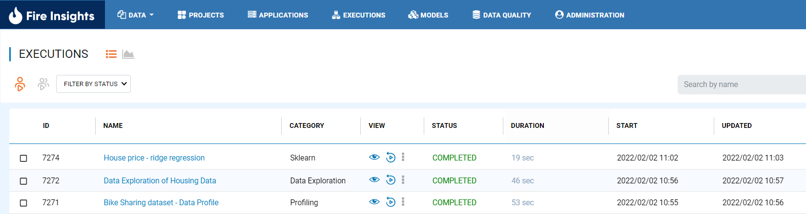
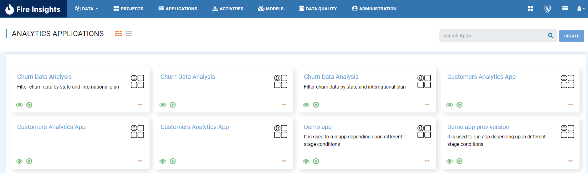
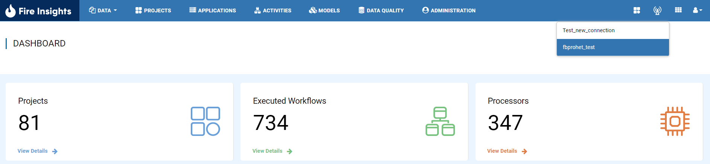
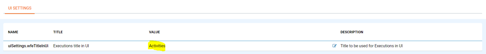
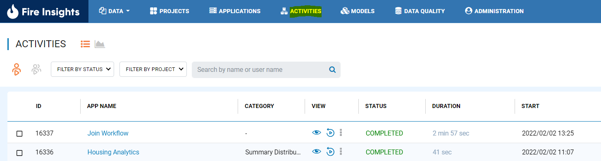

January 2022 (Version 3.1.48)
==========

These features and Sparkflows platform improvements were released in January 2022.

Datasets
+++++++

Fire Insights enables you to create Datasets using Snowflake Table with Snowflake Connection.

   

   

   

UI Upgrades
++++++++++
Our team made a series of UI upgrades to stay aligned with the existing and upcoming design trends.
This will greatly improve your overall user experience.

UI upgrades for Create Dataset Page

UI upgrades for Executions Page

UI upgrades for Analytics App

UI upgrades for Connections Change in Menu

Executions Menu is configurable

AutoML Features
+++++++++++++++
Provides option to user to select the data, type, evaluation metrics, target column, model type in fire-ui and build the automl model from H2O in fire.

