July 2022
========

These features and Fire Insights platform improvements were released in July 2022.

AutoML Enhancements
--------

- Save Model path fixes.
- Improvements in its Configurations parameters.

Persona Integrations
--------

Fire Insights enables you to provide Persona access on the basis of their requirements ie. Admin, Analyst or Business-User.

Inorder to Enable Persona, Administrator of Fire Insights enable its module from configuration.

::

    uiSettings.enablePersona : true

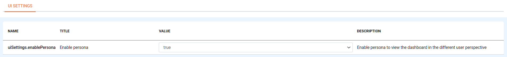

Fire Insights Administrator can provide required persona access depending on its usability, while creating user or an existing user.

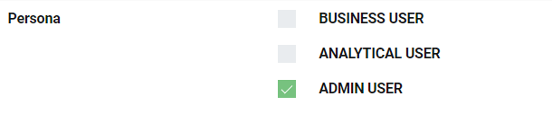

Once the Persona got added user can login to Fire Insights and on User Drop down, you will see Switch Persona and on selection of respective persona user will have access to it.

For Admin Persona:

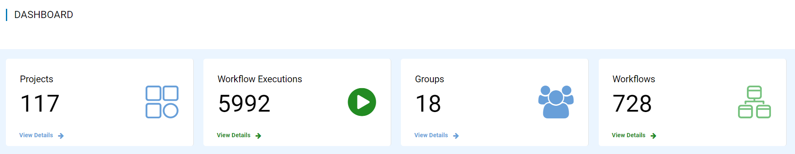

For Analyst Persona:

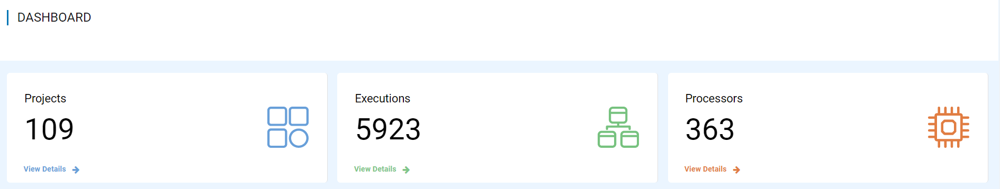

For Business-User Persona:

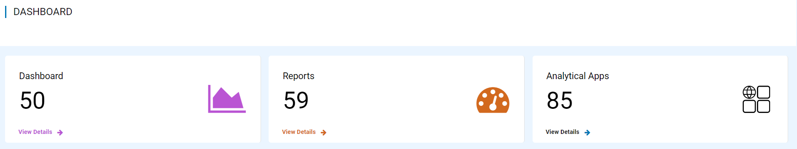

Report Enhancements
-----------

Fire Insights enable you create report with both Classic and standard method.

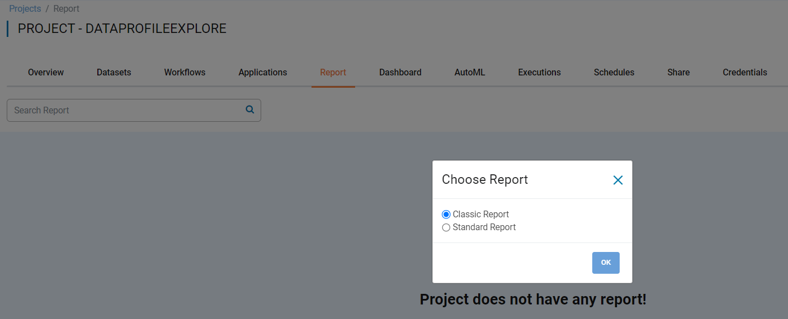

Classic Method:

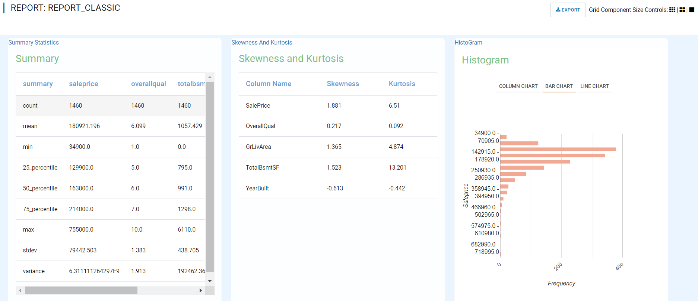

Standard Method:

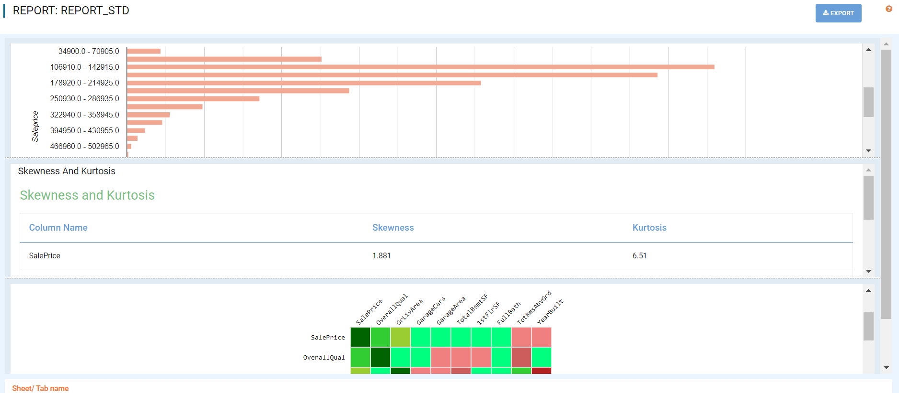

IAM Assume Role Integrations
-----------

Fire Insights enable you to configure IAM Assume role for accessing s3 bucket.

Inorder to Enable AssumeRole go to configurations enable below property

::

    aws.assumeRoleEnabled : true

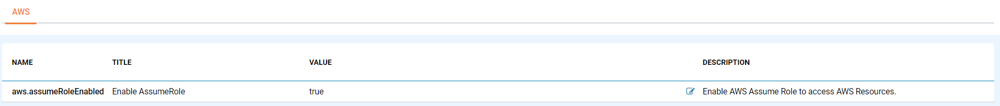

The arn of the assume role should be added in Group Configurations of Fire Insights application.

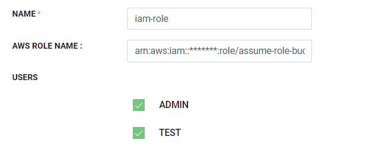
   
   
Now once user have access of Assume role, he will able to access respective s3 bucket 

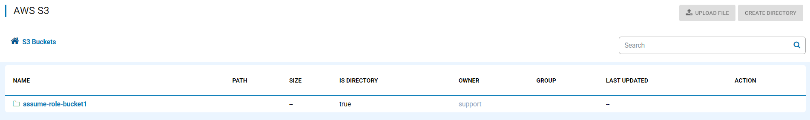

UI Upgrades
------

- Search alignment
- Permission Improvements
