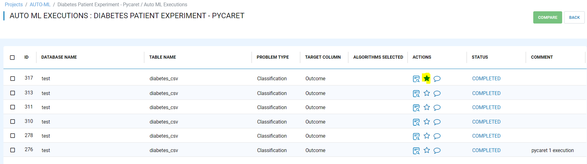
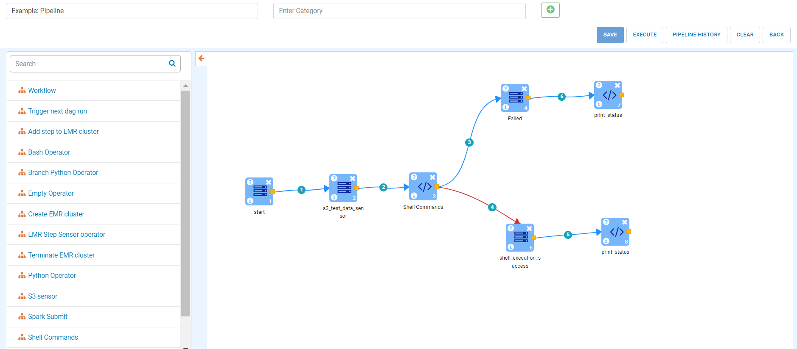
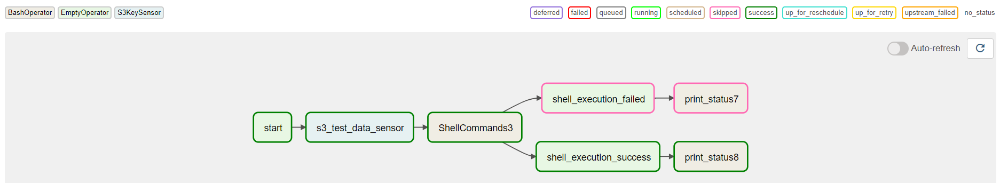
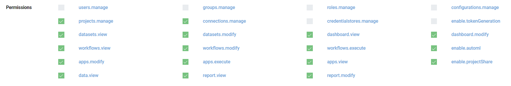
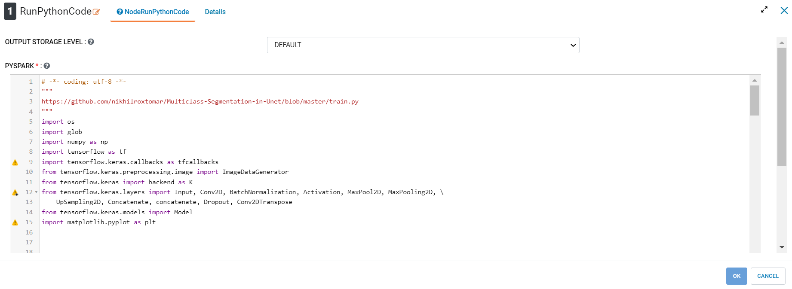
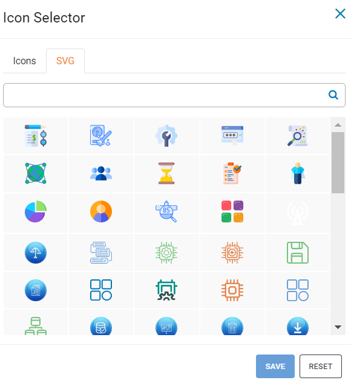
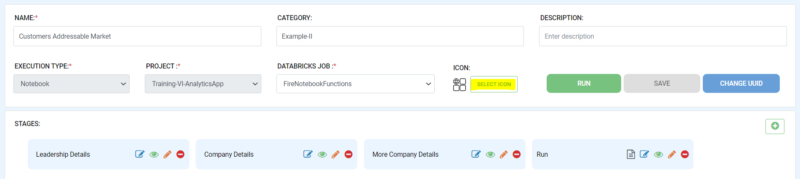
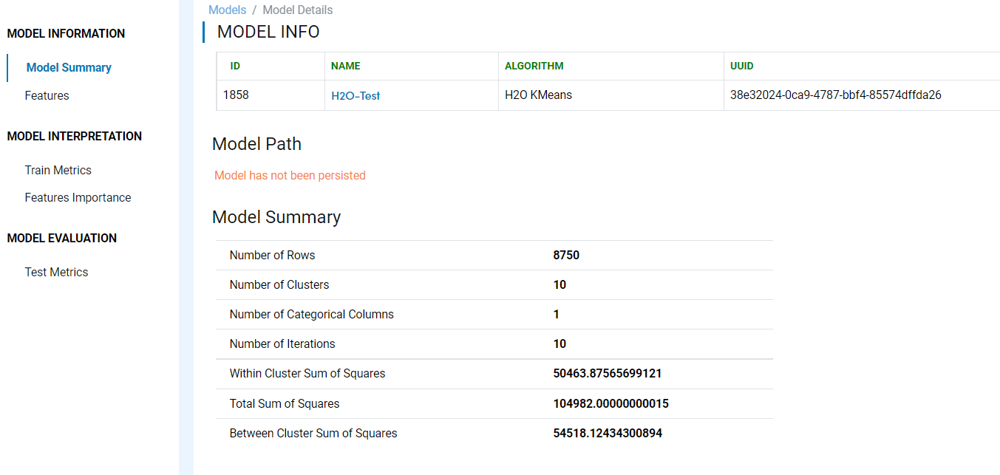
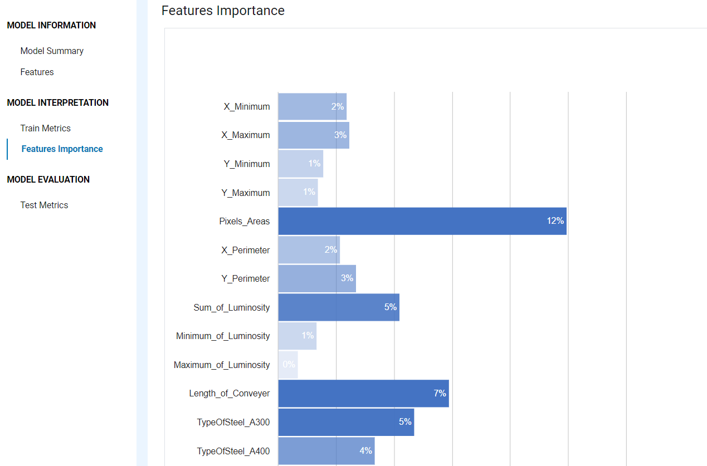
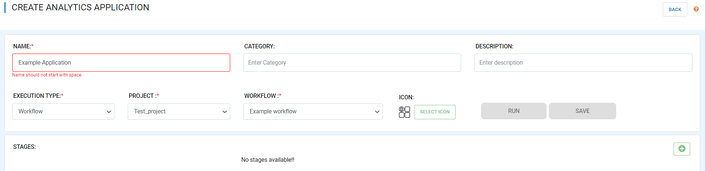

Version 3.1.28 -  June 30th, 2022
========

These features and Fire Insights platform improvements were released in June 2022.

AutoML Upgrades
--------

Fire Insights enables you to add Favourite auto-ml Execution Experiment from number of executions run with different parameters.

Pipeline Airflow Upgrades
------------

Fire Insights now have support for airflow with 2.x, it comes with different operators, once dag submitted from UI can be verify from Airflow.

   
   
Permission upgrades
---------------

Fire Insights enable to update User roles and Permission changes, Sharing of project to group, Changes in project-overview dashboard as per needed permission.

New Processors
---------------

The following new Processors have been added:

RunPythonCode
+++++

This node execute the python code.

UI Upgrades
------

- Added Icon Search Option in Project

- Icon selector in analytics app

- Model Page Improvements

   

- UI Validations in workflow name, report name, application name

