May 2022 (Version 3.1.53)
========

These features and Sparkflows platform improvements were released in May 2022.

Pipeline
----

Upgradation of Pipeline feature without airflow configurations.

Fire Insights provides option to user to run different workflow using Pipeline without airflow with different compute engine and view its executions.

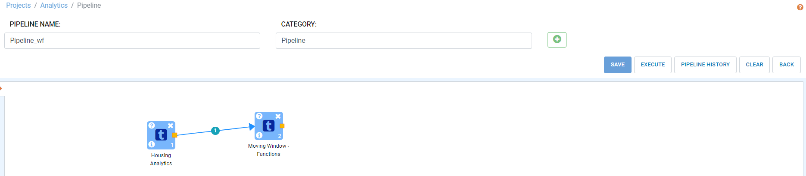

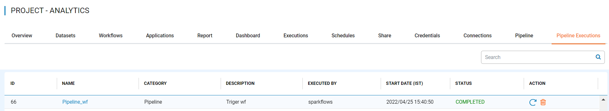

New Processors
---------------

The following new Processors have been added:

Read DynamoDB
+++++

- This node reads data from DynamoDB Table.

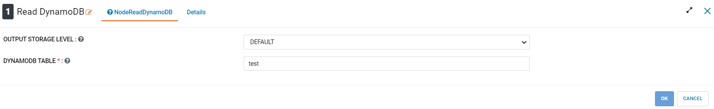
   
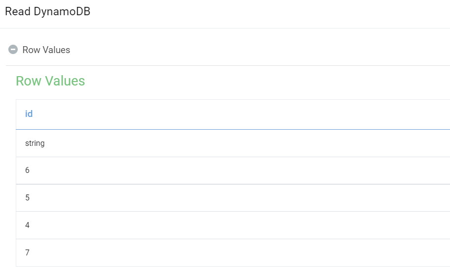

Save DynamoDB
+++++

- This node Saves data to DynamoDB Table.

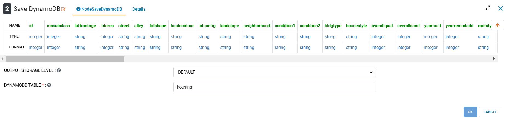
   
Flatten
++++++++++

Fire insights enable you to use Flatten Processor to Flatten the nested structure in struct into given column.

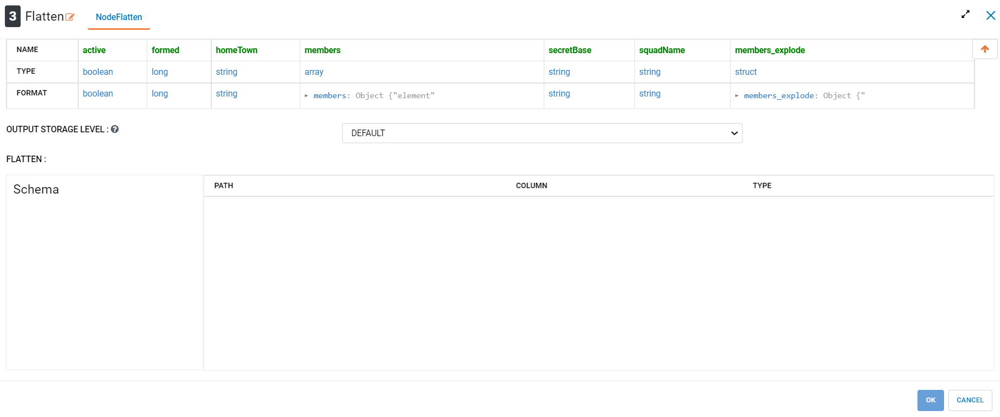

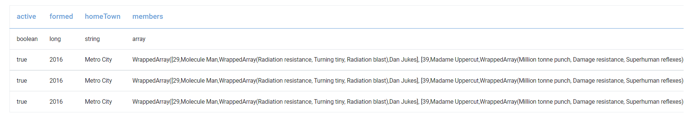
   

Explode
+++++++++

Fire insights enable you to use Explode Processor to Explode the array of values into multiple rows with columnname_explode.

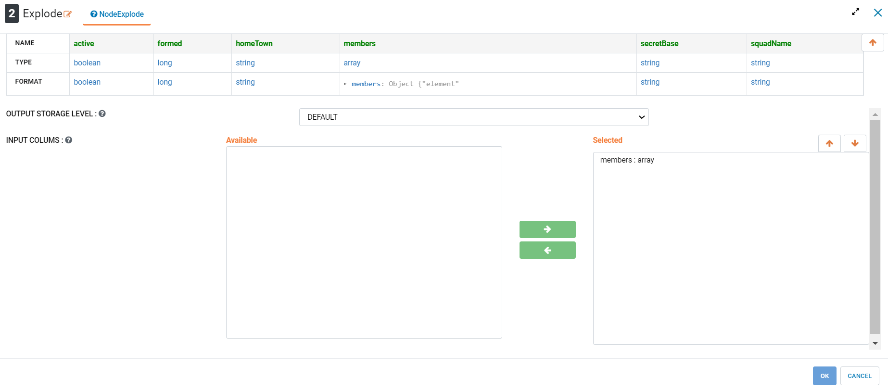

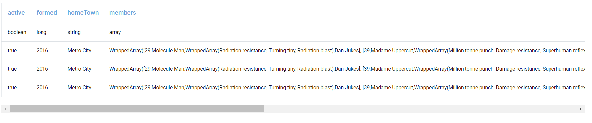

UI Upgrades
------

- Improvements on Clean up Data page

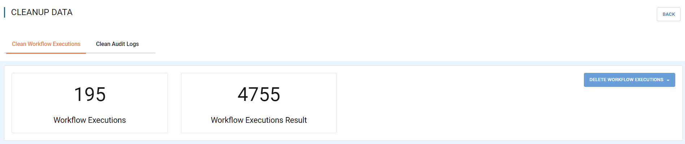
   
- Icon for Project

Fire Insights enable user to select icon for project as per functionality being used

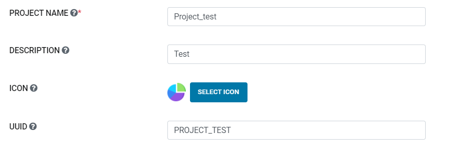
   
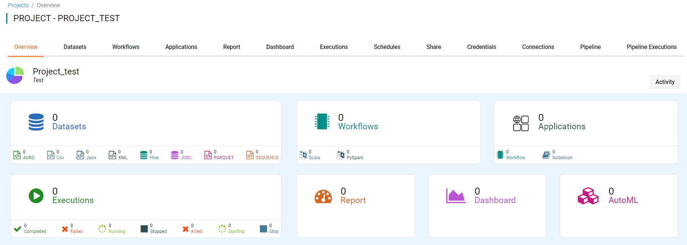
   
- Filter on the basis of project, status on Executions Page

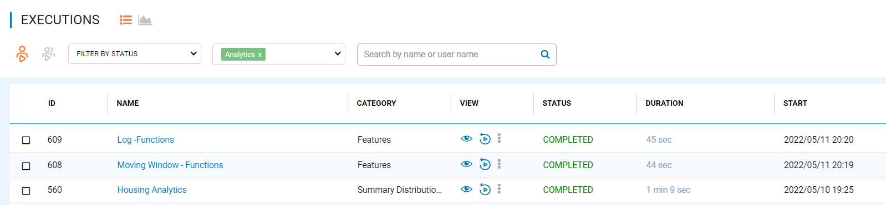
