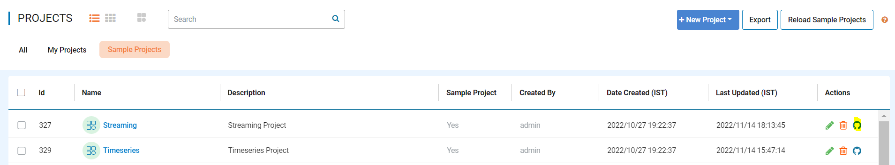
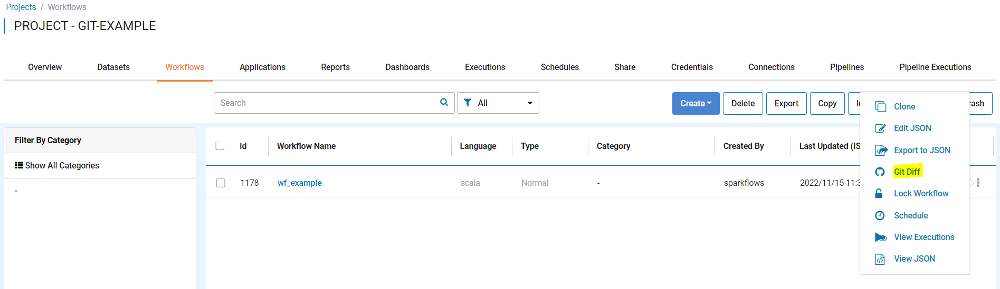
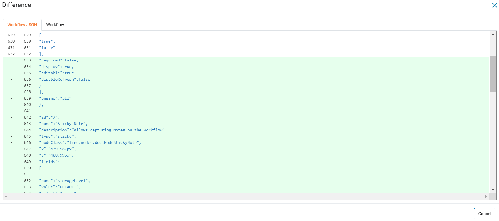

November 2022
=============

These features and Sparkflows platform improvements were released in November 2022.

Git Enhancements
-------

Sparkflows Comes up with Git Enhancements with below features:

- Project push to Git

Sparkflows enable you to push Project to Git.

Once the Project is linked with Git, you can push Specific Project to Git, using below actions icon.

- Git Diff of Workflow

Sparkflows enable you to view Git Diff of Workflow.

Once you updated the workflow after you pushed to Git, you will see ''Git Diff'' option and on Clicking, it will show the difference with pushed to Git.

