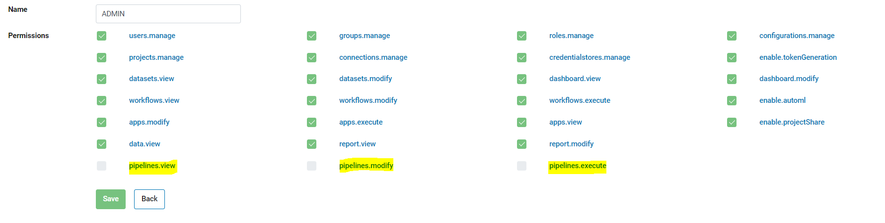
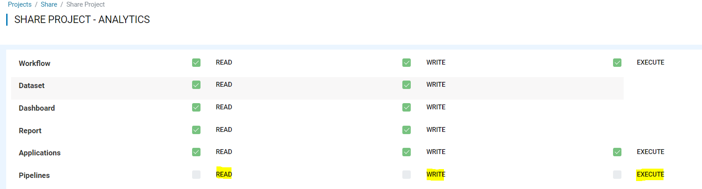
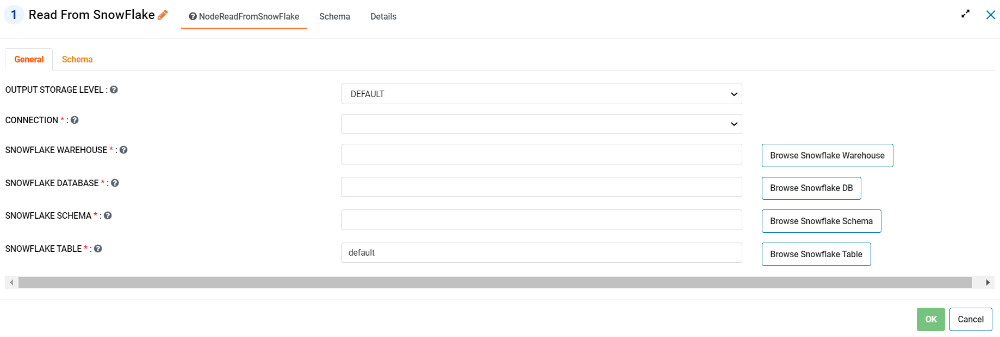
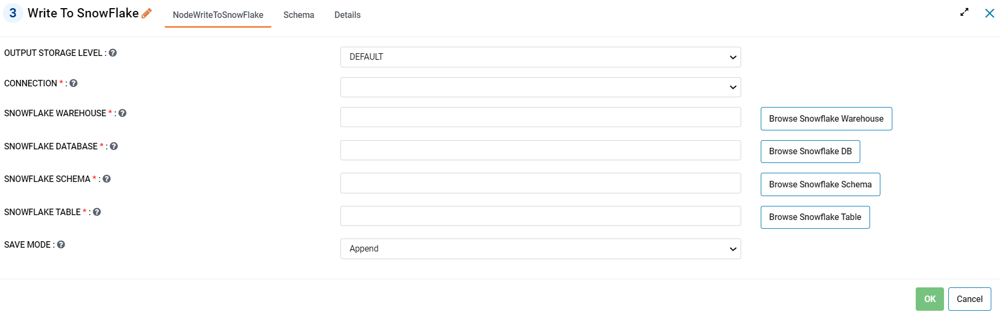
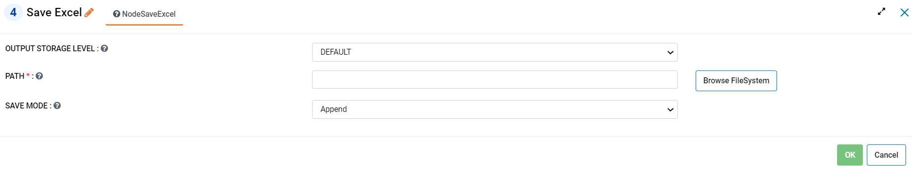
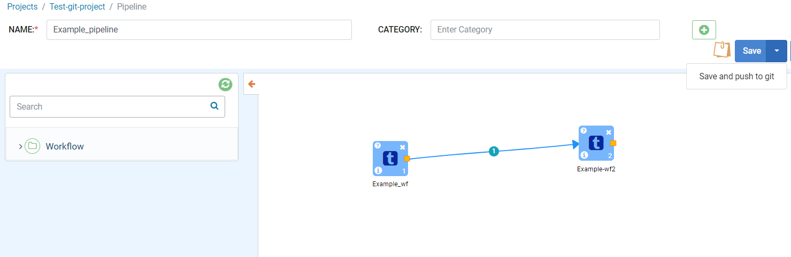
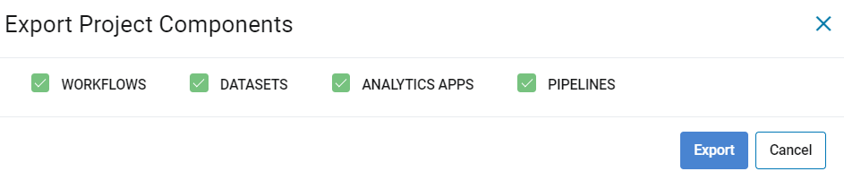
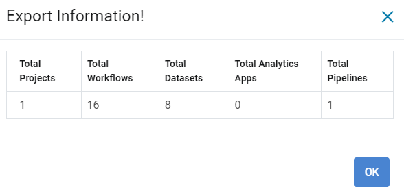
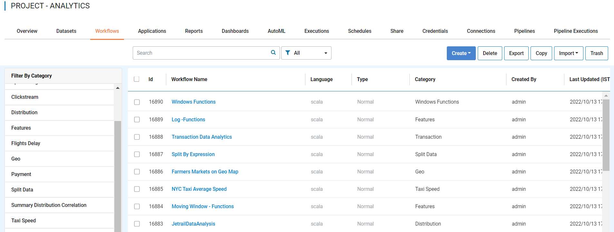

Version 3.1.32 -  October 30th, 2022
=============

These features and Sparkflows platform improvements were released in October 2022.

Pipeline Enhancements
-------

Sparkflows has enhanced the access permission rights for a pipeline. With this release an Administrator can provide or revoke access to a role or an user from the UI.

Additional Nodes
------

Sparkflows has added the below capabilities to its Pyspark workflow engine.

- Read From Snowflake 

- Execute Query In Snowflake 

.. figure:: ..//_assets/releases/october-2022/snowflake_query.PNG
   :alt: query snowflake
   :width: 80%

- Write To Snowflake

- Save To Excel

Enhancements to Git Integration 
--------

Using Sparkflows we can now push pipeline's to the configured git repository.

   
Export and Import a Pipeline
------

We can now Export and Import a Pipeline from the Project List page.

   

UI Improvements
----------

- This release has also added UI Improvements to the Project and Workflow List pages.

