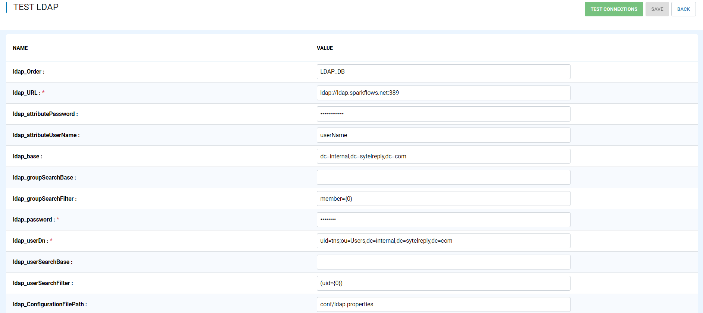
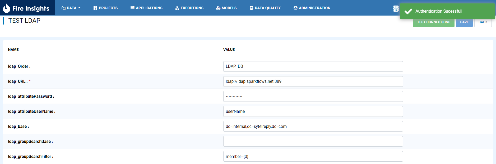
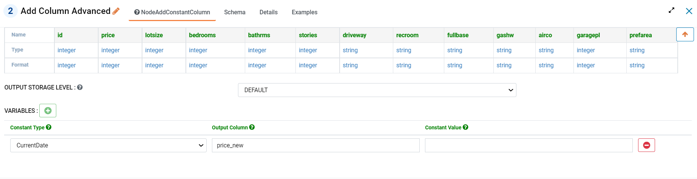
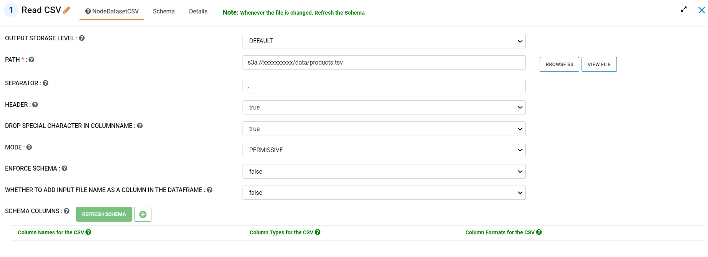
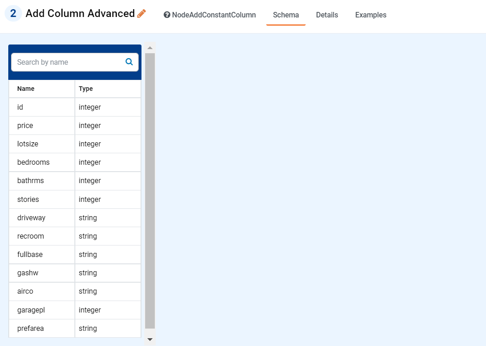

September 2022 (Version 3.1.62)
=============

These features and Sparkflows platform improvements were released in September 2022.

Ldap Enhancements
----------

- Ldap Configurations from properties file

Sparkflows enable you to use Ldap Configurations from properties file and Test the Connection from UI.

New Node and Enhancements
------

Sparkflows Comes up with New Node and Enhancement in Existing Node.

- AddColumnAdvanced

Support to create multiple columns with constant values.

- Enhancement in ReadCSV Node

Livy Enhancements
------------

- Livy Support for 0.7.1

UI Enhancements
----------

- UI Improvement in Project List, Workflow List page.
- UI Validations
- Node Example, Details Updates. 
- Schema Details

