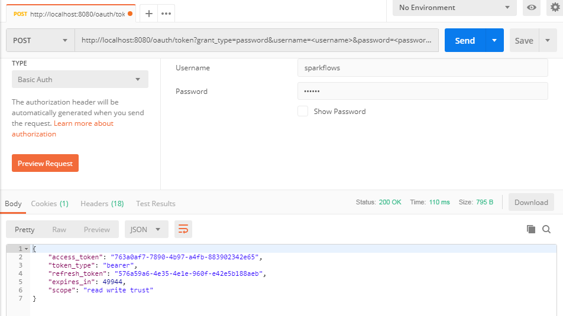
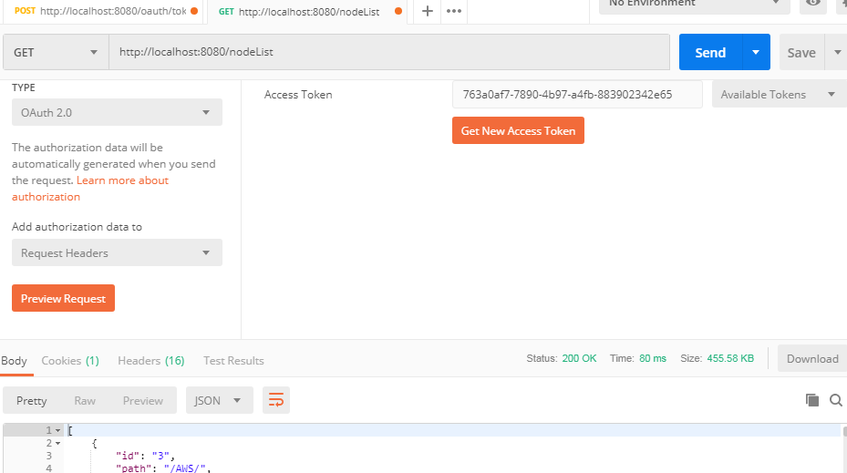
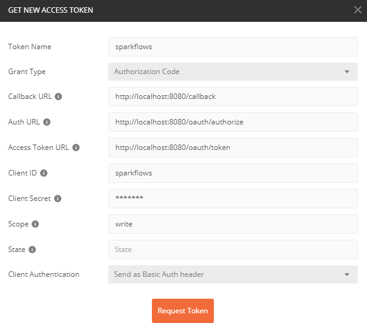
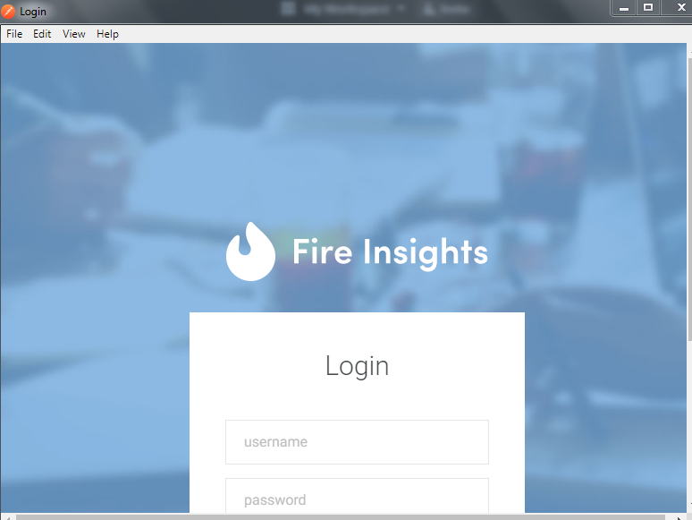
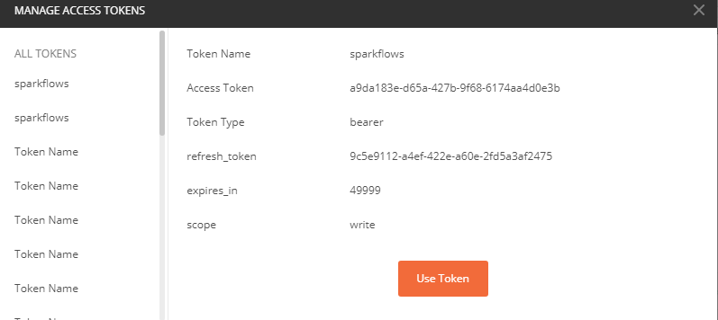
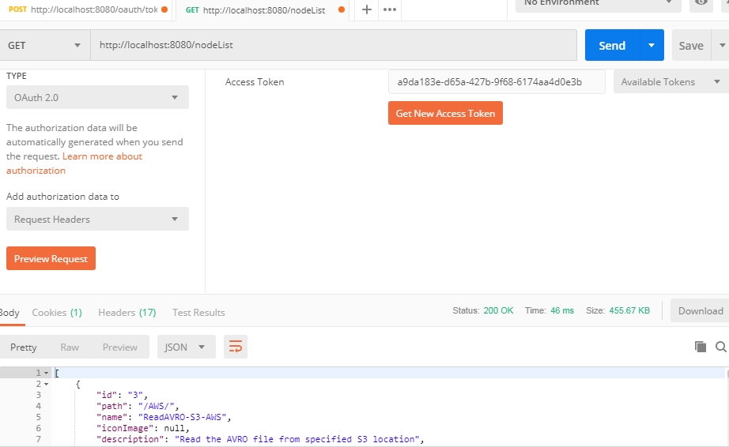

Accessing REST API using Postman
++++++++++++++++++++++++++++++++++++++

This document illustrates the interaction necessary to obtain and use OAuth 2.0 access tokens using Postman.

Grants are at the heart of OAuth 2.0. Each grant defines one way for a client to retrieve an authorization.

Fire supports two grant types for retrieving the access token:

- Grant Types – Password
- Grant Types – Authorization code

Using Grant Type – Password
---------------------------

The Password grant is used when the application presents a traditional username and password login form to collect the user’s credentials and makes a POST request to the server to exchange the password for an access token. The POST request that the application makes looks like the example below.

Post Request
==============

The POST Request method requests that a web server accepts the data enclosed in the body of the request message, most likely for storing it

- http://localhost:8080/oauth/token?grant_type=password&username=<username>&password=<password> 

Click on Authorization tab and select type - Basic
==================================================

Basic Auth is an authorization type that requires a verified username and password to access a data resource.

 
Fill username (clientId) and password (secret key) in request headers:

- Client Id = sparkflows
- Secret – (****)  

Example
===========
    

Now use access_token to access the rest api:
===========================================

An Access Token is a credential that can be used by an application to access an API, Below is example

   
   
Using Grant type - Authorization code
-------------------------------------

The Authorization Code grant type is used by confidential and public clients to exchange an authorization code for an access token.

Get the access token
====================

The app can obtain an access token that provides temporary, secure access to it, Below are steps involved to Request an Access_token 

- Click on Authorization tab
- Select Type OAuth 2.0

- Click on Request Token

- Fill the username and password and click on signIn

- OAuth is an authentication protocol that allows you to approve one application interacting with another on your behalf without giving away your password, Below are Screenshot For updating the Oauth approval.

.. figure:: ../_assets/tutorials/token/token5.PNG
   :alt: Token
   :align: center
   :width: 60%

Click on Use token
==================

A security token (sometimes called an authentication token) is a small hardware device that the owner carries to authorize access to a network service.

Using tokens for accessing REST API
===================================

Using above token we can Access the REST API.

