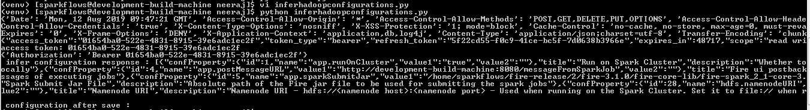

Accessing REST API using Python
====================================

Below are examples of Python code for accessing the Fire REST API using Python.

Get Processor Count
--------------------

The below code in Python invokes the Fire Insights REST API to calculate number of processors list available in Fire Insight.

  ::
    
    #!/usr/bin/python

    import requests

    import json

    import getpass

    token_url = "http://localhost:8080/oauth/token"

    processor_count_api_url = "http://localhost:8080/getNodeCount" # processor list count api of sparkflows

    #Step A - resource owner supplies credentials
    #Resource owner (enduser) credentials

    RO_user = 'admin'
    RO_password = 'admin'

    #client (application) credentials
    client_id = 'sparkflows'
    client_secret = 'secret'

    #step B, C - single call with resource owner credentials in the body and client credentials as the basic auth header will return #access_token

    data = {'grant_type': 'password','username': RO_user, 'password': RO_password}

    access_token_response = requests.post(token_url, data=data, verify=False, allow_redirects=False, auth=(client_id, client_secret))

    print(access_token_response.headers)
    print(access_token_response.text)

    tokens = json.loads(access_token_response.text)
    print( "access token: " + tokens['access_token'])

    # Step C - now we can use the access_token to make as many calls as we want.

    api_call_headers = {'Authorization': 'Bearer ' + tokens['access_token']}

    print( api_call_headers)

    api_call_response = requests.get(processor_count_api_url, headers=api_call_headers, verify=False)

    print(api_call_response.text)

After running above REST API code using Python, Will get the results as below

.. figure:: ../_assets/tutorials/token/8.PNG
   :scale: 60%
   :alt: REST API
   :align: center

  
Infer Cluster Configurations
-----------------------------

The below code in Python invokes the Fire Insights REST API to infer the cluster configurations. It then saves the infer cluster configurations as updated values.

::

   #!/usr/bin/python

   import requests

   import json

   token_url = "http://localhost:8080/oauth/token"

   infer_configuration_api_url = "http://localhost:8080/api/v1/configurations/infer"

   save_configuration_api_url = "http://localhost:8080/api/v1/configurations"

   #Step A - resource owner supplies credentials
   #Resource owner (enduser) credentials

   RO_user = 'admin' #input your own username
   RO_password = 'admin' #input your own password

   #client (application) credentials
   
   client_id = 'sparkflows'
   client_secret = 'secret'

   #step B, C - single call with resource owner credentials in the body and client credentials as the basic auth header will return #access_token

   data = {'grant_type': 'password','username': RO_user, 'password': RO_password}

   access_token_response = requests.post(token_url, data=data, verify=False, allow_redirects=False, auth=(client_id, client_secret))

   print(access_token_response.headers)
   print(access_token_response.text)

   tokens = json.loads(access_token_response.text)
   print( "access token: " + tokens['access_token'])

   #Step- now use the access_token to call infer configuration api and its save api.

   api_call_headers = {'Authorization': 'Bearer ' + tokens['access_token']}

   print( api_call_headers)

   #infer the hadoop configuration

   infer_configuration_api_response = requests.get(infer_configuration_api_url, headers=api_call_headers, verify=False)
   print(" infer configuration response : "+ infer_configuration_api_response.text)

   #save the hadoop configuration

   save_configuration_api_response = requests.post(save_configuration_api_url,infer_configuration_api_response, headers=api_call_headers, verify=False)

   print(" configuration after save : "+save_configuration_api_response.text)
 
   
After running above REST API code using Python, Will get the results as below

   
