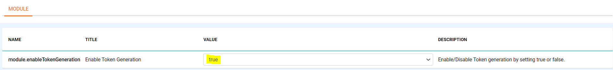
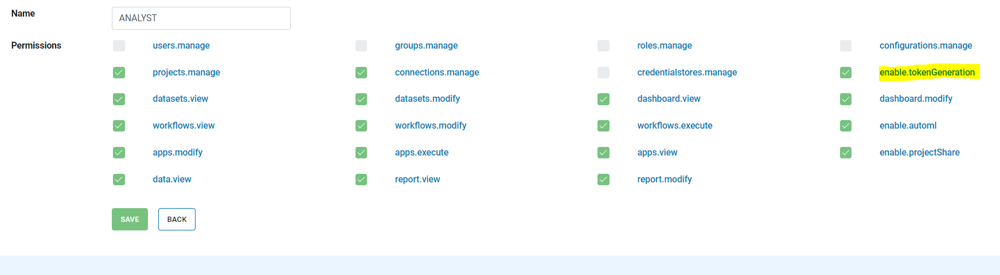
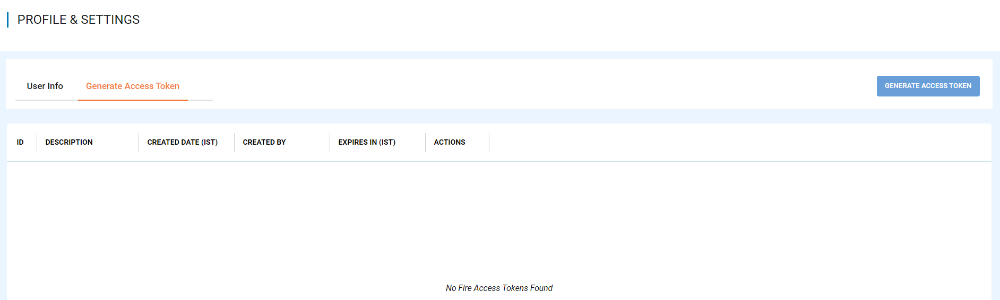
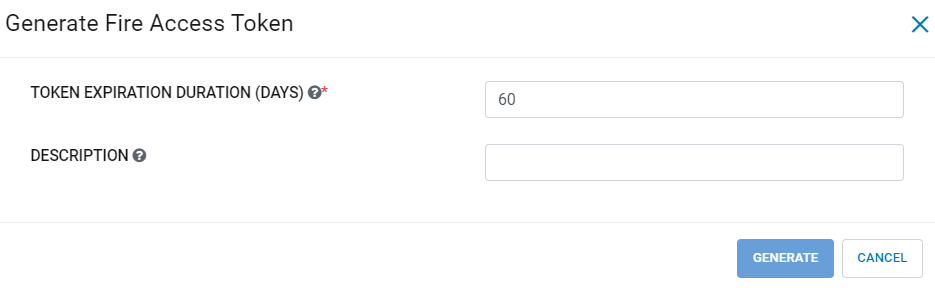
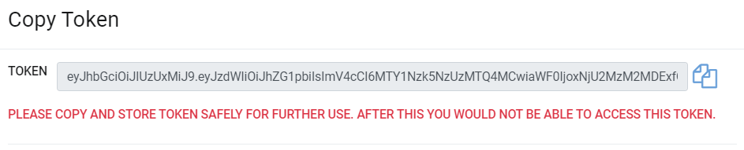
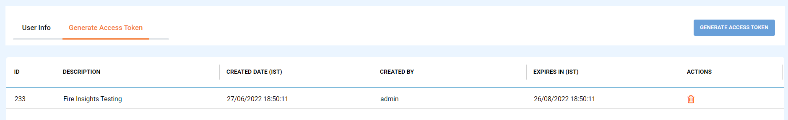

Acquire Access Token 
==================

Access Tokens can be acquired from Sparkflows Application which can be used for making the subsequent curl requests.

Below are steps for Generating Access Token in Sparkflows:

1. Login to Sparkflows Application and enable configuration for generating access tokens.

Once we login to Sparkflows Application as an Administrator user, go to the ``Configurations page`` and enable the parameter given below

::

    module.enableTokenGeneration : true

2. Once the configuration is enabled, go to the ``Administration/Roles``, and check mark the policy attached to the role for specific user.

::

    enable.tokenGeneration : true
    
    

3. Once the configuration is enabled, go to the ``User Profile``, which will lead to ``Profile & Settings`` page which has Generate Access Token tab.

4. Click on ``Generate Access Token`` button, which will pop up a new window with the information given below.

::

    TOKEN EXPIRATION DURATION (DAYS) : Number of Days for Token Expirations
    DESCRIPTION : Descriptions for Token Generated

   
5. Once the above information is filled, Click on ``Generate`` button which will create a new token.

   
6. Copy the token generated and press ok to see the token created in the list which can be used in making the subsequent curl requests.

.. note::  Make sure that the user has sufficient privileges to generate an Access Token.
