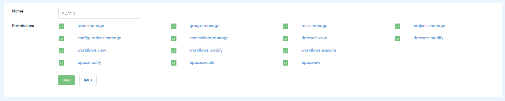
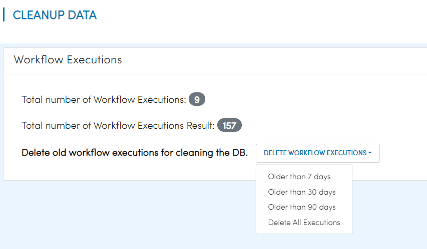

Admin user
===========

Fire Insights support variety of permissions for Roles. Each user can be assigned one more more Roles.

Below are the permissions supported by Fire Insights.

.. list-table:: 
   :widths: 10 20 
   :header-rows: 1

   * - Title
     - Description
   * - users.manage
     - create, modify & disable user
   * - groups.manage
     - Create, modify & delete the group
   * - roles.manage
     - Create, modify & delete the roles  
   * - projects.manage
     - Create, modify & delete the projects
   * - configurations.manage
     - modify diiferent configurations 
   * - connections.manage
     - add & modify diifferent connections  
   * - datasets.view
     - view dataset in specified project
   * - datasets.modify
     - modify datasets in specified project
   * - workflows.view
     - view workflows in specified project
   * - workflows.modify
     - modify workflows in specified project
   * - workflows.execute
     - execute workflow in specified project
   * - apps.modify
     - modify analytics application 
     
In Fire Insights generally the below permissions are associated with Admin features

- users.manage
- groups.manage
- roles.manage
- configurations.manage

An admin user in Fire Insights is one who has users.manage permission.

Admin User Rights
-----------------

In Fire Insights an admin user can do the following administration tasks:

- Configure Fire Insights
- Run Diagnostics
- Manage Users, Groups, Permissions
- Load Sample Projects
- View Server Logs
- Cleanup Data

     
More
----

     
   * - apps.execute
     - execute analytics application
   * - apps.view
     - view analytics application

.. note:: Apart from that Fire Insights come up with additional features for admin user as below:

- Diagnostics
Fire Insights enable to view detail informations about Machine environments.

.. figure:: ..//_assets/security/diagnostic.PNG
   :alt: security
   :width: 60%

- Usage Statistics
Fire Insights enable to view Total Users, Groups, Roles, Projects, Workflows & Workflows Executions

.. figure:: ..//_assets/security/usgae_satatistics.PNG
   :alt: security
   :width: 60%
   
- Runtime Statistics
Fire Insights enable to view Total Logged In User, Total Fire Spark Process, Total Fire Pyspark Process & Total Running Jobs

.. figure:: ..//_assets/security/runtime.PNG
   :alt: security
   :width: 60%
   
- Sample Projects
Fire Insights enable to RELOAD SAMPLE PROJECTS, as by default it come up with some sample projects containing different types of workflows & datasets

.. figure:: ..//_assets/security/reload_sample.PNG
   :alt: security
   :width: 60%

- Global Connections
Fire Insights enable to Add Connections For All & Add Connection For Group

.. figure:: ..//_assets/security/connection.PNG
   :alt: security
   :width: 60%

- Server Logs
Fire Insights enable to view Fire Server Logs, Fire Logs, Fire Exception Logs & Fire Pyspark Logs

.. figure:: ..//_assets/security/logs.PNG
   :alt: security
   :width: 60%
   
- Cleanup Data
Fire Insights enable to Delete old workflow executions for cleaning the DB which is Older than  Last 7 days, Older than  Last 30 days, Older than  Last 90 days & Delete All Executions

