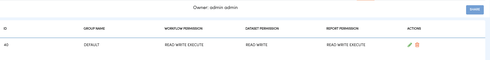
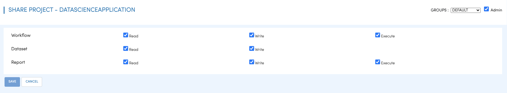

Sharing Projects
================

A project can be shared with multiple Groups. A Project is visible only to those users who belong to the groups with whom it has been shared with.

Below, the Project is shared with the ``DEFAULT`` group.

The following permissions can be given to a group during sharing of the project.

All users belonging to the group get the associated permissions on the Project.

